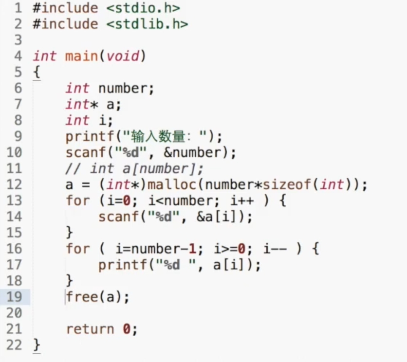

> [!note]- 这个是标题
> 这里是隐藏的内容。
> 只要开头写了 `-`，打开笔记时它就一定会自动折叠！
> 这里无论写多少行、怎么加空行都不会失效。

> [!note]- 外层：项目总览
> 这里是项目的主体描述。
> 
> > [!warning]- 点击查看已知的风险点
> > 1. 预算可能超支
> > 2. 交付周期较紧

> [!tip] 💡 **核心公式**：`E = mc²` （详见 [[相对论笔记]]）
> 标题里可以直接插入链接和格式！
> 
> - 列表 1
> - 列表 2

## 📌 1. Malloc 动态内存分配

> [!note]- 点击展开详细代码与解析
> 这里是你想默认折叠的内容：
> 
> ```c
> int *a;
> a = (int*)malloc(number * sizeof(int));
> ```
> 
> - **作用**：在堆区申请连续空间
> - **注意**：使用完后必须用 `free(a)` 释放

---

## 📌 2. Free 内存释放

> [!warning]- 点击展开注意事项
> 这里是免费释放相关的隐藏内容...
