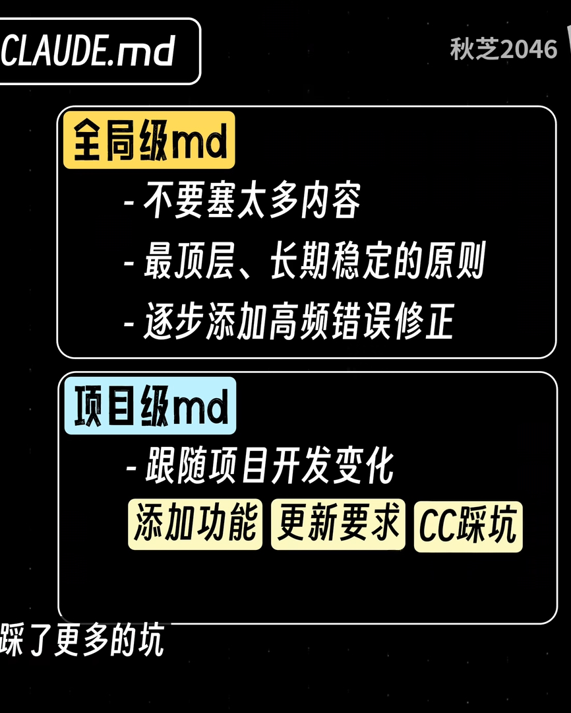
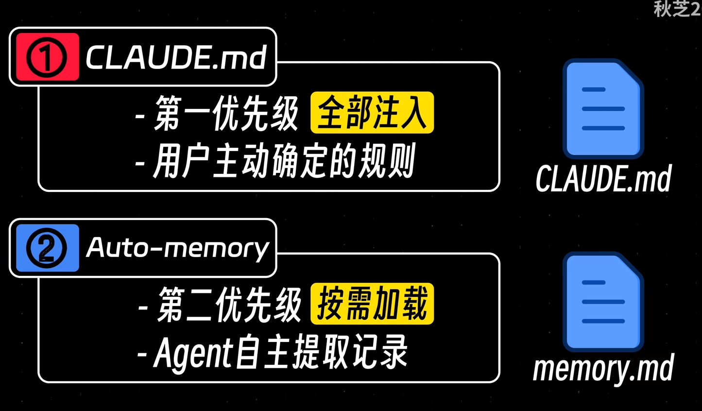
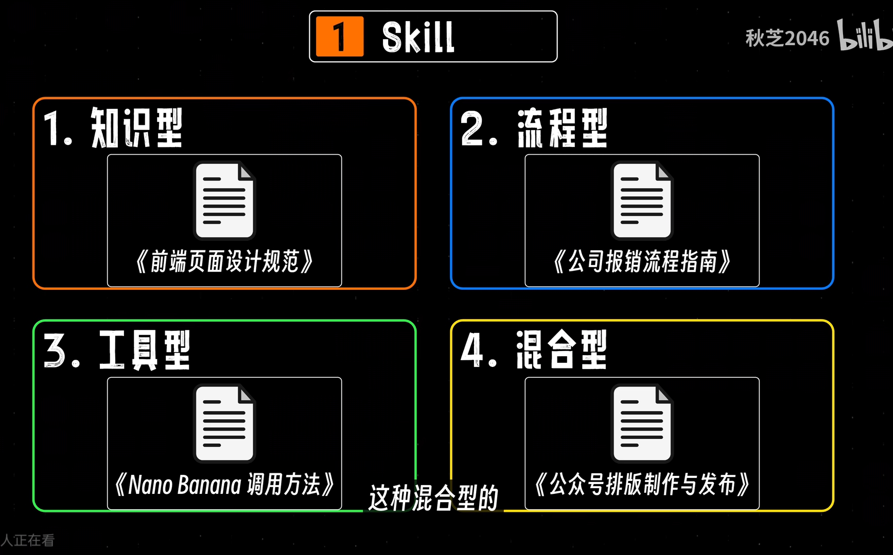
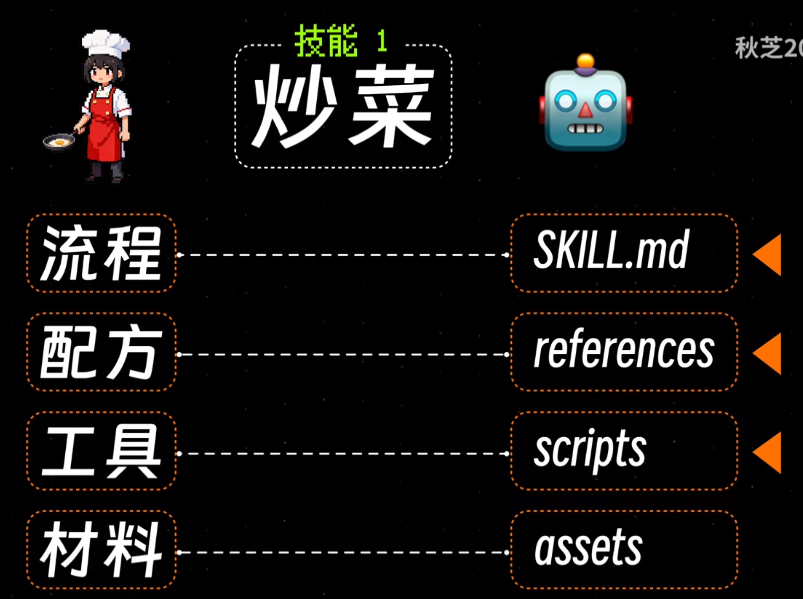
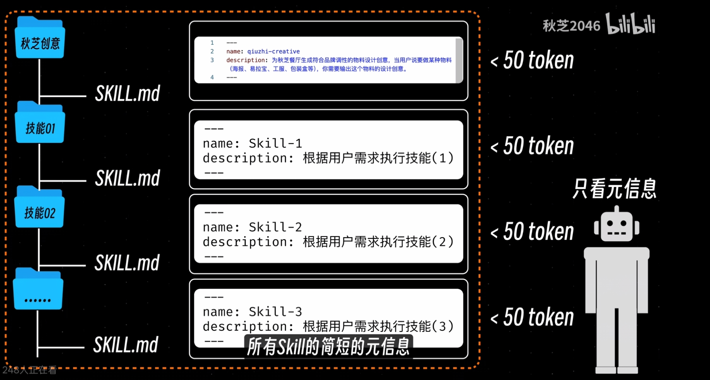
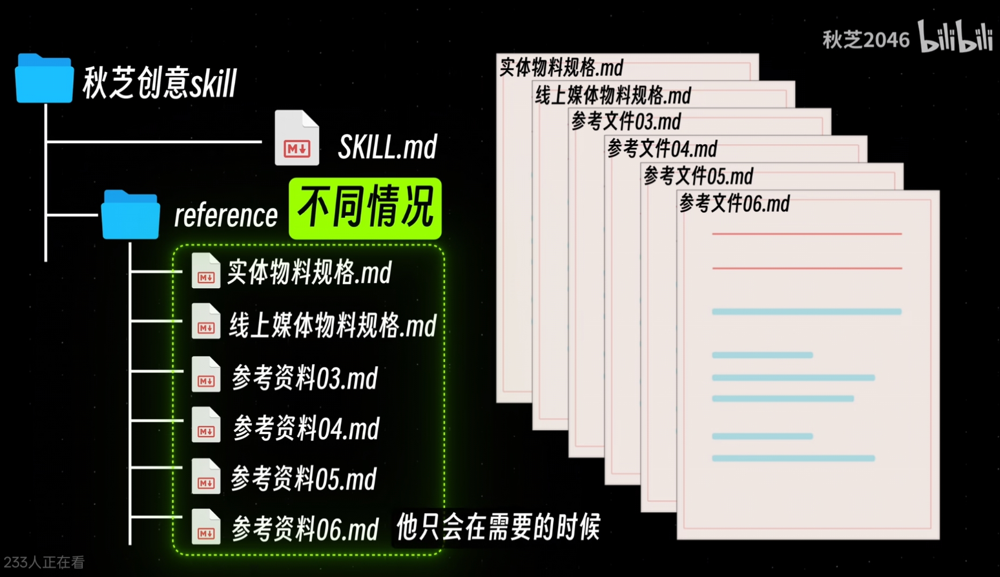
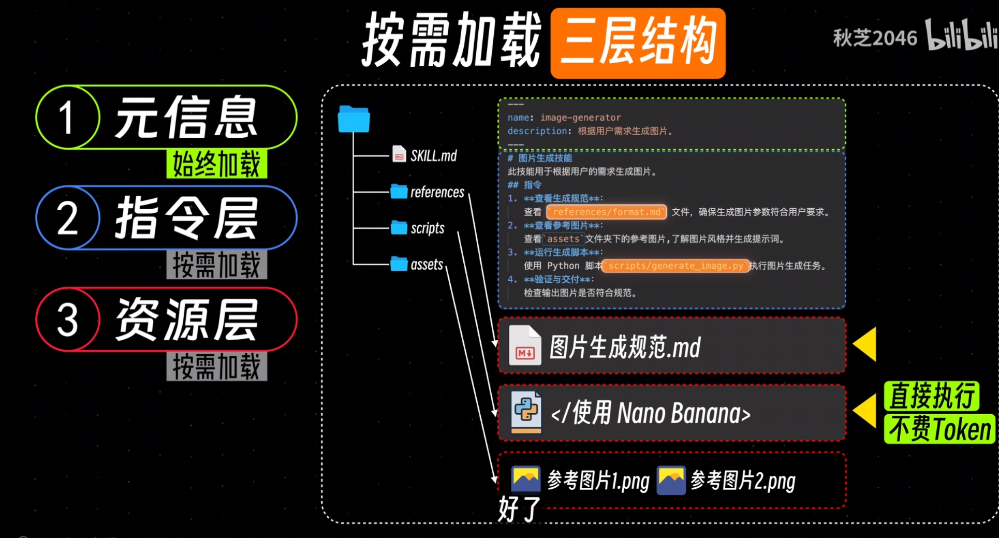
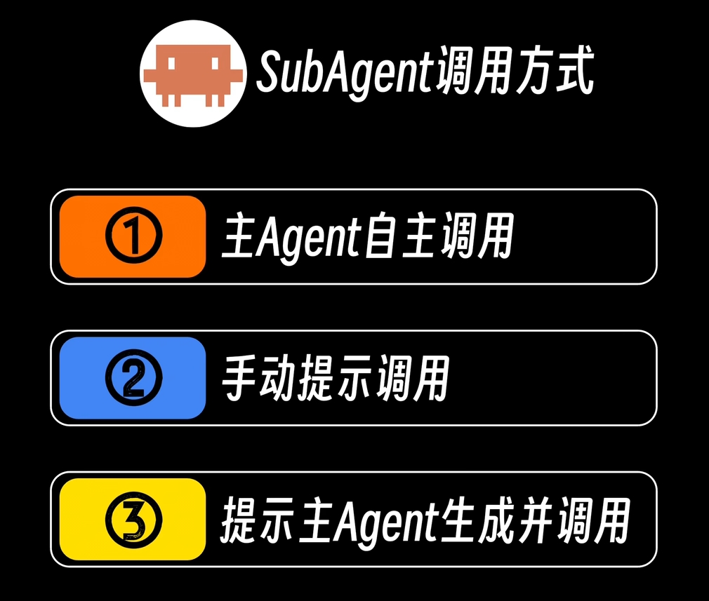
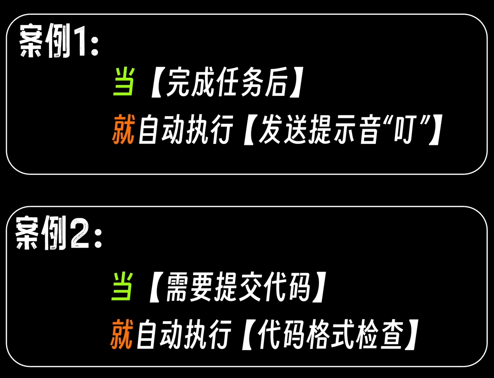

# 版本管理
双击esc回退
git 版本管理 回退

# claude.md
/init 引入项目 claude.md

两层记忆 

第三层是自己构建文档

# skill

## 初级skill
只有skill.md

 即元信息和指令两部分：
 - 元信息：name 和 description
 - 指令 md格式的信息
## 加上reference

## scripts

放脚本的

## assets
放材料 参考东西的 

## 总结构

写skill 可以用创建skill的skill

所以 我之前启动和结束的归档，也能用skill吗 不过依赖皮卡丘于外部 ，ds确实好像可以skill,不知道skill合适还是hook合适？还是脚本就行？
# subagent

原来是 gemini皮卡丘 
主要是因为gemini有pro会员 用3.1p✍️提示词免费，如果明年没有了 不知道怎么办 以及多agent协同好像是更优，这样就不怎么复制粘贴了，但是模型肯定没有gemini3.1p好用

# hook

或许脚本里面cc部分可以写成hook
但是我不知道这个hook触发消耗不消耗token?
,毕竟py脚本也就多点几下，肯定不耗token

版本选择 好像终端命令行的cc比vscode插件好一些 建不建议切换，好不好用?