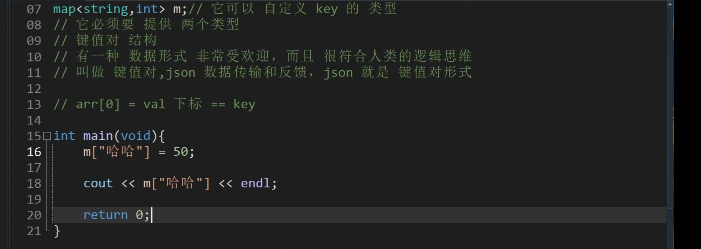
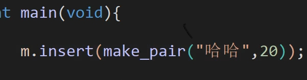
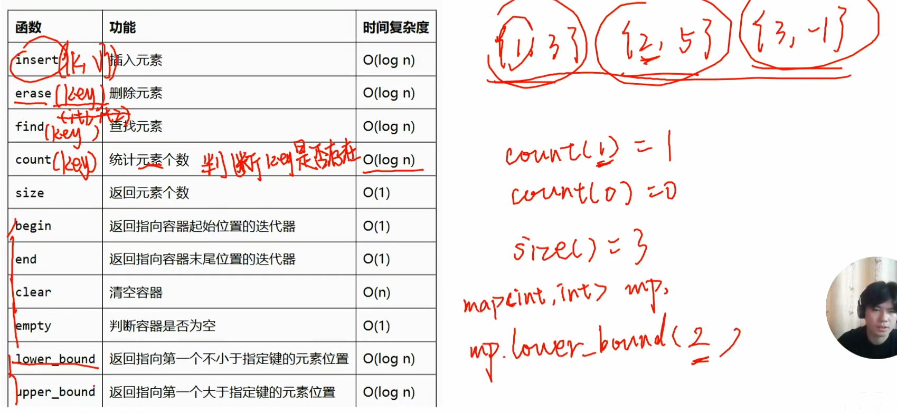
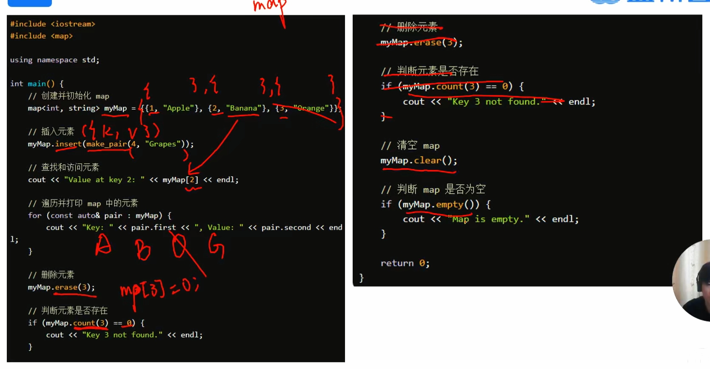

[STL-map](STL-map.md)
[数据结构 quque](数据结构%20quque.md)
[数据结构 stack](数据结构%20stack.md)
[sort](sort.md)
[STL-set](STL-set.md)
# 🎯 map 概念
> map ,里面键值对两者之间有映射关系

 ## 可以当数组看 前一个是下标，后一个是值 不过很智能 不拘泥于数字

map<KeyType, ValueType>` 是一个存储 键(Key)-值(Value)对的关联容器。

*   **KeyType**：键的类型（下标），用于唯一标识和查找。  
*   **ValueType**：值的类型，是与键相关联的数据。

    *   当 `ValueType` 是一个普通类型（如 `int`）时，它表现为**一对一**映射。  
    *   当 `ValueType` 是一个容器类型（如 `vector`）时，它表现为**一对多**映射。

> 

键值对 插入方法：


补充：

map 使用示例：

最新的遍历方法：
for (auto const& [key, val] : my_map) {
    // 直接使用 key 和 val
}


# P5266 【深基17.例6】学籍管理

## 题目描述

您要设计一个学籍管理系统，最开始学籍数据是空的，然后该系统能够支持下面的操作（不超过 $10^5$ 条）：

- 插入与修改，格式 `1 NAME SCORE`：在系统中插入姓名为 $\texttt{NAME}$(由字母和数字组成不超过 $20$ 个字符的字符串，区分大小写)，分数为 $\texttt{SCORE}$（$0<\texttt{SCORE}<2^{31}$） 的学生。如果已经有同名的学生则更新这名学生的成绩为 $\texttt{SCORE}$。如果成功插入或者修改则输出 `OK`。
- 查询，格式 `2 NAME`：在系统中查询姓名为 $\texttt{NAME}$ 的学生的成绩。如果没能找到这名学生则输出 `Not found`，否则输出该生成绩。
- 删除，格式 `3 NAME`：在系统中删除姓名为 $\texttt{NAME}$ 的学生信息。如果没能找到这名学生则输出 `Not found`，否则输出 `Deleted successfully`。
- 汇总，格式 `4`：输出系统中学生数量。

## 输入格式

第一行，输入一个正整数 $Q$（$1 \le Q \le 10^5$），表示操作数量。

接下来 $Q$ 行，每行先输入一个正整数 $op$（$op \in [1,4]$），表示操作种类。接着：
- 如果 $op = 1$，则再输入一个字符串 $\texttt{NAME}$ 以及一个正整数 $\texttt{SCORE}$，含义见题目描述。
- 如果 $op = 2$，则再输入一个字符串 $\texttt{NAME}$，含义见题目描述。
- 如果 $op = 3$，则再输入一个字符串 $\texttt{NAME}$，含义见题目描述。
- 如果 $op = 4$，则无需再输入其他内容。

## 输出格式

共输出 $Q$ 行，每行输出一个字符串或正整数，为对应操作的处理结果，具体含义见题目描述。

## 输入输出样例 #1

### 输入 #1

```
5
1 lxl 10
2 lxl
3 lxl
2 lxl
4
```

### 输出 #1

```
OK
10
Deleted successfully
Not found
0

```


# ✍️ 例题


```cpp
#include <bits/stdc++.h>
using namespace std;
using ll = long long;

map<string,ll> stu;
int q,op;
ll score;
string name;
int main()
{
	ios::sync_with_stdio(0);cin.tie(0);cout.tie(0);
	cin >> q;
	for(int i = 1;i <= q;++i)
	{
		cin >> op;
		if(op == 1)
		{
			cin >> name >> score;
			stu[name] = score;
			cout << "OK" <<'\n';
		}
		if(op == 2)
		{
			cin >> name;
			if(stu.count(name))
			{
				cout << stu[name] <<'\n';
			}
			else cout << "Not found" <<'\n';
		}
		if(op == 3)
		{
			cin >> name;
			if(stu.count(name))
			{
				stu.erase(name);
				cout << "Deleted successfully" <<'\n';
			}
			else cout << "Not found" <<'\n';
		}
		
		if(op == 4)
		{
			cout << stu.size() <<'\n';
		}
		
	}
	
	
	return 0;
}
```

# P8722 [蓝桥杯 2020 省 AB3] 日期识别

## 题目描述

小蓝要处理非常多的数据, 其中有一些数据是日期。

在小蓝处理的日期中有两种常用的形式：英文形式和数字形式。

英文形式采用每个月的英文的前三个字母作为月份标识，后面跟两位数字表示日期，月份标识第一个字母大写，后两个字母小写, 日期小于 $10$ 时要补前导 $0$。$1$ 月到 $12$ 月英文的前三个字母分别是 `Jan`、`Feb`、`Mar`、`Apr`、`May`、`Jun`、`Jul`、`Aug`、`Sep`、`Oct`、`Nov`、`Dec`。

数字形式直接用两个整数表达，中间用一个空格分隔，两个整数都不写前 导 `0`。其中月份用 $1$ 至 $12$ 分别表示 $1$ 月到 $12$ 月。

输入一个日期的英文形式, 请输出它的数字形式。

## 输入格式

输入一个日期的英文形式。

## 输出格式

输出一行包含两个整数，分别表示日期的月和日。

## 输入输出样例 #1

### 输入 #1

```
Feb08
```

### 输出 #1

```
2 8
```

## 输入输出样例 #2

### 输入 #2

```
Oct18
```

### 输出 #2

```
10 18
```

## 说明/提示

蓝桥杯 2020 第三轮省赛 AB 组 F 题。

```cpp
#include <bits/stdc++.h>
using namespace std; 
map<string,int> m = {{"Jan",1},{"Feb",2},{"Mar",3},{"Apr",4},{"May",5},{"Jun",6},{"Jul",7},{"Aug",8},{"Sep",9},{"Oct",10},{"Nov",11},{"Dec",12}};


int main()
{
	
	string s;
	cin >> s;
	string s1 = s.substr(0,3);
	int M = m[s1];
	string s2 = s.substr(3,2);
	int d = stoi(s2);
	cout << M << ' ' << d;
	return 0;
}
```
