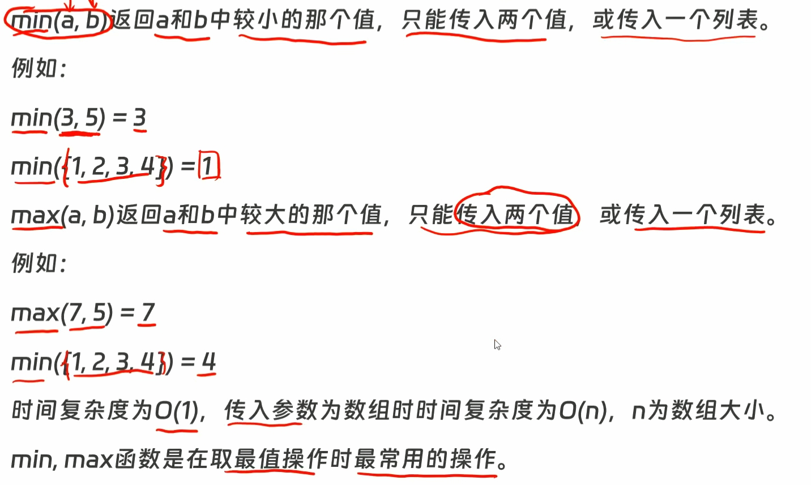
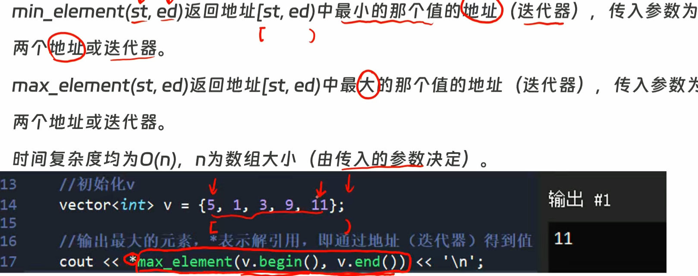
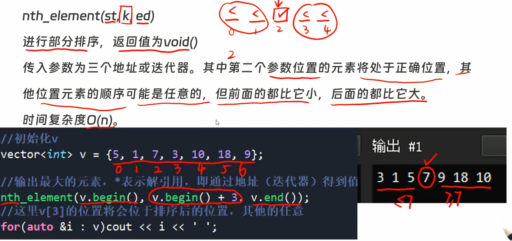
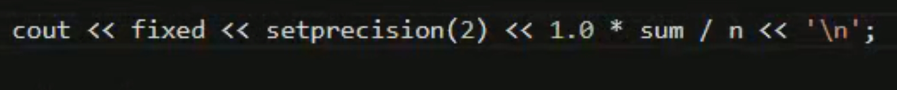

---
title:
tags:
related: []
data: 2026-03-02T09:16:00
---

### 🎯 核心功能 (Purpose)
> 


min_element 和 max_element





小技巧：保留小数

`fixed` 和 `setprecision(2)` 组合在一起，就是强制要求 `cout` 以小数形式输出，并且小数点后必须精确保留两位。


### ✍️ 标准语法 (Syntax)
```cpp

```
