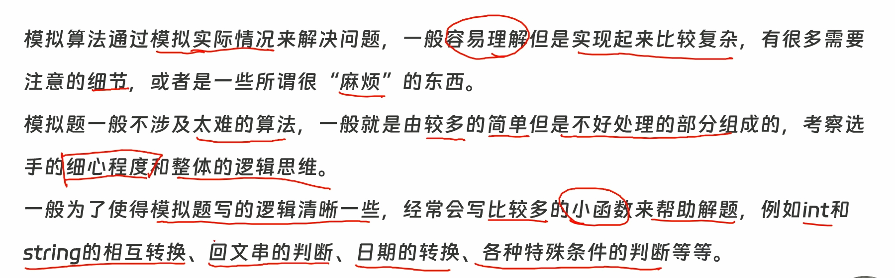

---
title:
tags:
related: []
data: 2026-03-06T08:49:00
Revision Time: 2026-03-22T18:12:00
---

## 注意事项：填空 一定 开 long long
## 看见求和 方案总数 无脑 全部long long(包括数组)


### 🎯 
>


[输入输出 + 高精度](输入输出%20+%20高精度.md)
[数学函数](数学函数.md)
[字符安检与变形](字符安检与变形.md)

# 遇到读入空格数据的处理方式
用
```cpp
getline(cin >> ws, line); 
    /*ws 的全称是 whitespace（空白字符）。cin >> ws 
    会在 getline 动手之前，像吸尘器一样把缓冲区里遗留的回车符、
    换行符、无用的空格全部吸干净，直到遇见真正的有效字母为止。*/
        
         // 读入整行，为什么不用之前那种字符串的方式cin >>?
        /*  因为 cin >> 有一个致命弱点：它遇到空格就会停下！
        //注意如果空格在开头 或者空行有意义则不能加 ws
``` 
代替 cin 

或者用 
```cpp
在cin >> 使用  cin.ignore() //防止输入多组数据后的回车残留 前者猛，后者柔和;
```

## 判断质数

```cpp
bool is_prime(ll x) {
    if (x < 2) return false;
    if (x == 2) return true;
    if (x % 2 == 0) return false; // 偶数直接秒杀
    for (int i = 3; i * i <= x; i += 2) { // 每次 +2，只查奇数 3, 5, 7...
        if (x % i == 0) return false;
    }
    return true;
}
```
## 日期模版 注意年月日边界
```cpp


// ================= 日期万能模块开始 =================

// 【零件1：天数库存】平年每个月的天数，下标直接对应月份（0号位废弃不用）
int month_days[13] = {0, 31, 28, 31, 30, 31, 30, 31, 31, 30, 31, 30, 31};

// 【零件2：基础安检门】判断闰年，注意括号包裹优先级！
bool is_leap(int y) {
    return ((y % 4 == 0) && (y % 100 != 0)) || (y % 400 == 0);
}

// 【零件3：查库存】获取某年某月的真实天数
int get_days(int y, int m) {
    if (m == 2 && is_leap(y)) return 29; // 闰年2月特殊处理
    return month_days[m];                // 其他月份直接查库存
}

// 【零件4：终极安检门】检查一个 8 位整数日期是否合法 (例如 20240230 会返回 false)
// 在你用 DFS 瞎组装数字时，这个函数能帮你立刻拦截死胡同！
bool is_valid(int date) {
    int y = date / 10000;
    int m = (date / 100) % 100;
    int d = date % 100;
    if (m < 1 || m > 12) return false;
    if (d < 1 || d > get_days(y, m)) return false;
    return true;
}

// 【零件5：核心发动机】时光机：输入今天的 8 位日期，直接返回明天的 8 位日期！
int get_next(int date) {
    // 1. 剥洋葱提取年月日
    int y = date / 10000;
    int m = (date / 100) % 100;
    int d = date % 100;
    
    // 2. 状态推演：无脑加一天
    d++; 
    
    // 3. 处理进位逻辑
    if (d > get_days(y, m)) { // 日期爆库存了，月份进位
        d = 1;
        m++;
        if (m > 12) {         // 月份爆了，年份进位
            m = 1;
            y++;
        }
    }
    
    // 4. 组装成新状态返回
    return y * 10000 + m * 100 + d; 
}

// ================= ⬇️ 终极升级：时间轴降维与升维模块 ⬇️ =================

// 【零件6：时间轴降维】输入具体时间，返回距离 1970-01-01 00:00 的总分钟数
// 如果想算秒数，返回时再 * 60 即可！
long long get_total_mins(int Y, int M, int D, int h, int m) {
    long long tolday = 0;
    
    // 1. 扣除完整的年份（过去了几整年）
    for (int i = 1970; i < Y; ++i) {
        tolday += is_leap(i) ? 366 : 365; // 完美复用你的零件2
    }
    // 2. 扣除完整的月份（今年过去了几整月）
    for (int i = 1; i < M; ++i) {
        tolday += get_days(Y, i);         // 完美复用你的零件3
    }
    // 3. 加上本月过去的完整天数（万物归零法则：当天还没过完！）
    tolday += (D - 1);
    
    // 4. 换算成总分钟（天*24*60 + 小时*60 + 分钟）
    return tolday * 24 * 60 + h * 60 + m; 
}

// 【零件7：时间轴升维】输入总分钟数，反向推演并以完美格式打印！
void print_real_date(long long tolmin) {
    // 1. 剥离天数和零头（时、分）
    int tolday = tolmin / (24 * 60);
    int remmin = tolmin % (24 * 60);
    int h = remmin / 60;
    int m = remmin % 60;  
    //先除以 当前单位等于多少的最小单位，再%上 他满了要进的下一位。
    // 2. 还原年份：一年一年扣天数，扣破产为止
    int Y = 1970; 
    while (1) {
        int stdyday = is_leap(Y) ? 366 : 365;
        if (tolday >= stdyday) {
            tolday -= stdyday; 
            Y++; 
        } else break; // 定格在此年
    }
    
    // 3. 还原月份：一月一月扣天数，扣破产为止
    int M = 1; 
    while (1) {
        int stdmday = get_days(Y, M); // 完美复用你的零件3
        if (tolday >= stdmday) {
            tolday -= stdmday; 
            M++; 
        } else break; // 定格在此月
    }
    
    // 4. 还原天数：剩下的零头天数 + 1（万物归零，加1回到人类日期）
    int D = tolday + 1;
    
    // 5. 调用 C++ 纯正输出流打印（自带补零魔法）
    cout << Y << '-'
         << setfill('0') << setw(2) << M << '-' 
         << setfill('0') << setw(2) << D << ' ' 
         << setfill('0') << setw(2) << h << ':' 
         << setfill('0') << setw(2) << m << ':' 
         << "00\n";
}

// 【零件8：查周期（星期几）】
// 0代表周日，1代表周一，... 6代表周六
int get_weekday(int Y, int M, int D) {
    long long tolday = 0;
    
    // 1. 复用你原来的降维打击，算出距离基准年（如1970年）过了几天
    for (int i = 1970; i < Y; ++i) {
        tolday += is_leap(i) ? 366 : 365; 
    }
    for (int i = 1; i < M; ++i) {
        tolday += get_days(Y, i);         
    }
    tolday += (D - 1);   //月和日 必须 1月1日 否则负数取模出事
    
    // 2. 创世基准日偏移：1970年1月1日是星期四
    // 用你笔记里的周期偏移量神技！
    int weekday = (4 + tolday % 7) % 7;  //月和日 必须 1月1日 否则负数取模出事
    
    return weekday;
}

int main() {
    // 提速咒语
    ios::sync_with_stdio(0); cin.tie(0); cout.tie(0);
    
    // ================= 玩法一：八位整数模拟法（适合算天数、算回文） =================
    /*
    int start_date = 20240101; // 起点状态 直接八位 
    int end_date = 20241231;   // 终点撞墙边界
    int curr = start_date;
    
    while (curr <= end_date) {
        // --- 写你的业务逻辑 ---
        curr = get_next(curr); // 核心传参：推演到下一天
    }
    */
    
    // ================= 玩法二：降维打击法（适合精确时间计算、打乱排序） =================
    /*
    char c1, c2, c3, c4; // C++ 输入魔法：海关吞噬法，专门用来吃掉 - 和 :
    int Y, M, D, h, m, s;
    
    // 假设读入格式为 2024-02-28 14:30:00 (自动跳过中间的空格)
    while (cin >> Y >> c1 >> M >> c2 >> D >> h >> c3 >> m >> c4 >> s) {
        // 1. 转成绝对数字
        long long mins = get_total_mins(Y, M, D, h, m);
        
        // 2. 算闹钟、算差值、加减乘除随便搞...
        // ...
        
        // 3. 还原打印
        // print_real_date(mins);
    }
    */

    // ================= ⬇️ 新增：玩法三：时光机逆向匹配法（上帝视角） ⬇️ =================
    /*
    [雷达预警]：当题目同时要求：“校验奇葩日期合法性” + “按先后顺序输出” + “不能重复输出”，
    且时间跨度在 1000 年以内（有明确起止点）时，绝对不要去拼凑输入！直接开时光机碾压！
    
    int a, b, c; char slash1, slash2; 
    // cin >> a >> slash1 >> b >> slash2 >> c; // 读入 02/03/04
    
    int curr = 19600101;     // 题目给定的绝对起点
    int end_date = 20591231; // 题目给定的绝对终点
    
    while (curr <= end_date) {
        int y = curr / 10000, m = (curr / 100) % 100, d = curr % 100;
        int yy = y % 100; // 如果题目只给两位年份，就截取后两位
        
        // 拿着绝对合法的当前天，去反向核对题目的暗号
        bool match1 = (yy == a && m == b && d == c); // 可能的格式 1
        bool match2 = (m == a && d == b && yy == c); // 可能的格式 2
        bool match3 = (d == a && m == b && yy == c); // 可能的格式 3
        
        if (match1 || match2 || match3) {
            // 时光机从小到大走：天然排序！只走一次：天然去重！直接打印！
            cout << y << '-' 
                 << setfill('0') << setw(2) << m << '-' 
                 << setfill('0') << setw(2) << d << '\n';
        }
        curr = get_next(curr); // 奔向明天
    }
    */
    
    玩法四：三维解体遍历法（应对超大跨度/超长位数） ⬇️ ================= 
    /* 【🚨 雷达预警】： 当终点极其离谱！比如跨度上百万年，或者终点日期变成了 11 位数 (如 20000000101)， 直接撑爆了 C++ 32位 int 的极限！并且题目要求拆开年月日做数学计算时。 
    【💡 核心心法】： 绝对不要用 get_next 逐天模拟（会溢出且超时）！直接把 y, m, d 拆成三个独立的 for 循环！ 配合【极速剪枝】和【边界剥离法则】，几百万年的数据 0.1 秒碾压！ 
    */ /* ll ans = 0; // 1. 主体归主体：只跑那些完整的、极度规律的年份（比如 2000 到 1999999） 
    for (int y = 2000; y < 2000000; ++y) { 
    for (int m = 1; m <= 12; ++m) { 
    // ⚠️ 致命易错点：月份必须是 <= 12！ // 🚨 极速剪枝：如果年份连月份都无法整除，直接砍掉这个月所有的天数！ 
    if (y % m != 0) continue; for (int d = 1; d <= get_days(y, m); ++d) { 
    // 终极业务逻辑：年份能整除天数 if (y % d == 0) { ans++; } } } } 
    // 2. 零头归零头：极其奇葩的边界截止日期（如 2000000 年 1 月 1 日）， // 绝对不要塞进循环里加 if 拖慢速度！单独拎出来在外面手工结账！
     if (2000000 % 1 == 0 && 2000000 % 1 == 0) { ans++; }
    
    return 0;
}

```

自己的：
```cpp
#include <bits/stdc++.h>
using namespace std; 
using ll = long long;

int M_day[13] = {0,31,28,31,30,31,30,31,31,30,31,30,31};

int sta_y;//(到时候自己填 这个只是说明) 
bool is_leap(int y)
{
	return (y % 4 == 0) && (y % 100 != 0) || y % 400 == 0;
}

int get_day(int y,int M)
{
	if(M == 2 && is_leap(y)) return 29;
	else return M_day[M];
}

int get_neday(int date)
{
	int y = date / 10000;
	int M = (date / 100) % 100;
	int d = date % 100;
	
	d++;
	if(d > get_day(y,M))
	{
		d = 1;
		M++;
		if(M > 12)
		{
			M = 1;
			y++;
		}
	}
	
	return y * 10000 + M * 100 + d;
	
}

ll get_tolsec(int y,int M,int d,int h,int m,int s)
{
	ll tolday = 0;
	
	for(int i = sta_y;i < y;++i)  // 1970是例子 
	{
		tolday += (is_leap(i) ? 366 : 365);  
		//注意 is_leap(i) 是i 
		
	}
	for(int i = 1;i < M;++i) // 目标年内，永远从 1 月开始查库存！
	{
		tolday += get_day(y,i);//注意 是 get_day(y,i)，不是M 
	}
	tolday += d-1;
	
	return tolday * 24 * 60 * 60 + h * 3600 + m * 60 + s;// 注意是分钟 不是M 
	
}

void print_date(ll tolsec)
{
	// [FIX] 剥洋葱法则：除以进位单位，取模满位阈值
	int s = tolsec % 60;//模的是 它本身 逢“”进1 到下一位 的值 
	int m = (tolsec / 60)% 60; 
	int h = (tolsec / 3600) % (24);// 除的是它本身等于多少 被处理数 的值； 
	int d = (tolsec / (24 * 3600));
	// [FIX] 起点必须和降维函数对齐
    int y = sta_y;
	int M = 1;
	
	while(1)
	{
		int stdy_day = (is_leap(y)) ? 366 : 365;
		if (d >= stdy_day) //[FIX] 必须带等号，扣干净！
		{
			d -= stdy_day;
			y++;
		}
		else break;
	}
	
	while(1)
	{
		int stdM_day = get_day(y,M);
		if(d >= stdM_day) //[FIX] 必须带等号，扣干净！
		{
			d -= stdM_day;
			M++;
		}
		else break;
	}
	d = d+1;
	cout << y << "-"
	<< setfill('0') << setw (2) << M << "-"
	<< setfill('0') << setw (2) << d <<" "
	<< setfill('0') << setw(2) << h << ":"
    << setfill('0') << setw(2) << m << ":"
    << setfill('0') << setw(2) << s << '\n';
}


int main()
{
	ios::sync_with_stdio(0);cin.tie(0);cout.tie(0);
	
	
	
	return 0;
}
```

## 数字转换模版

``` cpp
#include <iostream>
#include <string>
#include <algorithm>
using namespace std;

int main() {
    int n;
    cin >> n;
    
    // 1. 记录符号，只对绝对值进行字符串操作
    int sign = (n < 0) ? -1 : 1;
    
    // 2. 召唤官方模块：直接转成字符串
    string s = to_string(abs(n));  //注意c++11；
    
    // 3. 翻转字符串
    reverse(s.begin(), s.end()); 
    
    // 4. 召唤官方模块：字符串转回数字（stoi 会自动吃掉多余的前导 0！）
    int ans = sign * stoi(s); 
    
    cout << ans << '\n';
    return 0;
}
```
补充：取位核心方法
```cpp
int get_sum(int x) //数位和； 
{
	int sum = 0;
	while(x>0)
	{
		sum += x % 10;
		x /= 10;
	}             //核心剥洋葱方法 ； 
	return sum;
	
}
```
### ✍️ 例题代码


```cpp
//回文日期
#include <bits/stdc++.h>
using namespace std;
int s2i(string s)
{
  int res = 0; 
  for(const auto &i : s)  res = res * 10 + i - '0';
  return res; 
}

string i2s(int x,int w)
{
  string res;
  while(x) res += (x % 10) + '0',x /= 10;
  while(res.size() < w) res += '0';
  reverse(res.begin(),res.end());
  return res;
}

bool isleapyear(int year)
{
  return (year % 4 == 0) && (year % 100 != 0) || (year % 400 == 0);
}

bool isok(int year,int month,int day)
{
  int days[] = {0,31,28,31,30,31,30,31,31,30,31,30,31};
  if(isleapyear(year)) days[2] = 29;
  return day <= days[month];
}
bool ispa(string s)
{
	s = " " + s;  

    int n =  s.size()-1;

	for(int i = 1;i <= n ;++i)
	{
		if(s[i] != s[n-i+1] ) return false;
	}
	return true;
}
bool ispa2(string s)
{
  if(!ispa(s)) return false;
  return s[0] == s[2] && s[1] == s[3];
}
bool ans1 = true;
bool ans2 = true;
int main()
{
  string s;cin >> s;
  int year = s2i(s.substr(0,4)),month = s2i(s.substr(4,2)),day = s2i(s.substr(6,2));
  for(int i = year;i <= 9999; ++i)
  {
    for(int j = 1;j <= 12; ++j)
    {
      if(i == year && j < month) continue;
      for(int k = 1;k <= 31; ++k)
      {
        if(i == year && j == month && k <= day) continue;
        if(!isok(i,j,k)) continue;
        string date = i2s(i,4) + i2s(j,2) +i2s(k,2);
        
        if(ans1 && ispa(date))
        {
          cout << date << '\n';
          ans1 = false;
        }
        if(ans2 && ispa2(date))
        {
          cout << date << '\n';
          ans2 = false;
        }

      }
    }
  }
  return 0;
}
```


---

## 数字矩阵与坐标映射

📏 双坐标系“切换”

日常刷题（如 DP、网格遍历），坚决从 1 开始 (`for i = 1 to n`)，符合人类直觉，自带防越界安全垫（第 0 行/列全是 0）。

遇到必须计算周期、跨度（除法 / 和 取模 `%`）时，祭出“乾坤大挪移”公式：

1. **先减 1**，（变成 0 坐标系）去参与底层数学运算。
    
2. **算完加 1**，立刻回到1 坐标系！
    
    万能循环公式：`(x - 1) % n + 1`
    

---

### 1. 二维折叠（一维编号转二维坐标）

> **💡 效果演示（宽度 w = 3）：**
> 
> `[一维编号]` 1 2 3 4 5 6 7 8
> 
> `↓↓ 映射 ↓↓`
> 
> `1 2 3` (第 1 行)
> 
> `4 5 6` (第 2 行)
> 
> `7 8` (第 3 行)

当你有一个宽度为 `w` 的网格，里面按顺序填满了数字。你想知道编号为 `x`（从 1 开始计数）的数字，具体在第几行第几列？

- **算行号（Row）：** `r = (x - 1) / w + 1`
    
    _理解：_ 先减 1 变成机器视角的总偏移量。除以 `w` 算出门前有几个“完整的行”，最后加 1 回到人类真正的行号。
    
- **算列号（Col）：** `c = (x - 1) % w + 1`
    
    _理解：_ 先减 1 变成相对偏移量。对 `w` 取模算出在当前行排第几，最后加 1 变成人类眼里的列号。
    

---

### 2. 蛇形走位（S 型矩阵处理）

> **💡 效果演示（宽度 w = 3）：**
> 
> `[常规矩阵]` `[蛇形矩阵]`
> 
> `1 2 3` -> `1 2 3` (奇数行 →)
> 
> `4 5 6` -> `6 5 4` (偶数行 ← 发生翻转)
> 
> `7 8 9` -> `7 8 9` (奇数行 →)

网格排号如果是像贪吃蛇一样来回折返的。行号的计算与上面完全一样，但列号会根据所在行的奇偶性发生翻转。 (注：这里按第一行是正向来设定)

- **正向行（奇数行 1, 3, 5...）：** 方向从左到右，跟正常习惯一样。
    
    _公式：_ `实际列号 = c`
    
- **反向行（偶数行 2, 4, 6...）：** 方向从右到左，原本在最右边的变成了最左边。
    
    _公式：_ `实际列号 = w - c + 1`
    
    _理解：_ 极其优雅的镜像公式。比如宽度 `w = 6`，原本算出来 `c = 1` 的排头兵，经过翻转变成了 `6 - 1 + 1 = 6`（被发配到了最后）。
    

---

### 3. 曼哈顿距离（城市街区距离）

> **💡 效果演示：**
> 
> `A(1,1) . . .`
> 
> `. . . .`
> 
> `. . . B(3,4)`
> 
> **A 到 B 的距离** = 往下走 2 步 + 往右走 3 步 = **5 步**

在网格地图中，如果你只能上下左右横穿竖直地走（不能走斜线），两点之间的最短移动步数。

- **前提：** 你已经求出了点 A 的坐标 `(r1, c1)` 和点 B 的坐标 `(r2, c2)`。
    
- **公式：** `abs(r1 - r2) + abs(c1 - c2)`
    
    _理解：_ 简单粗暴，不管你是从 0 开始还是从 1 开始，距离绝对值永远不变！就是把竖着要走的行数差，加上横着要走的列数差。
    

---

### 4. 对角线规律（二维信箱/哈希映射核心）

> **💡 效果演示（括号内为坐标代入公式的值）：**
> 
> `[主对角线 \ (i-j)]` `[副对角线 / (i+j)]`
> 
> `0 -1 -2` `2 3 4`
> 
> `1 0 -1` `3 4 5`
> 
> `2 1 0` `4 5 6`
> 
> _(同值必定在同一条斜线上！)_

在二维数组里找对角线同行，不用管坐标是从 0 还是从 1 开始，规律永远成立！

- **左斜线 \ （主对角线方向）：** 在这条线上的所有格子，它们的 **行号减去列号 `(i - j)` 是一个永远不变的常数！**
    
    _防越界护盾：_ `i - j` 可能是负数，但 C++ 的数组抽屉编号不能是负数。所以统统加上一个足够大的常数（列数 `m` 或者 直接加极限值 `N`），变成 `i - j + N`。大家一起平移，同类依然在一个抽屉里，安全且完美！
    
- **右斜线 / （副对角线方向）：** 在这条线上的所有格子，它们的 **行号加上列号 `(i + j)` 是一个永远不变的常数！**
    
    _天然是正数：_ 直接把 `i + j` 当作抽屉编号即可。
    

---

### 5. 坐标映射（周期性图形平铺）

> **💡 效果演示（周期 L = 7）：**
> 
> `[向下 1 行，左移 1 位 (x=1)]` `[向下 1 行，左移 2 位 (x=2)]`
> 
> `L A N Q I A O` `L A N Q I A O`
> 
> `A N Q I A O L` `N Q I A O L A`
> 
> `N Q I A O L A` `I A O L A N Q`

任何这种“周期性平铺”的网格题，本质上都是在算“偏移量（Offset）”。

我们把电脑的 0 坐标系当成绝对的基准，人类的行号 `i` 和列号 `j`（从 1 开始）只是在基准上走路：

- **基础归零：** 起点 `(1, 1)` 的偏移量是 0。所以不管是算行还是算列，第一步永远是 `(i - 1)` 和 `(j - 1)`。
    
- **横向走路（列偏移）：** 在同一行里，往右走 1 格，读取字符串的下标就往后走 1 位。所以列的偏移量永远是 `(j - 1)`。
    
- **纵向走路（行偏移）：** 往下走 1 行，等于开头平移了几个字符。
    
- **终极万能公式诞生：**
    
    假设字符串长度为 `L`，每往下 1 行左移 `x` 个字符，那么坐标 `(i, j)` 对应的字符串下标就是：
    
    $$idx = ((i - 1) \cdot x + (j - 1)) \pmod L$$
    

---

### 6. 洋葱模型（矩阵圈层判定）

> **💡 效果演示（4x4 矩阵的圈层 k 值）：**
> 
> `1 1 1 1` (外圈 k=1)
> 
> `1 2 2 1` (内圈 k=2)
> 
> `1 2 2 1` (内圈 k=2)
> 
> `1 1 1 1` (外圈 k=1)

在一个 $n \times n$ 的矩阵中，如何快速判断任意坐标 `(i, j)` 属于第几圈（从外向内，最外层为第 1 圈）？

- **大道至简的对称法则：** 在 1 坐标系下，坐标值本身或者其对称坐标值，天然就代表了它所在的圈层深度！
    
- **求圈层公式：**
    
    `k = min({i, n - i + 1, j, n - j + 1})`
    
    _理解：_ 分别算出距离上边缘 `i`、下边缘 `n - i + 1`、左边缘 `j`、右边缘 `n - j + 1` 的坐标距离。它们的最小值，直接就是该格子所在的准确圈数。
    

---

### 7. 矩阵 90 度旋转映射（逆向找源头法则）

> **💡 效果演示：**
> 
> `[全矩阵顺时针 90 度]` `[洋葱圈层交错旋转 (外顺, 内逆)]`
> 
> `1 2 3` `7 4 1` `1 2 3 4` `13 9 5 1`
> 
> `4 5 6` `->` `8 5 2` `5 6 7 8` `->` `14 7 11 2`
> 
> `7 8 9` `9 6 3` `9 10 11 12` `15 6 10 3`
> 
> `13 14 15 16` `16 12 8 4`

对于新矩阵中的坐标 `(i, j)`（基于 1 坐标系，总大小为 `n`）：

- **顺时针旋转 90 度：** 源头坐标在老矩阵的 **`(n - j + 1, i)`**
    
    _理解：_ 顺时针旋转后，原来的“行”变成了现在的“列”（所以老行号由新列号 `j` 决定，并做了翻转），原来的“列”变成了现在的“行”（所以老列号由新行号 `i` 决定）。
    
- **逆时针旋转 90 度：** 源头坐标在老矩阵的 **`(j, n - i + 1)`**
    
    _理解：_ 完美的对称翻转映射。配合洋葱模型，可以直接实现任意指定圈层的独立交错旋转。

---
## 映射问题

- 当你需要把 **“字符串”映射成“数字”** 时（比如前面的“Jan”变成 1），你需要用 `std::map<string, int>`。
    
- 当你需要把 **“数字”映射成“字符串”** 时，并且数字还是一长串连续的整数（可以通过取模得到），**千万别用 `map`，直接开一个数组 `string a[]` 存进去**，把那个数字当成下标丢进去查！这在算法里叫作查表法”，偏移的话直接取模对应 （**凡是取模 一定下标从0开始**）

# P8716 [蓝桥杯 2020 省 AB2] 回文日期

## 题目描述

2020 年春节期间，有一个特殊的日期引起了大家的注意：2020 年 2 月 2 日。因为如果将这个日期按 `yyyymmdd` 的格式写成一个 $8$ 位数是 `20200202`，恰好是一个回文数。我们称这样的日期是回文日期。

有人表示 `20200202` 是“千年一遇” 的特殊日子。对此小明很不认同，因为不到 2 年之后就是下一个回文日期：`20211202` 即 2021 年 12 月 2 日。

也有人表示 `20200202` 并不仅仅是一个回文日期，还是一个 `ABABBABA` 型的回文日期。对此小明也不认同，因为大约 $100$ 年后就能遇到下一个 `ABABBABA` 型的回文日期：`21211212` 即 2121 年12 月12 日。算不上“千年一遇”，顶多算“千年两遇”。

给定一个 8 位数的日期，请你计算该日期之后下一个回文日期和下一个 `ABABBABA` 型的回文日期各是哪一天。

## 输入格式

输入包含一个八位整数 $N$，表示日期。

## 输出格式

输出两行，每行 $1$ 个八位数。第一行表示下一个回文日期，第二行表示下
一个 `ABABBABA` 型的回文日期。

## 输入输出样例 #1

### 输入 #1

```
20200202
```

### 输出 #1

```
20211202
21211212

```

## 说明/提示

对于所有评测用例，$10000101 \le N \le 92200229$，保证 $N$ 是一个合法日期的 $8$ 位数表示。

```cpp
#include <bits/stdc++.h>
using namespace std;
using ll =long long;
int sta_y = 1000;//自定义起始年，默认1970;
int sta_M = 1 ;//同上， 默认1
int Mday[13] ={0,31,28,31,30,31,30,31,31,30,31,30,31};
int a[8],b[8];
bool is_leap(int y)
{
    if((y % 4 == 0 && y % 100 != 0) || y % 400 == 0) return true;
    return false;
}

int getMday(int y,int M)
{
    if(M==2 && is_leap(y)) return 29;

    return Mday[M];
}


int getneday(int date)
{
    int y = date / 10000;
    int M = (date / 100) % 100;
    int d = date % 100;
    d++;
    if(d > getMday(y,M)) 
    {
        d=1;
        M++;
        if(M > 12)
        {
            M = 1;
            y++;

        }
    }

    return y*10000 + M*100 + d;
}

bool is_pa(int x)
{
    for(int i = 7;i >= 0;--i)
    {
        a[i] = x % 10;
        x /= 10;
    }
    for(int i = 0;i < 4;++i)
    {
        if(a[i] != a[7-i]) return false; 
    }
    return true;
}
bool is_ab(int x)
{
    if(!is_pa(x)) return false;
    for(int i = 7;i >= 0;--i)
    {
        b[i] = x % 10;
        x /= 10;
    }
    return (b[0] == b[2] && b[2] == b[5] && b[5] == b[7]) && (b[1] == b[3] && b[3] == b[4] && b[4] == b[6]);
    
    

}

int main()
{
    ios::sync_with_stdio(0);cin.tie(0);cout.tie(0);
    int date;
    cin >>  date;

    int curr = getneday(date);
    bool f1 = false;
    bool f2 = false;

    while(!(f1 && f2))
    {
        if(is_pa(curr) && !f1)
        {
            f1 = true;
            cout << curr <<'\n';
        }
        if(is_ab(curr) && !f2)
        {
            f2 = true;
            cout << curr <<'\n';
        }
        

        curr = getneday(curr);
    }

    return 0;
}


```

# P13928 [蓝桥杯 2022 省 Java B] 星期计算

## 题目描述

已知今天是星期六，请问 $20^{22}$ 天后是星期几？

注意用数字 1 到 7 表示星期一到星期日。

星期问题本质上就是 算余数：

星期六 = 6（先定基准）
要求的是 (6 + 20^22) % 7，再映射到 1~7
20^22 天文数字，碰都不能碰 → 用 同余定理 降维：

20 ≡ 6 (mod 7)
20^22 ≡ 6^22 (mod 7)
观察 6 的幂模 7 的规律：
6^n	模 7 结果
6^1	6
6^2	1
6^3	6
6^4	1
...	奇=6，偶=1
22 是偶数 → 6^22 ≡ 1 (mod 7)

(6 + 1) % 7 = 7 → 星期天

```cpp
#include <bits/stdc++.h>
using namespace std;
using ll = long long;
int week[7] = {7,1,2,3,4,5,6};
int main()
{
//20 % 7 = 6，所以问题变成 6^22 mod 7
// 6^2 = 36 ≡ 1 (mod 7) → 6 的偶数次幂 ≡ 1
// 20^22 ≡ 1 (mod 7)，即多了 1 天
// 星期六 + 1 = 星期天 = 7
    int res = 1;

    cout << week[(6+1)%7]<<'\n';

}
```


---


# P10385 [蓝桥杯 2024 省 A] 艺术与篮球

## 题目描述

小蓝出生在一个艺术与运动并重的家庭中。  
妈妈是位书法家，她希望小蓝能通过练习书法，继承她的艺术天赋，并练就一手好字。爸爸是一名篮球教练，他希望小蓝能通过篮球锻炼身体，培养运
动的激情和团队合作的精神。  
为了既满足妈妈的期望，又不辜负爸爸的心意，小蓝决定根据日期的笔画数来安排自己的练习。首先，他会将当天的日期按照 `YYYYMMDD` 的格式
转换成一个 $8$ 位数，然后将这 $8$ 位数对应到汉字上，计算这些汉字的总笔画数。如果总笔画数超过 $50$，他就去练习篮球；如果总笔画数不超过 $50$，他就去练习书法。  
例如，在 $2024$ 年 $1$ 月 $1$ 日这天，日期可表示为一个 $8$ 位数字 $20240101$，其转换为汉字是“二零二四零一零一”。日期的总笔画数为 $2 + 13 + 2 + 5 + 13 +
1 + 13 + 1 = 50$，因此在这天，小蓝会去练习书法。  
以下是汉字的笔画数对照表：

|汉字|笔画数|汉字|笔画数|
| -----------: | -----------: | -----------: | -----------: |
|零 |$13 $|五 |$4$|
|一 |$1$|  六 |$4$|
|二 |$2$|  七 |$2$|
|三 |$3$|  八 |$2$|
|四 |$5$| 九 |$2$|

现在，请你帮助小蓝统计一下，在 $2000$ 年 $1$ 月 $1$ 日到 $2024$ 年 $4$ 月 $13$ 日
这段时间内，小蓝有多少天是在练习篮球？

## 输入格式

这是一道结果填空题，你只需要算出结果后提交即可。本题的结果为一个整数，在提交答案时只填写这个整数，填写多余的内容将无法得分。

## 输出格式

这是一道结果填空题，你只需要算出结果后提交即可。本题的结果为一个整数，在提交答案时只填写这个整数，填写多余的内容将无法得分。

3228
```cpp
#include <bits/stdc++.h>
using namespace std;
int m_day[13] = {0,31,28,31,30,31,30,31,31,30,31,30,31};
int ch [10] = {13,1,2,3,5,4,4,2,2,2};
int ans1,ans2;
bool is_leap( int y)
{
	return (y % 4 == 0 && y % 100 != 0 || y % 400 == 0);
}

int get_day(int y,int m)
{
	if(m == 2 && is_leap(y) ) return 29;
	return m_day[m];
}

bool is_vaild(int date)
{
	int y = date / 10000;
	int m = (date / 100) % 100;
	int d = date % 100;
	if(d > get_day(y,m) || d < 1 ) return false;
	if(m < 1 || m > 12) return false;
	return true;
}

int get_nxday(int date)
{
	int y = date / 10000;
	int m = (date / 100) % 100;
	int d = date % 100;
	d++;
	if(d > get_day(y,m)) 
	{
		
		d = 1;
		m++;
		if(m > 12) 
		{
			m = 1;
			y++;
		}
	}
	return y*10000 + m*100 + d;
	
}


int main()
{
	int sta = 20000101;
	int end = 20240413;
	while(sta <= end)
	{
		int s1 = sta / 10000000;
		int s2 = (sta / 1000000)% 10;
		int s3 = (sta / 100000)% 10;
		int s4 = (sta / 10000)% 10;
		int s5 = (sta / 1000)% 10;
		int s6 = (sta / 100)% 10;
		int s7 = (sta / 10)% 10;
		int s8 = sta % 10;
		
		if(ch[s1] + ch[s2] + ch[s3] + ch[s4] + ch[s5] + ch[s6] + ch[s7] + ch[s8] > 50) ans1++;
		else ans2++;
		
		sta = get_nxday(sta);
	}
	cout << ans1;
	
	return 0;
 } 
```


# P1089 [NOIP 2004 提高组] 津津的储蓄计划

## 题目描述

津津的零花钱一直都是自己管理。每个月的月初妈妈给津津 $300$ 元钱，津津会预算这个月的花销，并且总能做到实际花销和预算的相同。

为了让津津学习如何储蓄，妈妈提出，津津可以随时把整百的钱存在她那里，到了年末她会加上 $20\%$ 还给津津。因此津津制定了一个储蓄计划：每个月的月初，在得到妈妈给的零花钱后，如果她预计到这个月的月末手中还会有多于 $100$ 元或恰好 $100$ 元，她就会把整百的钱存在妈妈那里，剩余的钱留在自己手中。


例如 $11$月初津津手中还有 $83$ 元，妈妈给了津津 $300$ 元。津津预计$11$月的花销是 $180$ 元，那么她就会在妈妈那里存 $200$ 元，自己留下 $183$ 元。到了 $11$ 月月末，津津手中会剩下 $3$ 元钱。


津津发现这个储蓄计划的主要风险是，存在妈妈那里的钱在年末之前不能取出。有可能在某个月的月初，津津手中的钱加上这个月妈妈给的钱，不够这个月的原定预算。如果出现这种情况，津津将不得不在这个月省吃俭用，压缩预算。


现在请你根据 $2004$ 年 $1$ 月到 $12$ 月每个月津津的预算，判断会不会出现这种情况。如果不会，计算到 $2004$ 年年末，妈妈将津津平常存的钱加上 $20\%$ 还给津津之后，津津手中会有多少钱。

## 输入格式

$12$ 行数据，每行包含一个小于 $350$ 的非负整数，分别表示 $1$ 月到 $12$ 月津津的预算。

## 输出格式

一个整数。如果储蓄计划实施过程中出现某个月钱不够用的情况，输出 $-X$，$X$ 表示出现这种情况的第一个月；否则输出到 $2004$ 年年末津津手中会有多少钱。

注意，洛谷不需要进行文件输入输出，而是标准输入输出。

## 输入输出样例 #1

### 输入 #1

```
290
230
280
200
300
170
340
50 
90 
80 
200
60 

```

### 输出 #1

```
-7 

```

## 输入输出样例 #2

### 输入 #2

```
290 
230 
280 
200 
300 
170 
330 
50 
90 
80 
200 
60 

```

### 输出 #2

```
1580

```
```cpp
#include <bits/stdc++.h>
using namespace std;
int a[15];

int rem,ans;
int main()
{
	ios::sync_with_stdio(0);cin.tie(0);cout.tie(0);
	for(int i = 1;i <= 12;++i)
	{
		cin >> a[i];
	}
	for(int i = 1;i <= 12;++i)
	{
		if(300+rem < a[i]) 
		{
			cout <<'-'<< i <<'\n';
			exit(0);
		}
		if(300 - a[i] + rem >= 100)
		{
			ans += (300 - a[i] +rem) / 100;
		}
		rem = ((300 - a[i] + rem) % 100);
		
		
	}
		cout << ans * 120 + rem  <<'\n';
	return 0;
}
```
# P1152 欢乐的跳

## 题目描述

一个 $n$ 个元素的整数数组，如果数组两个连续元素之间差的绝对值包括了 $[1,n-1]$ 之间的所有整数，则称之符合“欢乐的跳”，如数组 $\{1,4,2,3\}$ 符合“欢乐的跳”，因为差的绝对值分别为：$3,2,1$。

给定一个数组，你的任务是判断该数组是否符合“欢乐的跳”。

## 输入格式

每组测试数据第一行以一个整数 $n(1 \le n \le 1000)$ 开始，接下来 $n$ 个空格隔开的在 $[-10^8,10^8]$ 之间的整数。

## 输出格式

对于每组测试数据，输出一行若该数组符合“欢乐的跳”则输出 `Jolly`，否则输出 `Not jolly`。

## 输入输出样例 #1

### 输入 #1

```
4 1 4 2 3

```

### 输出 #1

```
Jolly

```

## 输入输出样例 #2

### 输入 #2

```
5 1 4 2 -1 6
```

### 输出 #2

```
Not jolly
```

## 说明/提示

$1 \le n \le 1000$

```cpp
#include <bits/stdc++.h>
using namespace std;
const int N = 1e3+9;
int a[N],diff,st[N];
int n;

int main()
{
	ios::sync_with_stdio(0);cin.tie(0);cout.tie(0);

	cin >> n;
	cin >> a[1];//数组做差的时候要先读第一个 
	for(int i = 2;i <= n;++i)
	{
	 cin >> a[i];
	 diff = abs(a[i] - a[i-1]); //注意要绝对值
	 if(diff > n-1 || diff < 1) continue; //注意范围；防止 下一次扫 越界
	 st[diff] = true; // 存值 到时候直接遍历 
	}
	for(int i = 1;i <= n-1;++i)
	{
		if(!st[i]) 
		{
			cout << "Not jolly" <<'\n';
			return 0;
		}
		
	}
	cout << "Jolly" <<'\n';
	
	return 0;
 } 
```
# P10985 [蓝桥杯 2023 国 Python A/Java A] 整数变换

## 题目背景

Python 选手建议使用 PyPy3 提交本题。

## 题目描述

小蓝有一个整数 $n$。每分钟，小蓝的数都会发生变化，变为上一分钟的数减去上一分钟的数的各个数位和。

例如，如果小蓝开始时的数为 $23$，则下一分钟变为 $23 - (2 + 3) = 18$，再下一分钟变为 $18 - (1 + 8) = 9$，再下一分钟变为 $9 - 9 = 0$，共经过了 $3$ 分钟变为 $0$。

给定一个正整数，请问这个数多少分钟后变为 $0$。

## 输入格式

输入一行包含一个整数 $n$。

## 输出格式

输出一个整数，表示答案。

## 输入输出样例 #1

### 输入 #1

```
23
```

### 输出 #1

```
3
```

## 说明/提示

对于 $30\%$ 的评测用例，$1 \le n \le 1000$；

对于 $60\%$ 的评测用例，$1 \le n \le 10^6$；

对于所有评测用例，$1 \le n \le 10^9$。

```cpp
#include <bits/stdc++.h>
using namespace std;
int n,ans;
int get_sum(int x) //数位和； 
{
	int sum = 0;
	while(x>0)
	{
		sum += x % 10;
		x /= 10;
	}             //核心剥洋葱方法 ； 
	return sum;
	
}
int main()
{
	ios::sync_with_stdio(0);cin.tie(0);cout.tie(0);

	cin >> n;
	
	
	
	while(n > 0)
	{
		
		n -= get_sum(n);
		ans++;
	}
	
	cout << ans <<'\n';
	
	return 0;
 } 
```

# P12172 [蓝桥杯 2025 省 Python B] LQ 图形

## 题目背景

本站蓝桥杯 2025 省赛测试数据均为洛谷自造，与官方数据可能存在差异，仅供学习参考。

## 题目描述

小蓝要为蓝桥画一个图形。由于小蓝的画图能力有限，他准备用大写字母 Q 画一个 L 形状的字符画。他希望 L 的粗细正好是 $w$ 个字符宽，竖的笔划伸出 $h$ 高（因此图形总共 $h + w$ 高），横的笔划伸出 $v$ 宽（因此图形总共 $v + w$ 宽），要求每个笔划方方正正不能有多余内容。

例如，当 $w = 2, h = 3, v = 4$ 时，图形如下所示：

```
QQ
QQ
QQ
QQQQQQ
QQQQQQ
```

给定 $w, h, v$，请帮助小蓝画出这个图形。

## 输入格式

输入的第一行包含三个正整数 $w, h, v$，相邻整数之间使用一个空格分隔。

## 输出格式

输出若干行，表示对应的图形。

## 输入输出样例 #1

### 输入 #1

```
3 4 5
```

### 输出 #1

```
QQQ
QQQ
QQQ
QQQ
QQQQQQQQ
QQQQQQQQ
QQQQQQQQ
```

## 说明/提示

### 评测用例规模与约定

对于 $30\%$ 的评测用例，$w = 1$，$1 \leq h, v \leq 20$；

对于 $60\%$ 的评测用例，$1 \leq w, h, v \leq 20$；

对于所有评测用例，$1 \leq w, h, v \leq 100$。

```cpp
#include <bits/stdc++.h>
using namespace std;

int w,h,v;
int main()
{
	ios::sync_with_stdio(0);cin.tie(0);cout.tie(0);

	cin >> w >> h >> v;
	for(int i = 1;i <=h;++i)
	{
		for(int j = 1;j <= w;++j)
		{
			cout <<'Q';
		}
		cout <<'\n';
	}
	for(int i = 1;i <=w;++i)
	{
		for(int j = 1;j <= v+w;++j)
		{
			cout <<'Q';
		}
		cout <<'\n';
	}
	

	
	return 0;
} 

```

# P12164 [蓝桥杯 2025 省 C/Python A] 2025 图形

## 题目背景

本站蓝桥杯 2025 省赛测试数据均为洛谷自造，与官方数据可能存在差异，仅供学习参考。

## 题目描述

小蓝要画一个 $2025$ 图形。图形的形状为一个 $h \times w$ 的矩形，其中 $h$ 表示图形的高，$w$ 表示图形的宽。当 $h = 5, w = 10$ 时，图形如下所示：

```
2025202520
0252025202
2520252025
5202520252
2025202520
```

图形的规律是：第一行用 $2025$ 重复填入，第二行开始，每行向左移动一个字符，用 $2025$ 重复填入。
给定 $h, w$，请输出对应的图形。

## 输入格式

输入的第一行包含两个正整数 $h, w$，用一个空格分隔。

## 输出格式

输出若干行，表示对应的图形。

## 输入输出样例 #1

### 输入 #1

```
4 5
```

### 输出 #1

```
20252
02520
25202
52025
```

## 说明/提示

### 评测用例规模与约定

- 对于 $30\%$ 的评测用例，$h = 1$，$1 \leq w \leq 20$；
- 对于 $60\%$ 的评测用例，$1 \leq h, w \leq 20$；
- 对于所有评测用例，$1 \leq h, w \leq 100$。

```cpp
#include <bits/stdc++.h>
using namespace std;
int n,m,maxsize;
string s = "2025";
int main()
{
	ios::sync_with_stdio(0);cin.tie(0);cout.tie(0);
	if(cin >> n >>m)
	{
		for(int i = 1;i <= n;++i)
		{
			for(int j = 1;j <= m;++j)
			{
				cout << s[(i+j-2) % 4];
			}
			cout << '\n';
		}
	}
	
	return 0;	
} 
```

# P10899 [蓝桥杯 2024 省 C] 劲舞团

## 题目描述

小蓝最近迷上了一款名为“劲舞团”的游戏，具体来说，只要按照游戏中给出的键位提示依次按出对应的键位，游戏人物便可以跟随节奏跳舞。对于连续的 $K$ 次正确敲击，如果任意连续的两次敲击间间隔时间都小于等于 $1\texttt s$，那么
我们称这是一次 $K$ 连击。现在给出一局小蓝的游戏记录文件，log.txt 中记录了 $N$ 条记录，每条记录有三个字段，依次为正确的敲击字符、小蓝打出的字符、打出字符的时间对应的毫秒时间戳。现在请你计算下最长的 $K$ 连击是多少，你
只需要输出 $K$ 的值。

## 输入格式

为了方便评测，输入数据已替换为 log.txt。在洛谷评测时，你可以从标准输入读取 log.txt，也可以从下发文件中下载。

## 输出格式

这是一道结果填空的题，你只需要算出结果后提交即可。本题的结果为一个整数，在提交答案时只填写这个整数，填写多余的内容将无法得分。

```cpp
#include <bits/stdc++.h>
using namespace std; 
using ll = long long;
char a,b;
ll t,lst_t,ans,max_ans;

int main()
{
	freopen("log.txt","r",stdin);
	ios::sync_with_stdio(0);cin.tie(0);cout.tie(0);
	while(cin >> a >> b >> t)
	{
		if(a != b) 
		{
			ans = 0;
		}
		else 
		{
			if(t - lst_t >= 1000 || ans == 0)
			{
				ans = 1;
			}
			else 
			{
				ans++;
			}
			lst_t = t;
			max_ans = max(max_ans,ans);
		}
		
	}
	
	cout << max_ans;
		return 0;
}
```

# P8781 [蓝桥杯 2022 省 B] 修剪灌木

## 题目描述

爱丽丝要完成一项修剪灌木的工作。

有 $N$ 棵灌木整齐的从左到右排成一排。爱丽丝在每天傍晩会修剪一棵灌木，让灌木的高度变为 $0$ 厘米。爱丽丝修剪灌木的顺序是从最左侧的灌木开始，每天向右修剪一棵灌木。当修剪了最右侧的灌木后，她会调转方向，下一天开始向左修剪灌木。直到修剪了最左的灌木后再次调转方向。然后如此循环往复。

灌木每天从早上到傍晩会长高 $1$ 厘米，而其余时间不会长高。在第一天的早晨，所有灌木的高度都是 $0$ 厘米。爱丽丝想知道每棵灌木最高长到多高。

## 输入格式

一个正整数 $N$，含义如题面所述。

## 输出格式

输出 $N$ 行，每行一个整数，第行表示从左到右第 $i$ 棵树最高能长到多高。

## 输入输出样例 #1

### 输入 #1

```
3
```

### 输出 #1

```
4
2
4
```

## 说明/提示

对于 $30 \%$ 的数据, $N \leq 10$。

对于 $100 \%$ 的数据, $1<N \leq 10000$。

蓝桥杯 2022 省赛 B 组 D 题。

```cpp
#include <bits/stdc++.h>
using namespace std; 
int n,ans;

int main()
{
	cin >> n; 
	for(int i = 1;i <= n;++i)
	{
		ans = max(i-1,n-i);
		cout << 2 * ans <<'\n';
	}
	
	
		return 0;
}
```

```cpp
#include <iostream>
#include <algorithm> // 召唤 max 函数
using namespace std;

// 记忆库存：记录每棵灌木上次被剪是第几天，以及历史最高纪录
// 全局数组默认初始化为 0，完美契合“第 0 天大家都是 0 厘米”的设定
int last_cut[10005]; 
int max_h[10005];

int main() {
    ios::sync_with_stdio(0); cin.tie(0); cout.tie(0);
    
    int n;
    cin >> n;
    
    // 特判：如果只有 1 棵灌木，每天都被剪，长不高
    if (n == 1) {
        cout << 0 << '\n';
        return 0;
    }
    
    int pos = 1; // 记忆：Alice 当前在第 1 棵灌木
    int dir = 1; // 记忆：Alice 面朝右边 (1右，-1左)
    
    // 我们需要模拟多少天？
    // Alice 走一个来回大概是 2*n 天。
    // 我们模拟 4*n 天（走两三个来回），绝对足够每一棵灌木都达到最高点！
    int total_days = 4 * n; 
    
    for (int day = 1; day <= total_days; ++day) {
        
        // 1. 算高度：今天 - 上次被剪的日子 (极其优雅的时间戳减法！)
        int h = day - last_cut[pos];
        
        // 2. 挑战历史最高记录
        max_h[pos] = max(max_h[pos], h);
        
        // 3. 一剪刀下去，记录今天剪了它
        last_cut[pos] = day;
        
        // 4. 准备去明天：先判断是不是该调头了？
        if (pos == n) {
            dir = -1; // 撞到最右边，调头向左
        } else if (pos == 1) {
            dir = 1;  // 撞到最左边，调头向右
        }
        
        // 5. 往前迈一步
        pos += dir;
    }
    
    // 模拟结束，盘点所有灌木的最高纪录并输出
    for (int i = 1; i <= n; ++i) {
        cout << max_h[i] << '\n';
    }
    
    return 0;
}
```

# P8665 [蓝桥杯 2018 省 A] 航班时间 *未解决*

## 题目描述

小 h 前往美国参加了蓝桥杯国际赛。小 h 的女朋友发现小 h 上午十点出发，上午十二点到达美国，于是感叹到“现在飞机飞得真快，两小时就能到美国了”。

小 h 对超音速飞行感到十分恐惧。仔细观察后发现飞机的起降时间都是当地时间。由于北京和美国东部有 $12$ 小时时差，故飞机总共需要 $14$ 小时的飞行时间。

不久后小 h 的女朋友去中东交换。小 h 并不知道中东与北京的时差。但是小 h 得到了女朋友来回航班的起降时间。小 h 想知道女朋友的航班飞行时间是多少。

对于一个可能跨时区的航班，给定来回程的起降时间。假设飞机来回飞行时间相同，求飞机的飞行时间。

## 输入格式

从标准输入读入数据。

一个输入包含多组数据。

输入第一行为一个正整数 $T$，表示输入数据组数。

每组数据包含两行，第一行为去程的起降时间，第二行为回程的起降时间。

起降时间的格式如下

```h1:m1:s1 h2:m2:s2```

或

```h1:m1:s1 h3:m3:s3 (+1)```

或

```h1:m1:s1 h4:m4:s4 (+2)```

表示该航班在当地时间 `h1` 时 `m1` 分 `s1` 秒起飞，

第一种格式表示在当地时间 当日 `h2` 时 `m2` 分 `s2` 秒降落

第二种格式表示在当地时间 次日 `h3` 时 `m3` 分 `s3` 秒降落。

第三种格式表示在当地时间 第三天 `h4` 时 `m4` 分 `s4` 秒降落。

对于此题目中的所有以 `h:m:s` 形式给出的时间, 保证（$0\le h\le23$，$0\le m,s\le59$）.

## 输出格式

输出到标准输出。

对于每一组数据输出一行一个时间 `hh:mm:ss`，表示飞行时间为 `hh` 小时 `mm` 分 `ss` 秒。

注意，当时间为一位数时，要补齐前导零。如三小时四分五秒应写为 `03:04:05`。

## 输入输出样例 #1

### 输入 #1

```
3
17:48:19 21:57:24
11:05:18 15:14:23
17:21:07 00:31:46 (+1)
23:02:41 16:13:20 (+1)
10:19:19 20:41:24
22:19:04 16:41:09 (+1)
```

### 输出 #1

```
04:09:05
12:10:39
14:22:05
```

## 说明/提示

保证输入时间合法，飞行时间不超过 $24$ 小时。

```cpp
#include <iostream>
#include <string>
#include <cstdio> // 召唤 sscanf 和 printf
using namespace std;

// 极其好用的功能函数：负责读入一行时间，并把它换算成纯秒数！
int get_time() {
    string line;
    // 1. getline 会把一整行连带空格全吸进来
    getline(cin, line); 
    
    int h1, m1, s1, h2, m2, s2, d = 0; // d 默认是 0 天
    
    // 2. 拿带括号的模具去盖！如果成功吸出了 7 个数字，说明跨天了
    if (sscanf(line.c_str(), "%d:%d:%d %d:%d:%d (+%d)", &h1, &m1, &s1, &h2, &m2, &s2, &d) != 7) 
    {
        // 3. 如果没吸出 7 个，说明是不跨天的航班。
        // 换个没有括号的普通模具，重新盖一次，吸出 6 个数字
        sscanf(line.c_str(), "%d:%d:%d %d:%d:%d", &h1, &m1, &s1, &h2, &m2, &s2);
    }
    
    // 4. 全部换算成秒！
    // 起飞时间 (秒)
    int time1 = h1 * 3600 + m1 * 60 + s1;
    // 降落时间 (秒)，记得加上多出来的天数 d
    int time2 = d * 24 * 3600 + h2 * 3600 + m2 * 60 + s2;
    
    // 5. 返回这趟航班的纸面飞行时间（秒）
    return time2 - time1;
}

int main() {
    int t;
    cin >> t;
    
    // ?? 致命避坑：cin >> t 之后，回车键还留在缓冲区里！
    // 必须用 getchar() 把那个回车键吃掉，否则后面的 getline 会直接读到一个空行！
    getchar(); 
    
    while (t--) {
        // 去程纸面时间 + 回程纸面时间，再除以 2，时差灰飞烟灭！
        int time = (get_time() + get_time()) / 2;
        
        // 算出最终的 小时、分钟、秒
        int h = time / 3600;
        int m = time % 3600 / 60;
        int s = time % 60;
        
        // 再次祭出 C 语言神技 printf 格式化输出：
        // %02d 的意思是：输出整数，如果不够两位数，前面自动补 0！（完美契合题目要求）
        printf("%02d:%02d:%02d\n", h, m, s);
    }
    
    return 0;
}
```

# P8738 [蓝桥杯 2020 国 C] 天干地支

## 题目描述

古代中国使用天干地支来记录当前的年份。

天干一共有十个，分别为：甲（jiǎ）、乙（yǐ）、丙（bǐng）、丁（dīng）、戊
（wù）、己（jǐ）、庚（gēng）、辛（xīn）、壬（rén）、癸（guǐ）。

地支一共有十二个，分别为：子（zǐ）、丑（chǒu）、寅（yín）、卯（mǎo）、辰（chén）、巳（sì）、午（wǔ）、未（wèi）、申（shēn）、酉（yǒu）、戌（xū）、亥（hài）。

将天干和地支连起来，就组成了一个天干地支的年份，例如：甲子。2020 年是庚子年。

每过一年，天干和地支都会移动到下一个。例如 2021 年是辛丑年。

每过 60 年，天干会循环 6 轮，地支会循环 5 轮，所以天干地支纪年每 60年轮回一次。例如 1900 年，1960 年，2020 年都是庚子年。

给定一个公元纪年的年份，请输出这一年的天干地支年份。

## 输入格式

输入一行包含一个正整数，表示公元年份。

## 输出格式

输出一个拼音，表示天干地支的年份，天干和地支都用小写拼音表示（不表示声调），之间不要加入任何多余的字符。

## 输入输出样例 #1

### 输入 #1

```
2020
```

### 输出 #1

```
gengzi
```

## 说明/提示

对于所有评测用例，输入的公元年份为不超过 $9999$ 的正整数。

蓝桥杯 2020 年国赛 C 组 F 题。

```CPP
#include <bits/stdc++.h>
using namespace std;
int n;
string tg[13] = {"geng","xin","ren","gui","jia","yi","bing","ding","wu","ji"};
string dz[21] = {"shen","you","xu","hai","zi","chou","yin","mao","chen","si","wu","wei"};


int main()
{
	cin >> n;
	cout << tg[n%10] << dz[n%12] <<'\n';
	
	return 0;
 } 
```
# P8748 [蓝桥杯 2021 省 B] 时间显示

## 题目描述

小蓝要和朋友合作开发一个时间显示的网站。在服务器上，朋友已经获取了当前的时间，用一个整数表示，值为从 1970 年 1 月 1 日 00:00:00 到当前时刻经过的毫秒数。

现在，小蓝要在客户端显示出这个时间。小蓝不用显示出年月日，只需要 显示出时分秒即可，毫秒也不用显示，直接舍去即可。

给定一个用整数表示的时间，请将这个时间对应的时分秒输出。

## 输入格式

输入一行包含一个整数，表示时间。

## 输出格式

输出时分秒表示的当前时间, 格式形如 $\mathrm{HH}: \mathrm{MM}: \mathrm{SS}$, 其中 $\mathrm{HH}$ 表示时, 值 为 $0$ 到 $23, \mathrm{MM}$ 表示分。值为 $0$ 到 $59$。$\mathrm{SS}$ 表示秒, 值为 $0$ 到 $59$。时、分、秒不足两位时补前导 `0` 。

## 输入输出样例 #1

### 输入 #1

```
46800999
```

### 输出 #1

```
13:00:00
```

## 输入输出样例 #2

### 输入 #2

```
1618708103123
```

### 输出 #2

```
01:08:23
```

## 说明/提示

对于所有评测用例, 给定的时间为不超过 $10^{18}$ 的正整数。 

蓝桥杯 2021 第一轮省赛 B 组 F 题。

```cpp
#include <bits/stdc++.h>
using namespace std;
using ll = long long;
ll n;
int main()
{
	cin >> n;
	n = n / 1000;
	int s = n % 60;
	
	int m = n / 60 % 60;
	
	int h = n / 3600 % 24;
	//先除以 当前单位等于多少的最小单位，再%上 他满了要进的下一位。
	printf("%02d:%02d:%02d\n",h,m,s);

	return 0;
 } 
```

# P9421 [蓝桥杯 2023 国 B] 班级活动

## 题目描述

小明的老师准备组织一次班级活动。班上一共有 $n$ 名（$n$ 为偶数）同学，老师想把所有的同学进行分组，每两名同学一组。为了公平，老师给每名同学随机分配了一个 $n$ 以内的正整数作为 id，第 $i$ 名同学的 id 为 $a_i$。

老师希望通过更改若干名同学的 id 使得对于任意一名同学 $i$，有且仅有另一名同学 $j$ 的 id 与其相同（$a_i = a_j$）。请问老师最少需要更改多少名同学的 id？

## 输入格式

输入共 $2$ 行。

第一行为一个正整数 $n$。

第二行为 $n$ 个由空格隔开的整数 $a_1, a_2, \cdots, a_n$。

## 输出格式

输出共 $1$ 行，一个整数。

## 输入输出样例 #1

### 输入 #1

```
4
1 2 2 3
```

### 输出 #1

```
1
```

## 说明/提示

### 样例说明

仅需要把 $a_1$ 改为 $3$ 或者把 $a_4$ 改为 $1$ 即可。

### 评测用例规模与约定

- 对于 $20\%$ 的数据，保证 $n \le 10^3$。
- 对于 $100\%$ 的数据，保证 $n \le 10^5$。

第十四届蓝桥杯大赛软件赛决赛 C/C++ 大学 B 组 C 题


```cpp
#include <bits/stdc++.h>
using namespace std;
int n;
const int N = 1e5+9;
int a[N],cnt[N];
int st[N];
int main()
{
	if(cin >> n)
	{
		for(int i = 1;i <= n;++i)
		{
			cin >> a[i];
			cnt[a[i]]++;
		}
		int si = 0;
		int over = 0;
		
		
		for(int i = 1;i <= n;++i)
		{
			if(cnt[i] == 1) si++;
			if(cnt[i] > 2) over += (cnt[i]-2);
		}
		cout << (over >= si ? over : (over + (si - over) / 2)) <<'\n';
		
	}
	
	return 0;
}
```

# P10906 [蓝桥杯 2024 国 B] 合法密码

## 题目描述

小蓝正在开发自己的 OJ 网站。他要求网站用户的密码必须符合以下条件：

1. 长度大于等于 $8$ 个字符，小于等于 $16$ 个字符。
2. 必须包含至少 $1$ 个数字字符和至少 $1$ 个符号字符。

例如 `lanqiao2024!`、`+-*/0601`、`8((>w<))8` 都是合法的密码。

而 `12345678`、`##**##**`、`abc0!#`、`lanqiao20240601!?` 都不是合法的密码。

请你计算以下的字符串中，有多少个子串可以当作合法密码？只要两个子串的开头字符和末尾字符在原串中的位置不同，就算作不同的子串。

字符串为：

```plain
kfdhtshmrw4nxg#f44ehlbn33ccto#mwfn2waebry#3qd1ubwyhcyuavuajb#vyecsycuzsmwp31ipzah#catatja3kaqbcss2th
```

## 输入格式

这是一道结果填空题，你只需要算出结果后提交即可。本题的结果为一个整数，在提交答案时只填写这个整数，填写多余的内容将无法得分。

## 输出格式

这是一道结果填空题，你只需要算出结果后提交即可。本题的结果为一个整数，在提交答案时只填写这个整数，填写多余的内容将无法得分。

```cpp
#include <bits/stdc++.h>
using namespace std;
int n,ans;

int main()
{
string s=" kfdhtshmrw4nxg#f44ehlbn33ccto#mwfn2waebry#3qd1ubwyhcyuavuajb#vyecsycuzsmwp31ipzah#catatja3kaqbcss2th";

	n = s.size() - 1;
	for(int i = 1;i<=n;++i)
	{
		int d_cnt = 0;
		int c_cnt = 0;
		for(int j = i ;j <= i+15 && j <= n;++j)
		{
			
			
			if(isdigit(s[j])) d_cnt++;
			else
			{
				if(!isalnum(s[j])) c_cnt++;
			}
			if(j-i+1 < 8) continue;//判段区间状态是否符合要求 
			if(d_cnt >= 1 && c_cnt >= 1) ans++;
			
		}	
		
		
	}
	cout << ans <<'\n';
	return 0;
}
```

# P13893 [蓝桥杯 2023 省 C] 工作时长

## 题目描述

小蓝手里有一份 2022 年度自己的上班打卡记录文件，文件包含若干条打卡记录，每条记录的格式均为“yyyy-MM-dd HH:mm:ss”，即按照年-月-日时:分:秒的形式记录着一个时间点（采用 24 小时进制）。由于某些原因，这份文件中的时间记录并不是按照打卡的时间顺序记录的，而是被打乱了。但我们保证小蓝每次上班和下班时都会正常打卡，而且正好打卡一次，其它时候不会打卡。每一对相邻的上-下班打卡之间的时间就是小蓝本次的工作时长，例如文件内容如下的话：

- 2022-01-01 12:00:05
- 2022-01-02 00:20:05
- 2022-01-01 07:58:02
- 2022-01-01 16:01:35

表示文件中共包含了两段上下班记录，1）2022-01-01 07:58:02 ~ 2022-01-01 12:00:05，工作时长为 $14523$ 秒；2）2022-01-01 16:01:35 ~ 2022-01-02 00:20:05，工作时长为 $29910$ 秒；工作时长一共是 $14523 + 29910 = 44433$ 秒。现在小蓝想知道在 2022 年度自己的工作时长一共是多少秒？

## 输入格式

无

## 输出格式

这是一道结果填空的题，你只需要算出结果后提交即可。本题的结果为一个整数，在提交答案时只输出这个整数，填写多余的内容将无法得分。

## 输入输出样例 #1

### 输入 #1

```

```

### 输出 #1

```

```

```cpp
#include <bits/stdc++.h>
using namespace std;
using ll = long long;
int daym[13] = {0,31,28,31,30,31,30,31,31,30,31,30,31};
vector<ll> times; 

ll get_tolsec(int M,int d,int h,int m,int s)
{
	ll tolday = 0;
	for(int i = 1;i <= M-1;++i) 
	{
		tolday += daym[i];
	} //过去的完整月； 
	tolday += d-1;// 这个月剩下的完整天；
	
	ll tolsec = tolday * 24 * 3600 + h * 3600 + m * 60 + s;
	 
	return tolsec;
}

int main()
{
	ios::sync_with_stdio(0);cin.tie(0);cout.tie(0);
	char c1,c2,c4,c5;//cin 自动吃空格  //只抵消符号 所以是char 
	int Y,M,D,H,m,S;//注意不要反了； 
	times.push_back(1);
	
	while(cin >> Y >> c1 >> M >> c2 >> D >> H >> c4 >> m >> c5 >> S)
	{
		
		 times.push_back(get_tolsec( M,D,H,m,S));
		 
	}
	sort(times.begin()+1,times.end());//排序求和打印必须放循环外面 
		 ll ans = 0;
		 int n =  times.size()-1;
		 for(int i = 1;i <=n ;i += 2)
		 {
		 	ans += times[i+1] - times[i];
		 }
		
		cout << ans <<'\n';
	return 0;
}
```

# P11002 [蓝桥杯 2024 省 Python B] 神奇闹钟

## 题目描述

小蓝发现了一个神奇的闹钟，从纪元时间（$1970$ 年 $1$ 月 $1$ 日 $00:00:00$）开始，每经过 $x$ 分钟，这个闹钟便会触发一次闹铃（纪元时间也会响铃）。这引起了小蓝的兴趣，他想要好好研究下这个闹钟。

对于给出的任意一个格式为 `yyyy-MM-dd HH:mm:ss` 的时间，小蓝想要知道在这个时间点之前（包含这个时间点）的最近的一次闹铃时间是哪个时间？

注意，你不必考虑时区问题。

## 输入格式

输入的第一行包含一个整数 $T$，表示每次输入包含 $T$ 组数据。

接下来依次描述 $T$ 组数据。

每组数据一行，包含一个时间（格式为 `yyyy-MM-dd HH:mm:ss`）和一
个整数 $x$，其中 $x$ 表示闹铃时间间隔（单位为分钟）。

## 输出格式

输出 $T$ 行，每行包含一个时间（格式为 `yyyy-MM-dd HH:mm:ss`），依
次表示每组数据的答案。

## 输入输出样例 #1

### 输入 #1

```
2
2016-09-07 18:24:33 10
2037-01-05 01:40:43 30

```

### 输出 #1

```
2016-09-07 18:20:00
2037-01-05 01:30:00

```

## 说明/提示

对于所有评测用例，$1 \le T \le 10，1 \le x \le 1000$，保证所有的时间格式都是合法的。

```cpp
#include <bits/stdc++.h>
using namespace std;
using ll = long long;
int daym[13] = {0,31,28,31,30,31,30,31,31,30,31,30,31};

bool isleap (int y)
{
	return ((y % 4 == 0 && y % 100 != 0 )|| y % 400 == 0);
}

ll getmin (int y,int M,int d,int h,int m)
{
	ll tolday = 0;
	for(int i = 1970; i < y;++i)
	{
		tolday += (isleap(i)) ? 366 : 365; //传入的是i，遍历每一年； 
		
	}
	for(int i = 1; i < M;++i)
	{
		if(isleap(y) && i == 2) tolday += 29;
		else tolday += daym[i];
		
	}
	tolday += d-1;
	ll tolmin = tolday * 24 * 60 + h * 60 + m;
	return tolmin;
}

void getdate (ll tolmin)
{
	int tolday = tolmin / (60 * 24);
	int remmin = tolmin % (60 * 24);
	int h = remmin / 60;
	int m = remmin % 60;  //还原这些 先天，/ 即可 
	
	int y = 1970; //还原年月 慢慢扣 
	while(1)
	{
		int stdyday = (isleap(y)) ? 366 : 365;//注意闰年 
		if(tolday >= stdyday)
		{
			tolday -= stdyday; //一次扣一年的天数 
			y++; 
		} 
		else break;//注意不够了就出来 就定格在这里； 
	}
	int M = 1; //还原年月 慢慢扣 
	while(1)
	{
		int stdmday = daym[M];
		if(isleap(y) && M==2) stdmday = 29;
		
		if(tolday >= stdmday)
		{
			tolday -= stdmday; //一次扣一年的天数 
			M++; 
		} 
		else break;//注意不够了就出来 就定格在这里； 
	}
	int d = tolday+1;//当前这一天； 
	
	cout << y <<'-'
	<< setfill('0') << setw(2) << M <<'-' 
	<< setfill('0') << setw(2) << d <<' ' 
	<< setfill('0') << setw(2) << h <<':' 
	<< setfill('0') << setw(2) << m <<':' 
	<< "00\n";
	
}

int main()
{
	ios::sync_with_stdio(0);cin.tie(0);cout.tie(0);
	int t;
	cin >> t;
	char s1,s2,s3,s4;
	int y,M,d,h,m,s,x;
	while(t--)
	{
		cin >> y >> s1 >> M >> s2 >> d >> h >> s3 >> m >> s4 >> s >> x;
		 ll mins = getmin(y,M,d,h,m);
		 ll ans = (mins / x) * x;//向下取整 
		 getdate (ans);
	}
	
	return 0;
 } 
```

# P12366 [蓝桥杯 2022 省 Python B] 数位排序

## 题目描述

小蓝对一个数的数位之和很感兴趣，今天他要按照数位之和给数排序。当两个数各个数位之和不同时，将数位和较小的排在前面，当数位之和相等时，将数值小的排在前面。

例如，$2022$ 排在 $409$ 前面，因为 $2022$ 的数位之和是 $6$，小于 $409$ 的数位之和 $13$。

又如，$6$ 排在 $2022$ 前面，因为它们的数位之和相同，而 $6$ 小于 $2022$。

给定正整数 $n$，$m$，请问对 $1$ 到 $n$ 采用这种方法排序时，排在第 $m$ 个的元素是多少？

## 输入格式

输入第一行包含一个正整数 $n$。

第二行包含一个正整数 $m$。

## 输出格式

输出一行包含一个整数，表示答案。

## 输入输出样例 #1

### 输入 #1

```
13
5
```

### 输出 #1

```
3
```

## 说明/提示

### 样例说明

$1$ 到 $13$ 的排序为：$1, 10, 2, 11, 3, 12, 4, 13, 5, 6, 7, 8, 9$。第 $5$ 个数为 $3$。

### 评测用例规模与约定

- 对于 $30\%$ 的评测用例，$1 \leq m \leq n \leq 300$。
- 对于 $50\%$ 的评测用例，$1 \leq m \leq n \leq 1000$。
- 对于所有评测用例，$1 \leq m \leq n \leq 10^6$。

```cpp
#include <bits/stdc++.h>
using namespace std;
using ll = long long;
vector<pair<int,int>> v;

ll ns(ll x)
{
	ll rem = 0;
	while(x >0)
	{
		 rem += x % 10;
		x /= 10;
	}
	return rem;
	
}


int main()
{
	ios::sync_with_stdio(0);cin.tie(0);cout.tie(0);
	int m,n;
	cin >> n >> m;
	v.push_back({-1,-1});
	for(ll i = 1;i <= n;++i)
	{
		v.push_back({ns(i),i});
	}
	sort(v.begin()+1,v.end());
	cout << v[m].second;
	
	return 0;
}
```

# P11043 [蓝桥杯 2024 省 Java B] 分布式队列

## 题目描述

小蓝最近学习了一种神奇的队列：分布式队列。简单来说，分布式队列包含 $N$ 个节点（编号为 $0$ 至 $N−1$，其中 $0$ 号为主节点），其中只有一个主节点，其余为副节点。主、副节点中都各自维护着一个队列，当往分布式队列中添加元素时都是由主节点完成的（每次都会添加元素到队列尾部）；副节点只负责同步主节点中的队列。可以认为主/副节点中的队列是一个长度无限的一维数组，下标为 $0,1,2,3,\dots$，同时副节点中的元素的同步顺序和主节点中的元素添加顺序保持一致。

由于副本的同步速度各异，因此为了保障数据的一致性，元素添加到主节点后，需要同步到所有的副节点后，才具有可见性。

给出一个分布式队列的运行状态，所有的操作都按输入顺序执行。你需要回答在某个时刻，队列中有多少个元素具有可见性。

## 输入格式

第一行包含一个整数 $N$，表示节点个数。


接下来包含多行输入，每一行包含一个操作，操作类型共有以下三个：add、sync 和 query，各自的输入格式如下：

1. `add element`：表示这是一个添加操作，将元素 $element$ 添加到队列中；

2. `sync follower_id`：表示这是一个同步操作，$follower\_id$ 号副节点会从主节点中同步下一个自己缺失的元素；

3. `query`：查询操作，询问当前分布式队列中有多少个元素具有可见性。

## 输出格式

对于每一个 query 操作，输出一行，包含一个整数表示答案。

## 输入输出样例 #1

### 输入 #1

```
3
add 1
add 2
query
add 1
sync 1
sync 1
sync 2
query
sync 1
query
sync 2
sync 2
sync 1
query
```

### 输出 #1

```
0
1
1
3
```

## 说明/提示

**【样例说明】**

执行到第一个 query 时，队列内容如下：

- 节点 $0$：$[1,2]$
- 节点 $1$：$[]$
- 节点 $2$：$[]$

两个副节点中都无元素，因此答案为 $0$。
 
执行到第二个 query 时，队列内容如下：

- 节点 $0$：$[1,2,1]$
- 节点 $1$：$[1,2]$
- 节点 $2$：$[1]$

只有下标为 $0$ 的元素被所有节点同步，因此答案为 $1$。

执行到第三个 query 时，队列内容如下：

- 节点 $0$：$[1,2,1]$
- 节点 $1$：$[1,2,1]$
- 节点 $2$：$[1]$

只有下标为 $0$ 的元素被所有节点同步，因此答案为 $1$。

执行到第四个 query 时，队列内容如下：

- 节点 $0$：$[1,2,1]$
- 节点 $1$：$[1,2,1]$
- 节点 $2$：$[1,2,1]$

三个元素都被所有节点同步，因此答案为 $3$。

**【评测用例规模与约定】**

设输入的操作数为 $q$。

对于 $30\%$ 的评测用例：$1\leq q \leq 100$。

对于 $100\%$ 的评测用例：$1\leq q\leq 2000$，$1\leq N\leq 10$，$1\leq follower\_id<N$，$0\leq element\leq10^5$。

**数据保证执行同步操作时，$follower\_id$ 号副节点一定缺失元素**。

```cpp
#include <bits/stdc++.h>
using namespace std;
int elecnt;
int idscnt[24];
int main()
{
	ios::sync_with_stdio(0);cin.tie(0);cout.tie(0);
	int n;
	cin >> n;
	string op;
	while(cin >> op)
	{
		if(op == "add")
		{
			int ele;
			cin >> ele;
			elecnt++;
		}
		else if(op == "sync")
		{
			int id;
			cin >> id;
			idscnt[id]++;
		}
		else if(op == "query")
		{
			int mincnt = elecnt;
			for(int i = 1;i <= n-1;++i)
			{
				mincnt = min(idscnt[i],mincnt);
			}
			
			cout << mincnt <<'\n';
		}
		
		
		
	}
	
	
	return 0;
}
```

# B4378 [蓝桥杯青少年组省赛 2025] 矩阵圈层 90 度交错旋转

## 题目描述

给定一个 $n \times n$ 的二维整数矩阵，你需要对这个矩阵的每一“圈层”的元素进行交错旋转，规则如下：

### 圈层的定义
- 矩阵从最外层开始，向内逐层定义“圈层”。最外层的元素构成第一圈层，移除最外层后剩余矩阵的最外层元素构成第二圈层，以此类推。
- 如果 $n$ 为奇数，最中心的一个元素属于最内层的圈层，且旋转后其值不改变。

### 旋转方向
- 最外层（第一圈层）的元素按照顺时针方向整体旋转 $90$ 度。
- 次外层（第二圈层）的元素按照逆时针方向整体旋转 $90$ 度。
- 再往内一层（第三圈层）的元素按照顺时针方向整体旋转 $90$ 度。
- 以此类推，圈层的旋转方向在顺时针和逆时针之间交替进行。

### 旋转范围
- 每一圈层的旋转仅限于该圈层内的元素。

【原题有 $n=4,6$ 的解释配图】

## 输入格式

第一行输入一个正整数 $n$（$2 \leq n \leq 100$），表示矩阵的行数和列数；

接下来 $n$ 行，每行输入 $n$ 个整数（$-1000 \leq$ 整数 $\leq 1000$），整数之间以一个空格隔开。

## 输出格式

输出 $n$ 行，每行 $n$ 个整数，整数之间以一个空格隔开，表示经过圈层交错旋转 $90$ 度变换后的矩阵。

## 输入输出样例 #1

### 输入 #1

```
4
1 2 3 4
5 6 7 8
9 10 11 12
13 14 15 16
```

### 输出 #1

```
13 9 5 1
14 7 11 2
15 6 10 3
16 12 8 4
```

```cpp
#include <bits/stdc++.h>
using namespace std;

int m[109][109],a[109][109];

int main()
{
	ios::sync_with_stdio(0);cin.tie(0);cout.tie(0);
	int n;
	cin >> n;
	for(int i = 1;i <=n;++i)
	{
		for(int j = 1;j <=n;++j)
		{
			cin >> m[i][j];
		}
	}
	
	for(int i = 1;i <=n;++i)
	{
		for(int j = 1;j <=n;++j)
		{
			int minup = i;
			int mindown = n-i+1;
			int minl = j;
			int minr = n-j+1;
			int min_d = min({minup,mindown,minl,minr});
			
			if(min_d % 2 == 1)
			{
				a[i][j] = m[n-j+1][i];
			}
			else
			{
				a[i][j] = m[j][n-i+1];
			}
			
		}
		
		
		
	}
	for(int i = 1;i <=n;++i)
	{
		for(int j = 1;j <=n;++j)
		{
			cout << a[i][j] <<" \n"[j==n];
		}
	}
	
	
	
	
	return 0;
}
```


# P8651 [蓝桥杯 2017 省 B] 日期问题

## 题目描述

小明正在整理一批历史文献。这些历史文献中出现了很多日期。小明知道这些日期都在 1960 年 1 月 1 日至 2059 年 12 月 31 日。令小明头疼的是，这些日期采用的格式非常不统一，有采用`年/月/日`的，有采用`月/日/年`的，还有采用`日/月/年`的。更加麻烦的是，年份也都省略了前两位，使得文献上的一个日期，存在很多可能的日期与其对应。  

比如 `02/03/04`，可能是 2002 年 03 月 04 日、2004 年 02 月 03 日或 2004 年 03 月 02 日。  

给出一个文献上的日期，你能帮助小明判断有哪些可能的日期对其对应吗？

## 输入格式

一个日期，格式是 `AA/BB/CC`。($0\le A, B, C\le 9$)

## 输出格式

输出若干个不相同的日期，每个日期一行，格式是 `yyyy-MM-dd`。多个日期按从早到晚排列。

## 输入输出样例 #1

### 输入 #1

```
02/03/04
```

### 输出 #1

```
2002-03-04  
2004-02-03  
2004-03-02  
```

```cpp
#include <bits/stdc++.h>
using namespace std;
using ll = long long;

int M_day[13] = {0,31,28,31,30,31,30,31,31,30,31,30,31};

bool is_leap(int y)
{
	return (y % 4 == 0 && y % 100 != 0 ) || y % 400 == 0; 
}
int get_Mday(int y,int M)
{
	if(is_leap(y) && M==2) return 29;
	return M_day[M];
}

int get_nextday(int date)
{
	int y = date / 10000;
	int M = (date / 100) % 100;
	int d = date % 100;
	
	d++;
	if(d > get_Mday(y,M))
	{
		d = 1;
		M++;
		if(M > 12)
		{
			M = 1;
			y++;
		
		}
	}
	
	return y * 10000 + M * 100 +d;
}


int main()
{
	ios::sync_with_stdio(0);cin.tie(0);cout.tie(0);
	char c1,c2;
	int a,b,c;
	cin >> a >> c1 >> b >> c2 >> c;
	int stad = 19600101;
	int endd = 20591231;

	while(stad <= endd)
	{
		int y = (stad / 10000) % 100;
		int yy = (stad / 10000);
		int M = (stad / 100) % 100;
		int d = stad % 100;
		
		bool m1= (y == a && M == b && d == c);
		bool m2=(d == a && M == b && y == c) ;
		bool m3=(M == a && d == b && y == c) ;//本质就是if 只是太长了
		if(m1 || m2 || m3) // 无论哪种情况 直接打印； 
		{
			cout << yy <<'-'
			<< setfill('0') << setw(2) << M << '-'
			<< setfill('0') << setw(2) << d <<'\n';
		}
		
		
		stad = get_nextday(stad);
	}
	
	
	
	
	return 0;
}
```

# P13876 [蓝桥杯 2023 省 Java/Python A] 特殊日期

## 题目描述

记一个日期为 $yy$ 年 $mm$ 月 $dd$ 日，统计从 2000 年 1 月 1 日（含）到 2000000 年 1 月 1 日（含），有多少个日期满足年份 $yy$ 是月份 $mm$ 的倍数，同时也是 $dd$ 的倍数。

当年份是 4 的倍数而不是 100 的倍数或者年份是 400 的倍数时，这一年是闰年，其他的年份都不是闰年。

## 输入格式

无

## 输出格式

这是一道结果填空的题，你只需要算出结果后提交即可。本题的结果为一个整数，在提交答案时只输出这个整数，填写多余的内容将无法得分。

## 输入输出样例 #1

### 输入 #1

```

```

### 输出 #1

```

```

```cpp
#include <bits/stdc++.h>
using namespace std;
using ll = long long;
ll ans;
int M_day[13] = {0,31,28,31,30,31,30,31,31,30,31,30,31} ;

bool is_leap(int y)
{
	return (y % 4 == 0 && y % 100 != 0) || y % 400 == 0;
}

int get_day(int y,int M)
{
	if(is_leap(y) && M == 2) return 29;
	else return M_day[M];
}


int main()
{
	ios::sync_with_stdio(0);cin.tie(0);cout.tie(0);
	

	for(int y = 2000; y < 2000000;++y)//零头特判；
	{
		
		for(int M = 1;M <= 12;++M)//注意12月 
		{
			if(y % M != 0) continue;
			for(int d = 1; d <= get_day(y,M);++d)
			{
				if(y % d == 0)
				{
					ans++;
				}
			}
		}
	 } 
	
	if(2000000 % 1 == 0 && 2000000 % 1 == 0)
	{
		ans++;
	}
	cout << ans << '\n';
	
	return 0;
}
```

# P10425 [蓝桥杯 2024 省 B] R 格式

## 题目描述

小蓝最近在研究一种浮点数的表示方法：$R$ 格式。对于一个大于 $0$ 的浮点数 $d$，可以用 $R$ 格式的整数来表示。给定一个转换参数 $n$，将浮点数转换为 $R$ 格式整数的做法是：
1. 将浮点数乘以 $2^n$。
2. 四舍五入到最接近的整数。

## 输入格式

一行一个整数 $n$ 和一个浮点数 $d$。

## 输出格式

一行一个整数表示 $d$ 用 $R$ 格式表示出的值。

## 输入输出样例 #1

### 输入 #1

```
2 3.14
```

### 输出 #1

```
13
```

## 说明/提示

### 样例 1 解释

$3.14 \times 2^2 = 12.56$，四舍五入后为 $13$。

### 数据规模与约定

用 $t$ 表示将 $d$ 视为字符串时的长度。

- 对于 $50\%$ 的数据，保证 $n \le 10$，$t \le 15$。
- 对于全部的测试数据，保证 $1 \le n \le 1000$，$1 \le t \le 1024$，保证 $d$ 是小数，即包含小数点。

```cpp
#include <bits/stdc++.h>
using namespace std;
using ll = long long;

int n;
double d;
ll ans;
int main()
{
	ios::sync_with_stdio(0);cin.tie(0);cout.tie(0);
	cin >> n >> d;
	ans =  (ll)round(pow(2,n) * d);
	
	cout << ans <<'\n';
	return 0;
}


```
---

## P8716 [蓝桥杯 2020 省 AB2] 回文日期

## 题目描述

2020 年春节期间，有一个特殊的日期引起了大家的注意：2020 年 2 月 2 日。因为如果将这个日期按 `yyyymmdd` 的格式写成一个 $8$ 位数是 `20200202`，恰好是一个回文数。我们称这样的日期是回文日期。

有人表示 `20200202` 是"千年一遇" 的特殊日子。对此小明很不认同，因为不到 2 年之后就是下一个回文日期：`20211202` 即 2021 年 12 月 2 日。

也有人表示 `20200202` 并不仅仅是一个回文日期，还是一个 `ABABBABA` 型的回文日期。对此小明也不认同，因为大约 $100$ 年后就能遇到下一个 `ABABBABA` 型的回文日期：`21211212` 即 2121 年12 月12 日。算不上"千年一遇"，顶多算"千年两遇"。

给定一个 8 位数的日期，请你计算该日期之后下一个回文日期和下一个 `ABABBABA` 型的回文日期各是哪一天。

## 输入格式

输入包含一个八位整数 $N$，表示日期。

## 输出格式

输出两行，每行 $1$ 个八位数。第一行表示下一个回文日期，第二行表示下
一个 `ABABBABA` 型的回文日期。

## 输入输出样例 #1

### 输入 #1

```
20200202
```

### 输出 #1

```
20211202
21211212

```

## 说明/提示

对于所有评测用例，$10000101 \le N \le 92200229$，保证 $N$ 是一个合法日期的 $8$ 位数表示。

蓝桥杯 2020 第二轮省赛 A 组 G 题（B 组 G 题）。

## 代码

```cpp
#include <bits/stdc++.h>
using namespace std;
using ll = long long;


int M_day[13] = {0, 31, 28, 31, 30, 31, 30, 31, 31, 30, 31, 30, 31}; 


bool is_leap(int y) {
    return (y % 4 == 0 && y % 100 != 0) || y % 400 == 0; 
}


int get_day(int y, int M) {
    if (M == 2 && is_leap(y)) return 29; 
    return M_day[M]; 
}

int main()
{
    ios::sync_with_stdio(0);cin.tie(0);cout.tie(0);


    return 0;
}
```
# P12219 [蓝桥杯 2023 国 Java B] 不完整的算式

## 题目描述

小蓝在黑板上写了一个形如 $A \quad op \quad B = C$ 的算式，其中 $A$、$B$、$C$ 都是非负整数，$op$ 是 $+$、$-$、$\times$、$/$（整除）四种运算之一。

不过 $A$、$op$、$B$、$C$ 这四部分有一部分被不小心的同学擦掉了。

给出这个不完整的算式，其中被擦掉的部分（被擦掉的部分是被完整的擦掉，不会出现留下若干位数字的情况）用 $\tt{?}$ 代替。请你输出被擦掉的部分。

## 输入格式

输入只有一行，包含一个字符串代表如上文所述的不完整的算式。

## 输出格式

如果被擦掉的部分是 $A$、$B$、$C$ 之一，请输出一个整数代表答案。如果被擦掉的部分是 $op$，请输出 $\tt{+}$、$\tt{-}$、$\tt{*}$、$\tt{/}$ 四个字符之一代表答案。

## 输入输出样例 #1

### 输入 #1

```
1+?=2
```

### 输出 #1

```
1
```

## 输入输出样例 #2

### 输入 #2

```
10?3=3
```

### 输出 #2

```
/
```

## 说明/提示

### 评测用例规模与约定

- 对于 $20\%$ 的数据，被擦掉的部分是 $C$。
- 对于 $40\%$ 的数据，被擦掉的部分是 $op$。
- 对于 $100\%$ 的数据，算式长度不超过 $10$，不包含空格。算式中出现的整数不包含多余的前导 $0$。输入保证合法且有唯一解。
```cpp
#include <bits/stdc++.h>
using namespace std;
using ll = long long;

int main()
{
    ios::sync_with_stdio(0);cin.tie(0);cout.tie(0);
    string s;
    cin >> s;
    s = " "+ s;
    int n = s.size()-1;
    int q = 0,eq = 0,op = 0;
    for(int i = 1 ;i <= n;++i)
    {
        if(s[i] == '?') q = i;
        if(s[i] == '=') eq = i;
        if(s[i] == '+' || s[i] == '-' || s[i] == '*' || s[i] == '/') op = i;
    }

    if(q > eq) // A op B = ?
    {
        ll a = stoll(s.substr(1,op - 1));
        ll b = stoll(s.substr(op+1,eq - op - 1));

        if(s[op] == '+') cout << a+b <<'\n';
        if(s[op] == '-') cout << a-b <<'\n';
        if(s[op] == '*') cout << a*b <<'\n';
        if(s[op] == '/') cout << a/b <<'\n';
    }

    if(op == 0) // A ? B = C
    {
        ll a = stoll(s.substr(1,q - 1));
        ll b = stoll(s.substr(q+1,eq - q - 1));
        ll c = stoll(s.substr(eq+1,n - eq));

        if(a+b == c) cout << '+' <<'\n';
        if(a-b == c) cout << '-' <<'\n';
        if(a*b == c) cout << '*' <<'\n';
        if(a/b == c && b != 0) cout << '/' <<'\n';
    }

    if(q == 1) // ? op B = C
    {
        //ll a = stoll(s.substr(1,op-1)); 没有a了 不然转换不了问号，卡死
        ll b = stoll(s.substr(op+1,eq - op - 1));
        ll c = stoll(s.substr(eq+1,n - eq));

        if(s[op] == '+') cout << c-b <<'\n';
        if(s[op] == '-') cout << c+b <<'\n';
        if(s[op] == '*') cout << c/b <<'\n';
        if(s[op] == '/') cout << c*b <<'\n';
    }

    if(q > op && q < eq) // A op ? = C 
    {
        ll a = stoll(s.substr(1,op-1));
        //ll b = stoll(s.substr(op+1,eq - op - 1)); 同上 没有b
        ll c = stoll(s.substr(eq+1,n - eq));

        if(s[op] == '+') cout << c-a <<'\n';
        if(s[op] == '-') cout << a-c <<'\n';
        if(s[op] == '*') cout << c/a <<'\n';
        if(s[op] == '/') cout << a/c <<'\n';
    }
    return 0;
}
```

# P12281 [蓝桥杯 2024 国 Python A/Java A] 记事本

## 题目描述

小蓝经常用记事本记录文字，最近他发现记事本功能太少，因此他写了一款插件用来支持记事本更多的文本编辑功能，这些功能如下表所示：

| 命令 | 功能 |
| :---: | :---: |
| $[n]\mathrm{h}$ | 光标向左移动 $[n]$ 个字符（到最左侧则停止）。 |
| $[n]\mathrm{l}$ | 光标向右移动 $[n]$ 个字符（到最右侧则停止）。 |
| $\mathrm{insert}$ "$[text]$" | 在当前光标位置插入文本 $[text]$，同时光标移动到 $[text]$ 右侧。 |
| $\mathrm d [n]\mathrm{h}$ | 删除光标左侧 $[n]$ 个字符（不足 $[n]$ 则全删除）。 |
| $\mathrm d [n]\mathrm{l}$ | 删除光标右侧 $[n]$ 个字符（不足 $[n]$ 则全删除）。 |

小蓝建立了一个新的文本文件，初始是空白的，在经过若干次上述操作之后，请将文本内容输出。

## 输入格式

输入的第一行包含一个整数 $T$，表示操作次数。

接下来 $T$ 行，每行包含一个命令，格式如上表所示。

## 输出格式

输出一行包含一个字符串表示最终文本内容。

## 输入输出样例 #1

### 输入 #1

```
9
d1h
insert "hello"
insert " world"
7h
d2h
insert "11"
3l
d1l
insert "0"
```

### 输出 #1

```
he11o w0rld
```

## 说明/提示

### 评测用例规模与约定

对于所有评测用例，$1 \leq T \leq 100$，$1 \leq |text| \leq 100$，$1 \leq n \leq 100$，$text$ 仅包含大小写字母、数字、空格。

```cpp
#include <bits/stdc++.h>
using namespace std;
using ll = long long;

int main()
{
    ios::sync_with_stdio(0);cin.tie(0);cout.tie(0);
    int T;
   	cin >> T;
    string txt = "";//
    int cursor = 0;//
    while(T--)
    {
        string line;
        getline(cin >> ws, line); 
    /*ws 的全称是 whitespace（空白字符）。cin >> ws 
    会在 getline 动手之前，像吸尘器一样把缓冲区里遗留的回车符、
    换行符、无用的空格全部吸干净，直到遇见真正的有效字母为止。*/
        
         // 读入整行，为什么不用之前那种字符串的方式cin >>?
        /*  因为 cin >> 有一个致命弱点：它遇到空格就会停下！
题目里有这种命令：insert "hello world"。*/
        if(line.substr(0,6) == "insert") 
        {
            int sta = line.find('"');
            int end = line.rfind('"');
            string str = line.substr(sta+1,end-sta-1);// sta要加一 是因为不包括“，减一是因为不包括两边”“；
            txt.insert(cursor,str);
            cursor += str.size();
            
        }
        else if(line[0] == 'd') //
        {
            char op = line.back();
            if(op == 'h')
            {
                int n = stoi(line.substr(1,line.size()-2));///*别忘记了stoi*/
                int dellen = min(n,cursor);//

                txt.erase(cursor-dellen,dellen);
                cursor -= dellen; /*退的是看实际删了多少，是删除长度*/
            }
            if(op == 'l')
            {
                int n = stoi(line.substr(1,line.size()-2));/*别忘记了stoi*/
                int dellen = min(n,(int)txt.size()-cursor);/*这是看当前 记事本长度，而不是字符指令长度*/
                                    /*.size返回的是无符号整数（size_t）,用在min需要转换成一样的 int*/
                txt.erase(cursor,dellen);
            }
        }
        else//很巧妙
        {
            int n = stoi(line.substr(0,line.size()-1)); /*别忘记了stoi*/
            char op = line.back();/*只有一个的时候不仅要注意''更要注意用char而不是string */
            if(op == 'h') 
            {
                cursor = max(0,cursor-n);
            }
            if(op == 'l') 
            {
                cursor = min((int)txt.size(),cursor+n);/*.size返回的是无符号整数（size_t）,用在min需要转换成一样的 int*/
            }

        }
        
        
    }

    cout << txt << '\n';//别忘记打印
    return 0;
}
```

# P10905 [蓝桥杯 2024 省 C] 回文字符串(80 % 正解 kmp)

## 题目描述

小蓝最近迷上了回文字符串，他有一个只包含小写字母的字符串 $S$，小蓝可以往字符串 $S$ 的开头处加入任意数目个指定字符：`l`、`q`、`b`（ASCII 码分别为：$108$、$113$、$98$）。小蓝想要知道他是否能通过这种方式把字符串 $S$ 转化为一个回文字符串。

## 输入格式

输入的第一行包含一个整数 $T$，表示每次输入包含 $T$ 组数据。

接下来依次描述 $T$ 组数据。

每组数据一行包含一个字符串 $S$。

## 输出格式

输出 $T$ 行，每行包含一个字符串，依次表示每组数据的答案。如果可以将 $S$ 转化为一个回文字符串输出 `Yes`，否则输出 `No`。

## 输入输出样例 #1

### 输入 #1

```
3
gmgqlq
pdlbll
aaa
```

### 输出 #1

```
Yes
No
Yes
```

## 说明/提示

**【样例说明】**

对于 `gmgqlq`，可以在前面加上 `qlq` => `qlqgmgqlq` 转化为一个回文字符串；

对于 `pdlbll`，无法转化为一个回文字符串；

对于 `aaa`，本身就是一个回文字符串。

**【评测用例规模与约定】**

对于 $50\%$ 的评测用例，$1 \le |S| \le 1000$，其中 $|S_j|$ 表示字符串 $S$ 的长度；  
对于所有评测用例，$1 \le T \le 10$，$1 \le \sum |S| \le 10^6$。

```cpp 
#include <bits/stdc++.h>

using namespace std;

using ll = long long;

  

void solve()

{

        string s;

        cin >> s;

        int l = 0,r = s.size()-1;

        while(l<r)

        {

            if(s[l] == s[r])

            {

                l++,r--;

            }

            else if(s[l] != s[r] && (s[r] == 'q' || s[r] == 'l' || s[r] == 'b'))

            {

                r--;

            }

            else

            {

                cout << "No" <<'\n';

                return ;

            }

        }

  

        cout << "Yes" <<'\n';

  

}

  

int main()

{

    ios::sync_with_stdio(0);cin.tie(0);cout.tie(0);

    int T;cin >> T;

    cin.ignore();

    while(T--)

    {

        solve();

  

    }

  
  

    return 0;

}
```

# P12843 [蓝桥杯 2025 国 A] 生日相遇问题

## 题目描述

小蓝和小乔是好朋友，他们想知道在未来的日子里，什么时候他们的生日会在同一个星期几。已知小蓝的生日是 $m$ 月 $d_1$ 日，小乔的生日是 $n$ 月 $d_2$ 日，请你计算从今年开始（今年为 2025 年），未来 $k$ 年内（包括今年，即年份在区间 $[2025, 2025 + k)$ 中），他们生日在同一个星期几的年份有哪些。

提示：
- 闰年的判断规则为：年份能被 $4$ 整除但不能被 $100$ 整除，或能被 $400$ 整除。闰年的 $2$ 月有 $29$ 天，非闰年的 $2$ 月有 $28$ 天。
- 如果某人的生日是 $2$ 月 $29$ 日，那么在非闰年中，他/她的生日将被视为 $2$ 月 $28$ 日进行计算。
- 保证输入日期均为合法日期。

## 输入格式

输入一行包含五个正整数 $m, d_1, n, d_2, k$，相邻整数之间使用一个空格分隔。

## 输出格式

输出若干行，每行包含一个整数，表示小蓝和小乔生日在同一个星期几的年份（从今年开始计算，按照年份从小到大的顺序输出）。如果在未来 $k$ 年内没有这样的年份，输出英文 No Answer。

## 输入输出样例 #1

### 输入 #1

```
1 16 5 21 8
```

### 输出 #1

```
2028
2032
```

## 说明/提示

**【样例说明】**

此样例中，小蓝的生日是 1 月 16 日，小乔的生日是 5 月 21 日。

从 2025 到 2032 年间，满足题意的是：

- 2028 年，1 月 16 日是星期日，5 月 21 日也是星期日。
- 2032 年，1 月 16 日是星期五，5 月 21 日也是星期五。

**【评测用例规模与约定】**

对于 25% 的评测用例，$1 \leq k \leq 10$；

对于 50% 的评测用例，$1 \leq k \leq 20$；

对于 75% 的评测用例，$1 \leq k \leq 30$；

对于所有评测用例，$1 \leq k \leq 50$，$1 \leq m, n \leq 12$，$1 \leq d_1, d_2 \leq 31$。

```cpp
#include <bits/stdc++.h>

using namespace std;

using ll = long long;

int Mday[13] = {0,31,28,31,30,31,30,31,31,30,31,30,31};

  

bool is_leap(int y)

{

    return (y % 4 == 0 && y % 100 != 0) || y % 400 == 0;

  

}

  

int getMday(int y,int M)

{

    if(M == 2 && is_leap(y)) return 29;

    return Mday[M];

  

}

  
  
  

int getweek(int y,int M,int d)

{

    ll tolday = 0;

    for(int i = 2025;i < y;++i)    //2025年1月1是星期三

    {                             /*基准一定要1月1日*/

        tolday += (is_leap(i) ? 366 : 365);

    }

  

    for(int i = 1;i < M;++i)

    {

        tolday += getMday(y,i);

    }

    tolday += (d-1);

  

    return (tolday+3) % 7; /*C++ 负数取模的致命陷阱（getweek 函数）*/

  

}

  
  
  

int main()

{

    ios::sync_with_stdio(0);cin.tie(0);cout.tie(0);

    int m,d1,n,d2,k;

    cin >> m >> d1 >> n >> d2 >> k;

    int sta = 2025;

    bool f1 = false;

    while(sta < 2025+k) /*注意看区间开闭 包不包括那年*/

    {

  

        int cu_d2 = d2,cu_d1 = d1;   /* 因为这个日子要变化

                为了不污染全局变量， 所以加临时 只改临时*/

        if(n == 2 && d2 == 29 && !is_leap(sta))

        {

            cu_d2 = 28;     /*注意它限定的是那一天，注意月份 以及看清楚是平年需要还是闰年*/

        }

        if(m == 1 && d1 == 29 && !is_leap(sta))

        {

            cu_d1 = 28;

        }

        if(getweek(sta,m,cu_d1) == getweek(sta,n,cu_d2))

        {

            cout << sta <<'\n';

            f1 = true;

            sta++;

        }

        else

        {

            sta++;

        }

    }

    if(!f1)

    {

        cout << "No Answer" <<'\n';

    }

    return 0;

}
```