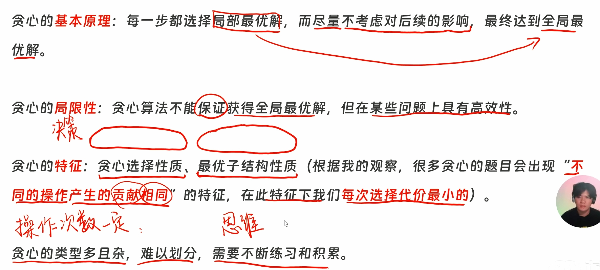

---
title:
tags:
related: []
data: 2026-03-10T11:54:00
---
# 遇到 累乘或加，特别是要 mod， 开 ll 防溢出(**数组**也要)

### 🎯 概念
> 

### ✍️ 例题代码
题目：

>
>

```cpp
#include <bits/stdc++.h>

using namespace std;

const int N = 1e5+9;

int a[N];

  

int main()

{

  int n;cin >> n;

  for(int i = 1;i <= n;++i) cin >> a[i];

  sort(a+1,a+1+n);

  int ans = a[2] - a[1];

  for(int i = 1;i < n;++i) ans = min(ans,a[i+1]-a[i]); //访问到i+1了，记得不取等。

  cout << ans << '\n';

  return 0;

}
```

题目：

>

```cpp
#include <bits/stdc++.h>

using namespace std;

using ll = long long;

priority_queue<ll,vector<ll>,greater<ll>> pq;

int main()

{

 int n;cin >> n;

 for(int i = 1;i <= n;++i)

 {

   ll x;cin >> x;

   pq.push(x);

 }

ll ans = 0;

 while(pq.size() > 1)

 {

   ll x = pq.top();pq.pop();

   ll y = pq.top();pq.pop();

   pq.push(x+y); 

   ans += x + y;

  

 }

  cout << ans << '\n';

  return 0;

}
```

题目：
>

```cpp
#include <bits/stdc++.h>

using namespace std;

const int N = 1e7+9;

int a[N];

int main()

{

  int w;cin >> w;

  int n;cin >> n;

  for(int i = 1;i <= n;++i)

  {

    cin >> a[i];

  }

  sort(a+1,a+1+n);

  int l = 1,r = n,ans = 0;

  while(l <= r)

  {

    if(l == r)

    {

      ans++;

      break;

    }

    if(a[l] + a[r] <= w) l++,r--,ans++;

    else r--,ans++;

  }

  cout << ans << '\n';

  return 0;

}
```


题目：


```cpp
#include <bits/stdc++.h>

using namespace std;

const int N = 1e7+9;

char s[N]; 

int main()

{

  int n,x;cin >> n >> x;

  cin >> s+1;

  sort(s+1,s+1+n);

  

  if(s[1] == s[n])

  {

    for(int i = 1;i <= n/x + (n%x ? 1 : 0); ++i) cout << s[i];

  }

  else if (s[1] == s[x]) 

  {

    for(int i = x;i <= n; ++i) cout << s[i]; 

  }

  else cout << s[x];

  return 0;

}
```

## 贪心模型：对称差值(n代表总数)

### 🎯 触发雷达

1. **目标**：把数组变成“回文”（左半边和右半边一模一样，即 $a_i = a_{n-i+1}$）。**(n代表总数 也可能是2n)**
    
2. 可以的操作：可以改 1 个数（单买），也可以**同时改相邻的 2 个数**（买一送一）。
    
3. **所求**：最少的操作次数。
    


---

### 为什么只看左半边？

回文是镜像对称的，左边拉长，右边就相当于缩短。我们只需要死死盯住**左半边（1 到 n/2）**。

我们建一个“左右差距数组”：

👉 **`diff[i] = a[i] - a[n-i+1]` （左边的 减去 右边对称的数）**

题目的目标：**用最少的步数，把 `diff` 里的数字全部变成 0！**

---

### 🎬 代码操作 和 原数组的真实变化

**📌 初始**

原数组：`a = [6, 4, 1, 2]` （共 4 个萝卜）。

只看左半段（第 1 和第 2 个坑），初始化：

- 第 1 坑：`diff[1] = 6 - 2 = 4`
    
- 第 2 坑：`diff[2] = 4 - 1 = 3`
    
    当前账本：**`diff = [4, 3]`**
    

我们要从左到右，把这个账本清零：

#### ⚡ 动作一：触发“买一送一”（相邻修改组合技）

我们在账本上看到，第 1 坑差 4，第 2 坑差 3。它们都需要做减法（同为正数）。

- **💻 代码指令**：
    

    ```C++
    int share = min(diff[1], diff[2]); // share = 3 
    ans += 3;       
    diff[1] -= 3;   
    diff[2] -= 3;   
    ```
    
- **🌍 原数组变化**：
    
    代码在减了 3，对应的物理动作是：**你跑进地里，把 `a[1]` 和 `a[2]` 两个萝卜同时砍掉了 3 ！**
    
    原数组从 `[6, 4, 1, 2]`
    
    变成了 👉 `[6-3, 4-3, 1, 2]` = **`[3, 1, 1, 2]`**！
    
    _(验算：此时左边是 `3, 1`，右边是 `2, 1`。第 2 个坑的 `1` 和右边的 `1` 已经对齐了！`diff[2]=0` 诚不欺我！)_
    

#### ⚡ 动作二 单点修改
变成了 `diff = [1, 0]`。第 1 个坑还残留了 `1` 的差距。右边已经是 0 了

- **💻 代码指令**：

    ```C++
    ans += diff[1]; // ans += 1 （老老实实付全款）
    diff[1] = 0;    // 账本强行清零
    ```
    
- **🌍 原数组物理形变（真相）**：
    
    对应的是：**你单独把 `a[1]` 这个萝卜又砍掉了 1 ！**
    
    原数组从 `[3, 1, 1, 2]`
    
    变成了 👉 `[3-1, 1, 1, 2]` = **`[2, 1, 1, 2]`**！
    
    _(验算：左边 `2, 1`，右边 `2, 1`。全剧终！数组完美变成回文！)_
    

总共花了`ans = 3 + 1 = 4` 次操作。
### 模板：

```cpp
#include <bits/stdc++.h>
using namespace std;

// 1. 万物乘积超 21 亿，必须开 long long 保平安！
// 极端情况下，每个坑 200万差距，5万个坑全不靠边，总和千亿级别，int 必死。
using ll = long long; 

const int N = 100005;
int a[N];
int diff_arr[N]; //对称差值数组

int main()
{
    
    ios::sync_with_stdio(0); cin.tie(0); cout.tie(0);
    
    int n;
    if(cin >> n)
    {
        // 从 1 开始录入
        for(int i = 1; i <= n; ++i) cin >> a[i]; 
        
        int m = n / 2; // 回文只看左半边即可
        
        // 4. 建立对称差值数组（左边减右边）
        for(int i = 1; i <= m; ++i)
        {
            diff_arr[i] = a[i] - a[n - i + 1];
        }
        
        ll ans = 0; // 记录（操作次数）
        
        // 5. 从左到右扫
        for(int i = 1; i <= m; ++i)
        {
            // ============ 情况 A：需要做减法的（正数） ============
            if(diff_arr[i] > 0) 
            {
                // ：右边也是正数？
                if(i < m && diff_arr[i+1] > 0)
                {
                    // 白嫖的次数，取决于谁的余额少
                    int share = min(diff_arr[i], diff_arr[i+1]);
                    ans += share; // 先把打折的钱付了
                    
                    // 真实形变同步：原数组 a[i] 和 a[i+1] 同时变小
                    diff_arr[i] -= share;
                    diff_arr[i+1] -= share;
                }
                
                // ⚠️ 极其致命：这里绝对不能写 else！
                // 不管上面有没有白嫖，只要现在还有残留，就得全款单买补齐！
                ans += diff_arr[i]; 
                
                // 物理形变：原数组 a[i] 单独变小，与右边彻底对称！
                diff_arr[i] = 0; 
            }
            
            // ============ 情况 B：需要做加法的（负数） ============
            else if(diff_arr[i] < 0)
            {
                // 【安检门】：右边兄弟也是负数？触发买一送一！
                if(i < m && diff_arr[i+1] < 0)
                {
                    // 负数比大小必须加负号，计算绝对值的 min
                    int share = min(-diff_arr[i], -diff_arr[i+1]);
                    ans += share; // 付钱
                    
                    // 物理形变：原数组 a[i] 和 a[i+1] 同时变大！（向 0 靠拢）
                    diff_arr[i] += share; 
                    diff_arr[i+1] += share;
                }
                
                // 物理形变：原数组 a[i] 单独变大，与右边彻底对称！
                ans += -diff_arr[i]; // 残留尾款
                diff_arr[i] = 0; 
            }
        }
        
        cout << ans << '\n';
    }
    
    return 0;
}
```

## 贪心匹配

### 🎯 概念

这题的本质是：**为了让目标 $T$ 的前缀尽可能长地出现在大背景 $S$ 里，一旦在 $S$ 中看到了 $T$ 当前需要的那个字符，就必须立刻配对

- **贪心证明（早匹配最优）**：如果你不选当前的 $S[i]$ 匹配 $T[j]$，想等后面再匹配，这绝不会让结果变好。

### 何时用这模板）
1. **关键词**：“子序列包含”、“匹配进度”。（注意：子序列可以不连续，只要保持先后顺序即可）。
2. **场景特征**：给两个字符串/数组，一个负责当长长的“主战场”，另一个负责当你要按顺序寻找的“目标清单”。

### 💡 核心心法与防爆零指南
- **快指针 `i`**：遍历主字符串 S 的进度条。必须放在 `for` 循环里，一路向右扫，绝不回头。
- **慢指针 `j`**：当前在目标字符串 T 里的进度。只有“牵手成功”时才 `j++`，否则原地死等。
- **致命安检门**：在做 `s[i] == t[j]` 的判断前，一定要加上 `j <= m`（目标清单还没找完），防止越界查到乱码。

### 模板

```cpp
#include <bits/stdc++.h>
using namespace std;

int main()
{
	
	ios::sync_with_stdio(0); cin.tie(0); cout.tie(0);
	
	string s, t;
	if (cin >> s >> t)
	{
		// 2. 万物从 1 开始（绝对的防越界信仰）
		s = " " + s;
		t = " " + t;
		
		int n = s.size() - 1;
		int m = t.size() - 1;
		
		int j = 1; // 慢指针：目标 T 的匹配进度（目前正急需第 1 个字符）
		int ans = 0; // 成功匹配的字符数量
		
		// 3. 快指针 i 像无情的流水线一样，从左到右扫荡 S
		for (int i = 1; i <= n; ++i)
		{
			// 【安检门】：目标还没找完 (j <= m) 且 当前流水线上的物品 s[i] 正是我们要的 t[j]！
			if (j <= m && s[i] == t[j])
			{
				ans++; // 牵手成功，答案 +1
				j++;   // T 的进度推进一步，准备查收下一个目标
			}
		}
		
		// 4. 成功出口：扫荡完毕，输出战果
		cout << ans << '\n';
	}
	
	return 0;
}
```


---

# 一、 切蛋糕原理（交替序列的区块划分模型）

**1. 核心定义**
在一个由两种元素（如 $L$ 和 $Q$）组成的交替序列中，如果要求相邻元素发生 $C$ 次“变化”（即不同元素交替 $C$ 次），就等同于在这个序列上“切了 $C$ 刀”。
**数学结论**：$C$ 次变化，必然会将序列精确划分为 **$C + 1$ 个连续的纯色区块**。

**2. 变量定义**

* $C$：目标变化次数。
* $l\_req$：序列中 $L$ 元素的区块总数。
* $q\_req$：序列中 $Q$ 元素的区块总数。

**3. 规律推导（基于奇偶性）**
区块的分配完全取决于序列的**首个区块元素**以及 **$C$ 的奇偶性**。假设序列以 $L$ 区块开头，总区块数为 $C+1$：

* **当 $C$ 为偶数时（例如 $C=2$，共 3 块）**：
排列必定是 `[L] -> [Q] -> [L]`。
此时首尾都是 $L$，因此 $L$ 区块数比 $Q$ 区块数多 $1$。
计算公式：$l\_req = C / 2 + 1$， $q\_req = C / 2$。
* **当 $C$ 为奇数时（例如 $C=3$，共 4 块）**：
排列必定是 `[L] -> [Q] -> [L] -> [Q]`。
此时两种区块数量绝对平分。
计算公式：$l\_req = (C + 1) / 2$， $q\_req = (C + 1) / 2$。

**4. 核心代码实现 (C++11 三目运算符浓缩版)**

```cpp
// 假设已确定序列必须以 'L' 开头
int l_req = (C % 2 == 0) ? (C / 2 + 1) : ((C + 1) / 2);
int q_req = (C % 2 == 0) ? (C / 2) : ((C + 1) / 2);

// 假设已确定序列必须以 'Q' 开头 (数量刚好反转)
int q_req_startQ = (C % 2 == 0) ? (C / 2 + 1) : ((C + 1) / 2);
int l_req_startQ = (C % 2 == 0) ? (C / 2) : ((C + 1) / 2);

```

---

# 二、 多余物资原理（差值归零的贪心分配法）

**1. 核心定义**
在需要将若干同类物资分配到若干个区块中，且要求**每个区块至少分配 1 个（保底）**，同时为了满足“字典序最小”或“极值最大化”，需要**将所有多余的物资全部集中分配给第 1 个区块**。

此原理通过一行数学公式，巧妙避免了使用 `if (是否为第一块)` 的条件判断，实现了全自动的“首块通吃，后续拿低保”逻辑。

**2. 变量定义**

* `rem_a`：当前手里**剩余的**物资总数。
* `lk`：当前**还需要填充的**区块总数。
* `count`：当前正在处理的这个区块**应该分配的**物资数量。

**3. 数学公式与物理推演**

> **分配公式：`count = rem_a - lk + 1**`
> *解析：(剩余总物资 - 剩余总区块数) 代表“多余物资”，`+1` 代表本区块的“基础保底”。*

* **第 1 次分配（触发贪心，榨干多余物资）**：
计算出 `count` 后，程序一次性将所有“多余物资 + 1个保底”全部分给第 1 块。
分配完成后执行状态更新：`rem_a -= count` 且 `lk--`。
**数学突变**：由于多余物资被瞬间抽干，更新后的 `rem_a` 将**严格等于** `lk`。
* **后续分配（差值归零，锁定低保）**：
在此后的每一次循环中，由于 `rem_a == lk` 永远成立，公式 `rem_a - lk` 的结果永远为 $0$。
因此，后续所有区块的计算结果永远是 `0 + 1 = 1`。

**4. 核心代码实现**

```cpp
// 假设我们要填充的所有区块总数为 blocks_total
int rem_a = 初始总物资数量;
int lk = 该类物资的区块总数; 

for (int i = 0; i < blocks_total; ++i) {
    if (当前该填 L 块) {
        // 核心公式：自动计算当前块该放几个物资
        int count = rem_a - lk + 1; 
        
        // 执行分配操作 (以输出字符串为例)
        cout << string(count, 'L'); 
        
        // 状态更新：扣除已分配物资与区块配额
        rem_a -= count;
        lk--;
    }
}

```

# P8739 [蓝桥杯 2020 国 C] 重复字符串

## 题目描述

如果一个字符串 $S$ 恰好可以由某个字符串重复 $K$ 次得到，我们就称 $S$ 是 $K$ 次重复字符串。例如 `abcabcabc` 可以看作是 `abc` 重复 $3$ 次得到，所以 `abcabcabc` 是 $3$ 次重复字符串。

同理 `aaaaaa` 既是 $2$ 次重复字符串、又是 $3$ 次重复字符串和 $6$ 次重复字符串。

现在给定一个字符串 $S$，请你计算最少要修改其中几个字符，可以使 $S$ 变为一个 $K$ 次字符串？

## 输入格式

输入第一行包含一个整数 $K$。

第二行包含一个只含小写字母的字符串 $S$。

## 输出格式

输出一个整数代表答案。如果 $S$ 无法修改成 $K$ 次重复字符串，输出 $−1$。

## 输入输出样例 #1

### 输入 #1

```
2
aabbaa
```

### 输出 #1

```
2
```

## 说明/提示

其中，$1 \le K \le 10^5$，$1 \le |S| \le 10^5$。其中 $|S|$ 表示 $S$ 的 长度。

蓝桥杯 2020 年国赛 C 组 G 题。
```cpp
#include <bits/stdc++.h>
using namespace std;
using ll = long long;

int ans;

int main()
{
	ios::sync_with_stdio(0);cin.tie(0);cout.tie(0);
	int k;cin >> k;
	string s;cin >> s;
	s = " "+ s;
	int n = s.size()-1;
	int len = n / k;//分段 
	if(n % k != 0) 
	{
		cout << -1 <<'\n';
		return 0;
	}
	
	for(int i = 1;i <= len;++i)//每段第一个 相 
	{
		int bkt[300] = {0};//贪心：找到每一列出现最多的次数；然后 减去它 就是 最小修改；
		// 注意bkt 是统计每一列 所以在外循环里面； 
		int p = 0;
		for(int j = i;j <= n;j+=len) //等差 遍历 起点为 i,配合外循环 当于一列一列 ；
		{							// abb
									// abb 
			bkt[s[j]]++;
			p = max(p,bkt[s[j]]);
			
		}
		ans += (k - p); //每一列的修改次数 = 每一列字母数（总份数） - 每一列所以在里面 
		
	}
	cout << ans <<'\n';
	

	return 0;
}
```

# P10902 [蓝桥杯 2024 省 C] 回文数组

## 题目描述

小蓝在无聊时随机生成了一个长度为 $n$ 的整数数组，数组中的第 $i$ 个数为 $a_i$，他觉得随机生成的数组不太美观，想把它变成回文数组，也是就对于任意 $i\in [1,n]$ 满足 $a_i=a_{n-i+1}$。小蓝一次操作可以指定相邻的两个数，将它们一起加 $1$ 或减 $1$；也可以只指定一个数加 $1$ 或减 $1$，请问他最少需要操作多少次能把这个数组变成回文数组？

## 输入格式

输入的第一行包含一个正整数 $n$。

第二行包含 $n$ 个整数 $a_1, a_2,\cdots, a_n$，相邻整数之间使用一个空格分隔。

## 输出格式

输出一行包含一个整数表示答案。

## 输入输出样例 #1

### 输入 #1

```
4
1 2 3 4
```

### 输出 #1

```
3
```

## 说明/提示

**【样例说明】**

第一次操作将 $a_1, a_2$ 加 $1$，变为 $2, 3, 3, 4$；

后面两次操作将 $a_1$ 加 $1$，变为 $4,3,3,4$。

**【评测用例规模与约定】**

对于 $20\%$ 的评测用例，$1 \le n \le 10$；  
对于所有评测用例，$1 \le n \le 10^5$，$-10^6 \le a_i \le 10^6$。

```cpp
#include <bits/stdc++.h>
using namespace std;

using ll = long long;
ll n;
int a[1000000];
int d[1000000]; 
ll ans;

int main()
{
	ios::sync_with_stdio(0);cin.tie(0);cout.tie(0);
	cin >> n;
	for(int i = 1;i <= n;++i)
	{
		cin >> a[i];
	}
	int m = n / 2;
	for(int i = 1;i <= m;++i)
	{
		d[i] = a[i] - a[n-i+1];
	}
	for(int i = 1;i <= m;++i)
	{
		ll cost = 0;
		if(d[i] > 0 )
		{
			if(i < m && d[i+1] > 0)
			{
				cost = min(d[i],d[i+1]);
				ans += cost;
				d[i] -= cost;
				d[i+1] -= cost;
			}
			ans += d[i];
			d[i] == 0;
		}
		else if(d[i] < 0 )
		{
			if(i < m && d[i+1] < 0)
			{
				cost = min(-d[i],-d[i+1]);
				ans += cost;
				d[i] += cost;
				d[i+1] += cost;
			}
			ans += -d[i];
			d[i] == 0;
		}
		
	}
	
	
		cout << ans <<'\n';
	
	return 0;
}
```

# P10910 [蓝桥杯 2024 国 B] 最小字符串

## 题目描述

给定一个长度为 $N$ 且只包含小写字母的字符串 $S$，和 $M$ 个小写字母 $c_1, c_2, \cdots, c_M$。现在你要把 $M$ 个小写字母全部插入到字符串 $S$ 中，每个小写字母都可以插入到任意位置。

请问能得到的字典序最小的字符串是什么？

## 输入格式

第一行包含两个整数 $N$ 和 $M$。

第二行包含一个长度为 $N$ 的字符串 $S$。
第三行包含 $M$ 个小写字母 $c_1, c_2, \cdots, c_M$。

## 输出格式

输出一个长度为 $N + M$ 的字符串代表答案。

## 输入输出样例 #1

### 输入 #1

```
4 3
abbc
cba
```

### 输出 #1

```
aabbbcc
```

## 输入输出样例 #2

### 输入 #2

```
7 3
lanqiao
bei
```

### 输出 #2

```
beilanqiao
```

## 说明/提示

**【评测用例规模与约定】**

对于 $20\%$ 的评测用例，$M = 1$。  
对于 $100\%$ 的评测用例，$1 \le N, M \le 10^5$。

```cpp
#include <bits/stdc++.h>
using namespace std;
using ll = long long;


int main()
{
	ios::sync_with_stdio(0);cin.tie(0);cout.tie(0);
	int n,m;cin >> n >> m;
	string s,c;
	cin >> s >> c;
	s = " " + s;c = " " + c;
	sort(c.begin()+1,c.end());// 注意审题 插入是到s所以只有sort可以排序 
	int j = 1,i = 1;
	while(i <= n && j <= m) //双指针 一起对比排 小的就先输出 ，两个边界为条件 
	{
		if(s[i] <= c[j])
		{
			cout << s[i];
			i++;
		}
		else
		{
			cout << c[j];
			j++;
		}
	}
					//总有一个先完事 就直接输出 
	while(i <= n)
	{
		cout << s[i];
			i++;
	}
	while(j <= m)
	{
		cout << c[j];
			j++;
	}
	
	
	cout << '\n';
	
	
	return 0;
}
```

# P12165 [蓝桥杯 2025 省 C/Java A] 最短距离

## 题目描述

在一条一维的直线上，存在着 $n$ 台显示器和 $n$ 个电源插座。老师给小蓝布置了个任务：负责将每台显示器通过电源线与一个插座相连接（每个插座最多只能给一台显示器供电）；同时，老师希望所消耗的电源线的长度尽可能的少，请你帮小蓝计算下电源线的最小消耗长度为多少？

为了便于计算，你只需要考虑直线距离即可。


## 输入格式

输入的第一行包含一个正整数 $n$。

接下来 $n$ 行，每行包含一个整数 $x_i$，依次表示每台显示器的坐标。

接下来 $n$ 行，每行包含一个整数 $y_i$，依次表示每个插座的坐标。

## 输出格式

输出一行包含一个整数表示答案。

## 输入输出样例 #1

### 输入 #1

```
2
0
1
2
3
```

### 输出 #1

```
4
```

## 说明/提示

### 评测用例规模与约定

- 对于 $20\%$ 的评测用例，$1 \leq n \leq 10$，$0 \leq x_i, y_i \leq 100$；
- 对于 $40\%$ 的评测用例，$1 \leq n \leq 100$，$0 \leq x_i, y_i \leq 10^3$；
- 对于 $60\%$ 的评测用例，$1 \leq n \leq 1000$，$0 \leq x_i, y_i \leq 10^5$；
- 对于 $80\%$ 的评测用例，$1 \leq n \leq 10000$，$0 \leq x_i, y_i \leq 10^9$；
- 对于所有评测用例，$1 \leq n \leq 50000$，$0 \leq x_i, y_i \leq 10^9$。

```cpp
#include <bits/stdc++.h>
using namespace std;
using ll = long long;
const int N = 50009;
ll a[N],b[N];

int main()
{
	ios::sync_with_stdio(0);cin.tie(0);cout.tie(0);
	int n;cin >> n;
	for(int i = 1;i <= n;++i)
	{
		cin >> a[i];
	 } 
	 for(int i = 1;i <= n;++i)
	{
		cin >> b[i];
	 } 
	 sort(a+1,a+n+1);
	 sort(b+1,b+n+1);
	 ll ans = 0;
	 for(int i = 1;i <= n;++i)
	 {
	 	ans += abs(a[i] - b[i]);
	 }
	
	cout << ans <<'\n';
	return 0;
}
```

# P12173 [蓝桥杯 2025 省 Python B] 最多次数

## 题目描述

小蓝有一个字符串 $s$，他特别喜欢由以下三个字符组成的单词：$\tt {l}, \tt{q}, \tt{b}$，任意顺序都可以，一共有 $6$ 种可能：$\tt{lqb}$、$\tt{lbq}$、$\tt{qlb}$、$\tt{qbl}$、$\tt{blq}$、$\tt{bql}$。

现在他想从 $s$ 中，尽可能切割出多个他喜欢的单词，请问最多能切割出多少个？单词指的是由若干个连续的字符组成的子字符串。

## 输入格式

输入一行包含一个字符串 $s$。

## 输出格式

输出一行包含一个整数表示答案。

## 输入输出样例 #1

### 输入 #1

```
lqbblqblqlxqb
```

### 输出 #1

```
3
```

## 说明/提示

### 评测用例规模与约定

- 对于 $20\%$ 的评测用例，$1 \leq |s| \leq 10$；
- 对于 $40\%$ 的评测用例，$1 \leq |s| \leq 20$；
- 对于 $60\%$ 的评测用例，$1 \leq |s| \leq 100$；
- 对于 $70\%$ 的评测用例，$1 \leq |s| \leq 10^3$；
- 对于 $80\%$ 的评测用例，$1 \leq |s| \leq 10^4$；
- 对于所有评测用例，$1 \leq |s| \leq 10^5$，$s$ 中只包含小写字母。

```cpp
#include <bits/stdc++.h>
using namespace std;
using ll = long long;


int main()
{
	ios::sync_with_stdio(0);cin.tie(0);cout.tie(0);
	string s;
	cin >> s;
	s = " "+s;
	int n = s.size()-1;
	ll ans = 0;
	int i = 1;
	while(i <= n-2)//边界注意 要保证最后有三个 
	{
		ll bkt[100000+9] = {0};
		bkt[s[i]]++;
		bkt[s[i+1]]++;
		bkt[s[i+2]]++; //读的是 字符串字符出现频率 ； 
		if(bkt['l'] == 1 && bkt['q'] == 1 && bkt['b'] == 1)
		{
			ans++;
			i+=3;
		}
		else
		{
			i++;
		}
		
		
	}
	cout << ans <<'\n';
	
	return 0;
}
```

# P12218 [蓝桥杯 2023 国 Java B] 玩具

## 题目描述

小明的妈妈给他买了 $n$ 个玩具，但是为了同时考察他的智力，只给了他 $2 \times n$ 个零件，第 $i$ 个零件的重量为 $w_i$（$1 \leq i \leq 2 \times n$）。

其中任意两个零件都可以拼接成一个玩具，这个玩具的权重就等于拼接所用的 **两个零件的重量的乘积**。小明的妈妈希望小明能够使用这 $2 \times n$ 个零件拼接出 $n$ 个玩具（每个零件必须使用且只能用一次），使得所有玩具的权重的和最小。小明希望你帮帮他计算出最小的权重和。

## 输入格式

输入共 $2$ 行。

第一行为一个正整数 $n$。

第二行为 $2 \times n$ 个由空格隔开的整数 $w_1, w_2, \ldots, w_{2 \times n}$。

## 输出格式

输出共 $1$ 行，一个整数。

## 输入输出样例 #1

### 输入 #1

```
2
2 2 3 4
```

### 输出 #1

```
14
```

## 说明/提示

### 样例说明

由于有两个零件的重量都为 $2$，所以一共有两种结果:
- $(2 \times 2) + (3 \times 4) = 16$;
- $(2 \times 3) + (2 \times 4) = 14$。

### 评测用例规模与约定

- 对于 $20\%$ 的数据，保证 $n \leq 10^3$。
- 对于 $100\%$ 的数据，保证 $n \leq 10^5$，$0 \leq w_i \leq 10^5$。

```cpp
#include <bits/stdc++.h>
using namespace std;
using ll = long long;

ll a[200018]; // ans 是 它弄出来的 临时装的时候还是取决于 a前面的类型 
ll ans;
int main()
{
	
	ios::sync_with_stdio(0);cin.tie(0);cout.tie(0);
	int n;cin >> n;
	ll tol_n = 2*n;  
	for(int i = 1;i <= tol_n;++i)
	{
		cin >> a[i];
	}
	sort(a+1,a+tol_n+1); //注意总数  总数 
	for(int i = 1;i <= tol_n / 2;++i) // 对称之前 先排序  问先问自己 要不要排序 
	{
		ans += a[i] * a[tol_n - i+1];
	}
	cout << ans <<'\n';
	
	return 0;
}
```

# P12268 [蓝桥杯 2024 国 Python B] 球衣号码

## 题目描述

在篮球之都，有一支传奇的篮球队，名为“坤之队”。这支球队由 $n$ 位才华横溢的球员组成，编号分别为 $1, 2, \ldots, n$。

今年，坤之队共参加了 $m$ 场激烈的比赛。在每场比赛前，坤之队的教练阿坤都会举行一个出征仪式。他会指定其中一名球员为队长，并将其球衣的号码设为 $0$。同时，为了保持队员之间的秩序和团结，教练还会对其他球员的球衣号码进行调整。具体来说，站在队长右边的每个球员的球衣号码将比他左边球员的球衣号码大 $1$，而站在队长左边的每个球员的球衣号码将比他右边球员的球衣号码大 $1$。球队中可能会有相同的球衣号码。

举个例子，假设坤之队有 $n = 5$ 名球员，阿坤在一场比赛前指定编号为 $3$ 的球员为队长，那么球员们球衣的号码就会变为 $[2, 1, 0, 1, 2]$。

经过 $m$ 轮比赛的激烈角逐后，阿坤希望你能帮助他确定，每个球员所拥有过的最大球衣号码是多少。

## 输入格式

输入的第一行包含两个正整数 $n$ 和 $m$，用一个空格分隔，分别表示球员数量和比赛场次数。

第二行包含 $m$ 个整数 $p_1, p_2, \ldots, p_m$，表示每场比赛前被指定为队长的球员的编号。

## 输出格式

输出一行包含 $n$ 个整数，相邻整数之间使用一个空格分隔，依次表示每个球员所拥有过的最大球衣编号。

## 输入输出样例 #1

### 输入 #1

```
6 2
1 3
```

### 输出 #1

```
2 1 2 3 4 5
```

## 说明/提示

### 样例说明

- 在第一场比赛的出征仪式中，阿坤指定了编号为 1 的球员为队长。此时球员们的球衣号码为：
$$[0,1,2,3,4,5]$$
- 在第二场比赛的出征仪式中，阿坤指定了编号为 3 的球员为队长。此时球员们的球衣号码为：
$$[2,1,0,1,2,3]$$
- 因此，每个球员所拥有过的最大球衣号码为：
$$[2,1,2,3,4,5]$$

### 评测用例规模与约定

- 对于 $20\%$ 的评测用例，$1 \leq m \leq n \leq 100$，$1 \leq p_i \leq n$，$p_1, p_2, \ldots, p_m$ 各不相同。
- 对于 $50\%$ 的评测用例，$1 \leq m \leq n \leq 10^3$，$1 \leq p_i \leq n$，$p_1, p_2, \ldots, p_m$ 各不相同。
- 对于所有评测用例，$1 \leq m \leq n \leq 10^5$，$1 \leq p_i \leq n$，$p_1, p_2, \ldots, p_m$ 各不相同。

```cpp
#include <bits/stdc++.h>
using namespace std;
using ll = long long;
int h;
const int N = 1e5+9;
int a[N];

int main()
{
	ios::sync_with_stdio(0);cin.tie(0);cout.tie(0);
	int n,m;cin >> n >> m;
	for(int i = 1; i <= m;++i) cin >> a[i];
	for(int i = 1;i <= n;++i)
	{    int maxh = 0; //在哪输出 在哪定义；
		for(int j = 1;j <=m;++j)
		{
			h = abs(i - a[j]);
			
			maxh = max(h,maxh);
		}
		
		cout << maxh <<" \n"[i==n];//作用完了结算 ：比完了结算 ；
	}
	
	
	return 0;
}
```

优化：
```cpp
#include <bits/stdc++.h>
using namespace std;
using ll = long long;
int h;
const int N = 1e5+9;
int a[N];

int main()
{
	ios::sync_with_stdio(0);cin.tie(0);cout.tie(0);
	int n,m;cin >> n >> m;
	int max_p = 0;
	int min_p = 1e6+9;//找极值 初始要设的极大 或者极小； 
	for(int i = 1; i <= m;++i) 
	{
		cin >> a[i];
		max_p = max(a[i],max_p);
		min_p = min(a[i],min_p);
	}
	for(int i = 1;i <= n;++i)
	{    
	
		
			int h1 = abs(i - max_p);
			int h2 = abs(i - min_p);
			

		
		
		cout << max(h1,h2) <<" \n"[i==n]; //作用完了结算 ：比完了结算 ； 
	}
	
	
	return 0;
}
```


# P12342 [蓝桥杯 2025 省 B/Python B 第二场] 数列差分

## 题目描述

小蓝有两个长度均为 $n$ 的数列 $A=\{a_1, a_2, \cdots, a_n\}$ 和 $B=\{b_1, b_2, \cdots, b_n\}$，将两个数列作差定义为 $C=A-B=\{c_1=a_1-b_1, c_2=a_2-b_2, \cdots, c_n=a_n-b_n\}$。小蓝将对数列 $B$ 进行若干次操作，每次操作可以将数列 $B$ 中的任意一个数更改为任意一个整数。在进行完所有操作后，小蓝可以按任意顺序将数列 $B$ 重排，之后再计算数列 $C$。小蓝想知道，最少操作多少次可以使得数列 $C$ 中的所有数都为正整数。

## 输入格式

输入的第一行包含一个正整数 $n$；

第二行包含 $n$ 个整数 $a_1, a_2, \cdots, a_n$，相邻整数之间使用一个空格分隔。

第三行包含 $n$ 个整数 $b_1, b_2, \cdots, b_n$，相邻整数之间使用一个空格分隔。

## 输出格式

输出一行包含一个整数表示答案。

## 输入输出样例 #1

### 输入 #1

```
4
22 31 12 14
3 19 27 44
```

### 输出 #1

```
1
```

## 说明/提示

### 样例说明

其中一种方案：将 $44$ 改为 $0$，重新排列 $B$ 为 $\{19, 27, 3, 0\}$，使得数列 $C=\{3, 4, 9, 14\}$ 均为正整数。

### 评测用例规模与约定

- 对于 $30\%$ 的评测用例，$n \leq 10$；
- 对于所有评测用例，$1 \leq n \leq 10^5$，$-10^9 \leq a_i \leq 10^9$，$-10^9 \leq b_i \leq 10^9$。

```cpp
#include <bits/stdc++.h>
using namespace std;
using ll = long long;
int n;
const int N = 1e5+9;
bool st[N];
ll ans = 1e5+9;//是最小的时候 定最大一些； 
ll a[N],b[N];

int main()
{
	ios::sync_with_stdio(0);cin.tie(0);cout.tie(0);
	cin >> n;
	for(int i = 1;i <=n; ++i) cin >> a[i];
	for(int i = 1;i <=n; ++i) cin >> b[i];
	sort(a+1,a+1+n); 
	sort(b+1,b+1+n); 
	
	int i = 1,j = 1;
	ll sz = 0;
	while(i <= n && j <= n)
	{
		if(a[i] <= b[j])//题目是 a > b成功
		{
			sz++;
			i++;// 这个a比最小的b都小，那只能花费一次操作去改一个最小的b 随后保留b继续试探其他的a,看看这种无可救药的还有多少； 
		}       //所以匹配失败 只有i动； 
		else 
		{
			i++;
			j++;
		}
	}

	cout << sz <<'\n';
	return 0;
}
```


# P12341 [蓝桥杯 2025 省 A/Python B 第二场] 消消乐

## 题目描述

小蓝正在玩一个叫“一维消消乐”的游戏。游戏初始时给出一个长度为 $n$ 的字符串 $S = S_0S_1\ldots S_{n-1}$，字符串只包含字符 $\text{A}$ 和 $\text{B}$。小蓝可以对这个字符串进行若干次操作，每次操作可以选择两个下标 $i, j \in [0, n-1]$，如果 $i < j$ 且 $S_i = \text{A}$ 且 $S_j = \text{B}$，小蓝就可以把它们同时消掉。小蓝想知道在经过若干次操作后，直到无法对字符串继续进行操作时，字符串最多剩下多少个字符。

## 输入格式

输入一行包含一个长度为 $n$ 的字符串 $S$。

## 输出格式

输出一行包含一个整数表示答案。

## 输入输出样例 #1

### 输入 #1

```
BABAABBA
```

### 输出 #1

```
4
```

## 说明/提示

### 样例说明

先消掉 $(S_1, S_6)$，再消掉 $(S_4, S_5)$，此时剩下 $\text{BBAA}$，无法继续进行操作。

### 评测用例规模与约定

- 对于 $10\%$ 的评测用例，$1 \leq n \leq 20$；
- 对于 $20\%$ 的评测用例，$1 \leq n \leq 100$；
- 对于 $50\%$ 的评测用例，$1 \leq n \leq 10000$；
- 对于所有评测用例，$1 \leq n \leq 10^6$。
```cpp
#include <bits/stdc++.h>
using namespace std;
using ll = long long;
const int N = 1e6+9;
ll cnt[N];

int main()
{
	ios::sync_with_stdio(0);cin.tie(0);cout.tie(0);
	string s;cin >> s;
	s = " "+s;
	int n = s.size()-1;
	for(int i = 1;i <= n;++i)
	{
		if(s[i] == 'B')
		{
			cnt['B']++;//统计全场总共有多少个 B
		}
	 } 
	
	 for(int i =1 ;i <= cnt['B'];++i) //切割点就是B的总数 
	 {
	 	if(s[i] == 'A')
		{
			cnt['A']++;//统计左边A的数量 也是要消去的一半 
			
		}
		
	 }
	
	cout << n - 2*cnt['A'] <<'\n' ;
	return 0;
}
```

# P12344 [蓝桥杯 2025 省 B/Python B 第二场] 破解信息

## 题目描述

在遥远的未来，星际旅行已经成为常态。宇航员小蓝在一次探险任务中，意外发现了一个古老的太空遗迹。遗迹中存放着一个数据存储器，里面记录着一段加密的信息。经过初步分析，小蓝发现这段信息可以被表示为一个字符串 $S$，而解密的关键，在于找出 $S$ 中字典序最大的回文子序列。

- **子序列**：指从原字符串中抽取若干个字符（可以不连续），按照它们在原字符串中的相对顺序排列所形成的新序列。例如，对于字符串 `abc`，其子序列包括 `a`、`b`、`c`、`ab`、`ac`、`bc` 和 `abc`。
- **字典序**：指字符串按照字典中的排序规则比较大小的方式。对于两个字符串，从左到右逐字符比较，先出现较大字符的字符串字典序更大；若比较到某个字符串结束仍未找到不同的字符，则较短的字符串字典序较小。例如，`abc` < `abd`，而 `ab` < `abc`。

现在，请你从字符串 $S$ 中，找出字典序最大的回文子序列，帮助小蓝解开这段来自星际文明的信息。

## 输入格式

输入一行包含一个字符串 $S$，表示加密的信息。

## 输出格式

输出一行包含一个字符串，表示 $S$ 中字典序最大的回文子序列。

## 输入输出样例 #1

### 输入 #1

```
abcd
```

### 输出 #1

```
d
```

## 输入输出样例 #2

### 输入 #2

```
abab
```

### 输出 #2

```
bb
```

## 说明/提示

### 评测用例规模与约定

- 对于 $30\%$ 的评测用例，$1 \leq |S| \leq 300$，其中 $|S|$ 表示字符串 $S$ 的长度；
- 对于所有评测用例，$1 \leq |S| \leq 10^5$，$S$ 中只包含小写英文字母。
## 思路

在“字典序（查字典的顺序）”规则里，长度根本不重要，**排在前面的字母大，才是真的大！**

我们拿样例 2 `abab` 来做个残酷的对比。 你能找出的回文子序列有：`a`, `b`, `aba`, `bab`, `bb`。 我们把 `bab` 和 `bb` 放在一起，按字典序比大小：

- 第 1 个字母：`b` 和 `b` 打平。
    
- 第 2 个字母：`bab` 的第 2 个字母是 `a`，而 `bb` 的第 2 个字母是 `b`。
    
- 结果：因为 `b` > `a`，所以 **`bb` > `bab`**！
    

你看！哪怕 `bab` 有 3 个字母，`bb` 只有 2 个字母，但因为 `bb` 在第二个位置用的是更大的字母，它就赢了！


既然字典序比的是“谁在最前面放了最大的字母”，那我们怎么才能赢到最后？ **把全场最大的那个字母挑出来，它出现过几次，我们就把它连在一起写几次！**

假设你的字符串里有几个 `z`。

- 你选 `z`，好。
    
- 你选 `zz`，更好！(`zz` > `z`)
    
- 如果你手贱，在中间夹了一个别的字母，比如 `zaz`。对不起，第二位 `a` 绝对打不过 `z`，瞬间变成 `zz` > `zaz`。
    

并且最绝的是：**由同一个字母组成的字符串（比如 `zzzzz`），它天生就是回文串！正着念反着念一模一样！**

（三步走）

1. 找出整个字符串里**最大（最靠后）的英文字母**。
    
2. 数一数这个最大的字母在字符串里**总共出现了几次**。
    
3. 把这个字母**重复打印这么多次**，就是全宇宙字典序最大的回文子序列！


```cpp
#include <bits/stdc++.h>
using namespace std;
using ll = long long;
int bkt[300];


int main()
{
	ios::sync_with_stdio(0);cin.tie(0);cout.tie(0);
	string s;cin >> s;
	s = " "+ s;
	int n = s.size()-1;
	char ch = 'a';
	for(int i = 1; i <= n;++i)
	{
		
		if(s[i] > ch) //有新的就取代
		{
			ch = s[i];
			bkt[ch] = 1;//更大的字符重新开始计数
		}
		else if(s[i]==ch) //注意再次出现计数；
		{
			bkt[ch]++;
		}
	 } 
	string ans (bkt[ch],ch); //（数量，字符）初始化新方法；
	cout << ans <<'\n';
	
	
	return 0;
}
```

# P12879 [蓝桥杯 2025 国 C] 打破规则

## 题目描述

蓝桥小镇的钟表铺里，工匠小蓝正在修复一座三针时钟。其中，时针的长度为 $A$，分针的长度为 $B$，秒针的长度为 $C$，均为正整数。制造商为追求独特的设计，设定了以下规则：

- 三根指针的长度互不相同，即 $A \neq B$，$A \neq C$，$B \neq C$；
- 将三根指针的长度从大到小排序后，第二长的指针必须是时针（长度 $A$）或秒针（长度 $C$）。

然而，这些规则会导致指针运行时相互干扰，影响时钟的稳定性。于是，小蓝决定调整指针长度，打破上述规则：要么三根指针的长度不互不相同（存在至少两根指针的长度相同），要么第二长的指针不是 $A$ 或 $C$。他可以执行以下三种操作：

- 将时针的长度 $A$ 减少 1；
- 将分针的长度 $B$ 减少 1；
- 将秒针的长度 $C$ 减少 1。

调整后的指针长度必须为正整数，即 $A, B, C > 0$。

现在，请你帮助小蓝计算，打破制造商规则所需的最小操作次数。

## 输入格式

输入一行包含三个正整数 $A, B, C$，相邻整数之间使用一个空格分隔，分别表示时针、分针和秒针的初始长度。

## 输出格式

输出一行包含一个整数，表示打破制造商规则所需的最小操作次数。

## 输入输出样例 #1

### 输入 #1

```
1 2 3
```

### 输出 #1

```
0
```

## 输入输出样例 #2

### 输入 #2

```
5 9 2
```

### 输出 #2

```
3
```

## 输入输出样例 #3

### 输入 #3

```
5 6 5
```

### 输出 #3

```
0
```

## 说明/提示

**【评测用例规模与约定】**

对于 $50\%$ 的评测用例，$1 \leq A, B, C \leq 100$；

对于所有评测用例，$1 \leq A, B, C \leq 10^5$。

暴力解：
```cpp
#include <bits/stdc++.h>
using namespace std;
using ll = long long;


int main()
{
	ios::sync_with_stdio(0);cin.tie(0);cout.tie(0);
	int a,b,c;cin >> a >> b >> c;//abc是读入的 状态流转的 是 ijk ;
	ll ans = 1e6+9;
	for(int i = 1;i <= a;++i)
	{
		for(int j = 1;j <= b;++j)
		{
			for(int k = 1;k <= c;++k)
			{
				if(i==j || i==k || j==k || (i > j && j > k) || (k > j && j > i))
				{
					ll cz = a-i + b-j + c-k;
					ans = min(ans,cz);
				}
			}
		}
	}
	cout << ans <<'\n';
	
	return 0;
}

```

# P12887 [蓝桥杯 2025 国 Java B] 答题数量

## 题目描述

小蓝从一间空荡的房间中醒来，眼前放着一张木桌，桌上摆放着两份密封的答案纸，一份属于他，另一份属于他的朋友。每张纸上都写着一个长度为 $N$ 的字符串，仅包含字符 $\tt T$ 和 $\tt F$ ——这是他们昨晚参加一场判断题考试后的答题记录。

考试共有 $N$ 道题目，每题的答案只有两种可能：
- $\tt T$ 表示 $\text{True}$（正确）
- $\tt F$ 表示 $\text{False}$（错误）

两人在相互隔离、无法交流的情况下各自完成了作答，并提交了自己的答案。

今早，小蓝收到了一条神秘信息：
> “你的朋友恰好答对了 $M$ 道题。”

标准答案尚未公布，小蓝无法直接判断自己答对了多少题。然而，基于已知信息，小蓝希望评估出，在所有可能的标准答案中，他自己最多能答对多少题。现在，请你计算小蓝至多能答对的题目数量。

## 输入格式

第一行包含两个整数 $N$ 和 $M$，分别表示题目数量和朋友答对的题目数量。

第二行包含一个长度为 $N$、仅由字符 $\text{T}$ 和 $\text{F}$ 组成的字符串 $S$，表示小蓝的答案。

第三行包含一个长度为 $N$、仅由字符 $\text{T}$ 和 $\text{F}$ 组成的字符串 $T$，表示朋友的答案。

## 输出格式

输出一个整数，表示在所有可能的标准答案中，小蓝最多能答对的题目数量。

## 输入输出样例 #1

### 输入 #1

```
4 2
TTFF
FTTF
```

### 输出 #1

```
4
```

## 说明/提示

**【评测用例规模与约定】**

对于 $100\%$ 的评测用例，$2 \leq M \leq N \leq 10^5$。

```cpp
#include <bits/stdc++.h>
using namespace std;
using ll = long long;


int main()
{
	ios::sync_with_stdio(0);cin.tie(0);cout.tie(0);
	int n,m;cin >> n >> m;
	string s1,s2;cin >> s1 >> s2;
	s1 = " "+s1;s2 = " "+ s2;
	int un = 0,nun = 0;
	int ans = 0,d_un=0;
	int d_nun = 0;
	int d = 0;
	for(int i = 1;i <= n;++i)
	{
		
	
			if(s1[i] == s2[i])
			{
				un++;//相同 
			}
			else nun++;
			
			
			
		
	}
			d_un = min(m,un); // 我在一样部分对的题 =  他在一样部分对的题；尽量重合两部分：一样的和它对的； 
			d_nun = nun - (m -d_un );   // 我在不一样的部分得分 = 不一样的部分总题数 - 他在不一样的的题得分// 他在错的题得分 = 他对的题 - 他在对的题得分 //他在对的部分得分 等于 我在对的部分得分； 
			d = d_un +d_nun;
			
			
			
			
	
	
	cout << d <<'\n';
	return 0;
}
```

# P13878 [蓝桥杯 2023 省 Java/Python A] 平均

## 题目描述

有一个长度为 $n$ 的数组（$n$ 是 $10$ 的倍数），每个数 $a_i$ 都是区间 $[0, 9]$ 中的整数。小明发现数组里每种数出现的次数不太平均，而更改第 $i$ 个数的代价为 $b_i$，他想更改若干个数的值使得这 $10$ 种数出现的次数相等（都等于 $\frac{n}{10}$），请问代价和最少为多少。

## 输入格式

输入的第一行包含一个正整数 $n$。

接下来 $n$ 行，第 $i$ 行包含两个整数 $a_i, b_i$，用一个空格分隔。

## 输出格式

输出一行包含一个正整数表示答案。

## 输入输出样例 #1

### 输入 #1

```
10
1 1
1 2
1 3
2 4
2 5
2 6
3 7
3 8
3 9
4 10
```

### 输出 #1

```
27
```

## 说明/提示

**【样例说明】**

只更改第 $1, 2, 4, 5, 7, 8$ 个数，需要花费代价 $1 + 2 + 4 + 5 + 7 + 8 = 27$。

**【评测用例规模与约定】**

对于 $20\%$ 的评测用例，$n \leq 1000$；

对于所有评测用例，$n \leq 100000, 0 < b_i \leq 2 \times 10^5$。

```cpp
#include <bits/stdc++.h>
using namespace std;
using ll = long long;
const int N =1e5+9;
vector<ll> v[10]; 

ll a,b;
int main()
{
	ios::sync_with_stdio(0);cin.tie(0);cout.tie(0);
	int n;cin >> n;
	for(int i = 1;i <= n;++i)
	{
		cin >> a >> b;
		
		v[a].push_back(b);  //循环读入； 
	}
	int num = n / 10;
	ll cost = 0;
	for(int i = 0;i <= 9;++i)
	{
		if(v[i].size() > num)
		{
			sort(v[i].begin(),v[i].end());
			int cnt =v[i].size() - num;
			for(int j = 0;j < cnt;++j)
			{
				cost += v[i][j];
			}
		}
	}
	cout << cost <<'\n';
	
	return 0;
}
```
[桶排序计数排序](桶排序计数排序.md);

# P13887 [蓝桥杯 2023 省 Python A] 三国游戏

## 题目描述

小蓝正在玩一款游戏。游戏中魏蜀吴三个国家各自拥有一定数量的士兵 $X, Y, Z$（一开始可以认为都为 $0$）。游戏有 $n$ 个可能会发生的事件，每个事件之间相互独立且最多只会发生一次，当第 $i$ 个事件发生时会分别让 $X, Y, Z$ 增加 $A_i, B_i, C_i$。

当游戏结束时（所有事件的发生与否已经确定），如果 $X, Y, Z$ 的其中一个大于另外两个之和，我们认为其获胜。例如，当 $X > Y + Z$ 时，我们认为魏国获胜。小蓝想知道游戏结束时如果有其中一个国家获胜，最多发生了多少个事件？

如果不存在任何能让某国获胜的情况，请输出 $-1$。

## 输入格式

输入的第一行包含一个整数 $n$。

第二行包含 $n$ 个整数表示 $A_i$，相邻整数之间使用一个空格分隔。

第三行包含 $n$ 个整数表示 $B_i$，相邻整数之间使用一个空格分隔。

第四行包含 $n$ 个整数表示 $C_i$，相邻整数之间使用一个空格分隔。

## 输出格式

输出一行包含一个整数表示答案。

## 输入输出样例 #1

### 输入 #1

```
3
1 2 2
2 3 2
1 0 7
```

### 输出 #1

```
2
```

## 说明/提示

**【样例说明】**

发生两个事件时，有两种不同的情况会出现获胜方。

发生 $1, 2$ 事件时蜀国获胜。

发生 $1, 3$ 事件时吴国获胜。

**【评测用例规模与约定】**

对于 $40\%$ 的评测用例，$n \leq 500$；

对于 $70\%$ 的评测用例，$n \leq 5000$；

对于所有评测用例，$1 \leq n \leq 10^5$，$1 \leq A_i, B_i, C_i \leq 10^9$。

```cpp
#include <bits/stdc++.h>
using namespace std;
using ll = long long;
const int N = 1e5+9;
ll a[N],b[N],c[N],v[N];

ll ans = -1;
int main()
{
	ios::sync_with_stdio(0);cin.tie(0);cout.tie(0);
	int n;cin >> n;
	for(int i = 1;i <= n;++i)  cin >> a[i];
	for(int i = 1;i <= n;++i)  cin >> b[i];
	for(int i = 1;i <= n;++i)  cin >> c[i];
	for(int co = 1;co <= 3;++co)//国家 最外面 
	{
		for(int i = 1;i <= n;++i)
		{
			if(co == 1)    v[i] = a[i] - b[i] - c[i];
			else if(co == 2) v[i] = b[i] - a[i] - c[i];
			else if(co == 3) v[i] = c[i] - a[i] - b[i];
		}
		
		ll sum = 0;
		ll cnt = 0;
		
		sort(v+1,v+n+1,greater<ll>());//降序排序； 
		for(int i = 1;i <= n;++i) //在国家里面 因为每个国家有特定的 v[i] 
		{
			sum += v[i]; //从大到小的排序 确保了一定加了最大 越后面越小 
			if(sum > 0)
			{
				cnt++; // 就是为了求它 最后的比较 
			}
			else break; // 不满足就停下来； 
			
		}
		if(cnt > 0) //表示到最大限度的和 再加就小了； 
			{
				ans = max(ans,cnt);  //比较求最大 的次数 
			}
		
	}
	
	
	cout << ans <<'\n'; 
	
	return 0;
}
```
[sort](sort.md)

# P13894 [蓝桥杯 2023 省 C] 填充

## 题目描述

有一个长度为 $n$ 的 01 串，其中有一些位置标记为 `?`，这些位置上可以任意填充 `0` 或者 `1`，请问如何填充这些位置使得这个 01 串中出现互不重叠的 00 和 11 子串最多，输出子串个数。

## 输入格式

输入一行包含一个字符串。

## 输出格式

输出一行包含一个整数表示答案。

## 输入输出样例 #1

### 输入 #1

```
1110?0
```

### 输出 #1

```
2
```

## 说明/提示

**【样例说明】**

如果在问号处填 $0$，则最多出现一个 $00$ 和一个 $11$：$111000$。

**【评测用例规模与约定】**

对于所有评测用例，$1 \leq n \leq 1000000$。

```cpp
#include <bits/stdc++.h>
using namespace std;
using ll = long long;

ll ans;

int main()
{
	ios::sync_with_stdio(0);cin.tie(0);cout.tie(0);
	string s;cin >> s;
	s = " "+s;
	int n = s.size() - 1;
	for(int i = 1;i < n;)//因为后面是条件移动 所以没有i++ 
	{
		
		if(s[i] == s[i+1] || s[i] == '?' || s[i+1] == '?')
		{
			ans++;
			i += 2;//所以for里面没有i++ 
		}
		else i += 1;
		
	}  
	cout << ans <<'\n';
	
	
	return 0;
}
```
# 小苯的Z串匹配


```cpp
#include <bits/stdc++.h>
using namespace std;
using ll = long long;
const int N = 2e5+9;
ll a[N];//你还是呆在外面安全 

int main()
{
	ios::sync_with_stdio(0);cin.tie(0);cout.tie(0);
	int t;cin >> t;
	while(t--)
	{
		int n;cin >> n;
		
	
		for(int i = 1;i <= n;++i) cin >> a[i];
		string s;cin >> s;s = " " + s;
		ll ans = 0;
		char ch = ' ';
		for(int i = 1;i <= n;++i)
		{
			if(s[i] != 'Z')
			{
				ch = s[i];//判断状态 是不是“Z”
			}
			if(ch == '>' && a[i] <= 0)
			{
				ans++;
			}
			else if(ch == '<' && a[i] >= 0)
			{
				ans++;
			}
			
		}
		cout << ans <<'\n';
			
		
		
		
		
	 } 
	
	
	return 0;
}
```
# U535982 C-小梦的AB交换

## 题目描述

小梦有一个长度为 $2 * n$ 的 $AB$ 串 $s$，即 $s$ 中只包含 "$A$" 和 "$B$" 两种字符，且其中恰好有 $n$ 个 "$A$" 和 $n$ 个 "$B$"。

他可以对 $s$ 执行以下操作：

$\bullet$ 选择 $i, j\ (1 \leq i, j \leq 2\cdot n, i \ne j)$，并交换 $s_i$ 和 $s_j$。

他想知道，需要至少多少次操作，才能使得 $s$ 满足相邻的字符不相同，请你帮他算一算吧。

## 输入格式

**本题有多组测试数据。**

输入的第一行包含一个正整数 $T$，表示数据组数。

接下来包含 $T$ 组数据，每组数据的格式如下：

第一行一个正整数 $n$，表示 $s$ 长度的一半。

第二行一个长度为 $2*n$ 的字符串 $s$，保证只由 "$A$", "$B$" 两种字符构成。

## 输出格式

对于每组测试数据：

在单独的一行输出一个整数，表示最少进行的操作次数。

## 输入输出样例 #1

### 输入 #1

```
2
3
AAABBB
3
ABAABB
```

### 输出 #1

```
1
1
```

## 说明/提示

**【样例 1 解释】**

交换 $s_2 = A$ 和 $s_5=B$，得到 $s=$ "$\rm ABABAB$"，满足题意，一次交换即可。

**【数据范围】**

令 $N$ 表示 $T$ 组数据中 $n$ 的总和。

对于 $\rm 50\%$ 的数据有：$T = 1, 1 \leq N\leq 3$。

对于所有的测试数据有： $1 \leq T \leq 100, 1 \leq N \leq 10^6$。

```cpp
#include <bits/stdc++.h>
using namespace std;
using ll = long long;


int main()
{
	ios::sync_with_stdio(0);cin.tie(0);cout.tie(0);
	int t;cin >> t;
	while(t--)
	{//记得清全局；
		int n;cin>>n;//注意是一半；
		 string s = {""};cin >> s; // 只要输入字符串 就记得加空格； 
		 s = " "+ s;
		 ll s_cnt = 0;
		 ll d_cnt = 0;
		 ll ans = 0;
		 for(int i = 1;i <= 2*n;++i)
		 {
		 	if(i % 2 == 1 && s[i] == 'A') s_cnt++; //想要变成BA型 则奇数位的A要改；
			if(i % 2 == 0 && s[i] == 'A') d_cnt++; //想要变成AB型 则偶数位的A要改；
		 }
		
		ans = min(s_cnt,d_cnt);
		cout << ans <<'\n';
		
	}
	
	
	
	return 0;
}
```

# P15433 [蓝桥杯 2025 国 Python B] 灯塔

## 题目描述

在一片海岸线上，有 $n$ 个灯塔排成一排，从左到右编号为 $1$ 到 $n$。你需要点亮其中的一些灯塔以指引船只航行。给定一个长度为 $m$ 的点亮序列 $a_1, a_2, \dots, a_m$，其中第 $i$ 个操作表示尝试点亮编号为 $a_i$ 的灯塔。然而为了节约能源，如果灯塔 $a_i - 1$ 或灯塔 $a_i + 1$ 已经被点亮，则灯塔 $a_i$ 无法被点亮，该操作将被跳过。当然，同一个灯塔只会被点亮一次。

你可以从给定的点亮序列中挑选一个子序列（保持操作的相对顺序），按照子序列的顺序依次执行点亮操作。请问，最多能成功点亮多少个灯塔？

## 输入格式

输入的第一行包含两个正整数 $n, m$，用一个空格分隔。

第二行包含 $m$ 个正整数 $a_1, a_2, \dots, a_m$，相邻整数之间使用一个空格分隔。

## 输出格式

输出一行包含一个整数表示答案。

## 输入输出样例 #1

### 输入 #1

```
10 9
1 3 2 5 2 10 9 6 5
```

### 输出 #1

```
4
```

## 说明/提示

### 样例说明

其中一种方案：保留子序列 $1, 3, 5, 9$，可以点亮四个灯塔。

### 评测用例规模与约定

对于 $40\%$ 的评测用例，$1 \le n, m \le 5000$；

对于所有评测用例，$1 \le n, m \le 10^6$，$1 \le a_i \le n$。

```cpp
#include <bits/stdc++.h>
using namespace std;
const int N = 1e6+9;
using ll = long long;
int arr[N];
bool st[N];
vector<int> v;
ll ans;
int main()
{
	ios::sync_with_stdio(0);cin.tie(0);cout.tie(0);
	int n,m;cin >> n >> m;
	for(int i = 1;i <= m;++i)
	{
		int x;cin >> x;
		if(!st[x])//去重 
		{
			st[x] = false;
			v.push_back(x);
		}
	}
	
	sort(v.begin(),v.end());
	
	int lst = -9;
	
	for(int curr : v)
	{
		if(curr > lst + 1)//相邻判定 
		{
			ans++;
			lst = curr;
		}
	}
	
	cout << ans <<'\n'; 
	
	
}
```

# P8669 [蓝桥杯 2018 省 B] 乘积最大

## 题目描述

给定 $N$ 个整数 $A_1, A_2,\cdots, A_N$。请你从中选出 $K$ 个数，使其乘积最大。  

请你求出最大的乘积，由于乘积可能超出整型范围，你只需输出乘积除以 $1000000009$（即 $10^9+9$）的余数。  

注意，如果 $X<0$， 我们定义 $X$ 除以 $1000000009$ 的余数是 $0-((0-x)\bmod 1000000009)$。

## 输入格式

第一行包含两个整数 $N$ 和 $K$。

以下 $N$ 行每行一个整数 $A_i$。

## 输出格式

一个整数，表示答案。

## 输入输出样例 #1

### 输入 #1

```
5 3 
-100000   
-10000   
2   
100000  
10000
```

### 输出 #1

```
999100009
```

## 输入输出样例 #2

### 输入 #2

```
5 3 
-100000   
-100000   
-2   
-100000  
-100000
```

### 输出 #2

```
-999999829
```

## 说明/提示

对于 $40\%$ 的数据，$1\le K\le N\le 100$。

对于 $60\%$ 的数据，$1\le K \le 1000$。

对于 $100\%$ 的数据，$1\le K\le N\le 10^5$，$-10^5\le A_i\le 10^5$。

```cpp
#include <bits/stdc++.h>
using namespace std;
using ll = long long;
const int N = 1e5+9;
ll mod = 1e9+9;
int cnt;
ll a[N]; // 遇到 ×，特别是要 mod 开ll防溢出(数组也要)
int x;
int sign = 1;
ll ans = 1;
int main()
{
	ios::sync_with_stdio(0);cin.tie(0);cout.tie(0);
	int n,k;cin >> n >> k;
	for(int i = 1;i <= n;++i)
	{
		cin >> a[i];
	}
	
	sort(a+1,a+n+1);
	int l = 1,r = n;
	
	if(k % 2 == 1) //如果 k 是奇数，必须先拿掉一个，接下来两两配对
	{
		ans = a[r];
		k--;
		r--;
		if(ans < 0) sign = -1; // 如果最大也为负数，就需要它反转，应该立刻判定，如果这一步放后面就容易被干扰； 
	}
	
	while(k > 0)
	{
		ll lp = a[l] * a[l+1];
		ll rp = a[r] * a[r-1];
		
		if(lp * sign > rp * sign)
		{
			ans = (ans * (lp % mod)) % mod;
			
			l += 2; //一被选就选两个 
		}
		else 
		{
			ans = (ans * (rp % mod)) % mod;
			r -= 2; 
		}
		
		k -= 2;//循环条件
		
	}
	
	cout << ans % mod <<'\n';
	return 0;
}
```
# P12135 [蓝桥杯 2025 省 B] 水质检测

## 题目描述

小明需要在一条 $2 \times n$ 的河床上铺设水质检测器。在他铺设之前，河床上已经存在一些检测器。如果两个检测器上下或者左右相邻，那么这两个检测器就是互相连通的。连通具有传递性，即如果 $A$ 和 $B$ 连通，$B$ 和 $C$ 连通，那么 $A$ 和 $C$ 也连通。现在他需要在河床上增加铺设一些检测器使得所有的检测器都互相连通。他想知道最少需要增加铺设多少个检测器？

## 输入格式

输入共两行，表示一个 $2 \times n$ 的河床。

每行一个长度为 $n$ 的字符串，仅包含 `#` 和 `.`，其中 `#` 表示已经存在的检测器，`.` 表示空白。

## 输出格式

输出共 $1$ 行，一个整数表示答案。

## 输入输出样例 #1

### 输入 #1

```
.##.....#
.#.#.#...
```

### 输出 #1

```
5
```

## 说明/提示

### 样例说明

其中一种方案：

```
.###....#
.#.######
```

增加了 5 个检测器。

### 评测用例规模与约定

对于 $100\%$ 的评测用例，保证 $n \leq 1000000$。

暴力简单模拟 30到50
```cpp
#include <bits/stdc++.h>
using namespace std;
using ll = long long;

int main()
{
    ios::sync_with_stdio(0);cin.tie(0);cout.tie(0);
    string s1,s2;
    cin >> s1;
    cin >> s2;
    int n = s1.size();
    int l = n,r = -1;/* 比较特别 因为这l和r是通过一次for和min,max找到，所以取初值要像最值取初值一样*/
    for(int i = 0;i < n;++i)
    {
        if(s1[i] == '#' || s2[i] == '#')
        {
            l = min(l,i);
            r = max(r,i);
        }
    }
    if(l >= r)//特判：说明没有找到 或者只有一个
    {
        cout << 0 <<'\n';
        return 0;
    }
    ll cost1 = 0;
    for(int i = l;i <= r;++i)
    {
        if(s1[i] == '.') cost1++;
    }
    ll cost2 = 0;
    for(int i = l;i <= r;++i)
    {
        if(s2[i] == '.') cost2++;
    }
    cout << min(cost1,cost2);

    return 0;
}
```

# P11006 [蓝桥杯 2024 省 Python B] 纯职业小组

## 题目描述

在蓝桥王国，国王统治着一支由 $n$ 个小队组成的强大军队。每个小队都由
相同职业的士兵组成。具体地，第 $i$ 个小队包含了 $b_i$ 名职业为 $a_i$ 的士兵。

近日，国王计划在王宫广场举行一场盛大的士兵检阅仪式，以庆祝王国的繁荣昌盛。然而，在士兵们入场的过程中，一场突如其来的风暴打乱了他们的行列，使得不同小队的士兵混杂在一起，次序乱成一团，

尽管国王无法知道每个士兵的具体职业，但为了确保仪式能顺利进行，国王打算从这些混乱的士兵中选出一部分，组成 $k$ 个“纯职业小组”进行检阅。一个“纯职业小组”定义为由 $3$ 名同职业的士兵组成的队伍。

请问，国王至少需要选择多少名士兵，才能确保这些士兵可以组成 $k$ 个“纯职业小组”？

## 输入格式

输入的第一行包含一个整数 $T$，表示每次输入包含 $T$ 组数据。

接下来依次描述 $T$ 组数据。

每组数据的第一行包含两个整数 $n_t$ 和 $k$ ，用一个空格分隔，表示小队的数量和要组成的纯职业小组的数量。

接下来的 $n_t$ 行，每行包含两个整数 $a_i$ 和 $b_i$，用一个空格分隔，表示第 $i$ 个小队中士兵的职业和数量。

## 输出格式

输出 $T$ 行，每行包含一个整数，依次表示每组数据的答案，即为了组成 $k$
个“纯职业小组”，国王至少需要选择的士兵数量。如果无论如何也无法组成 $k$ 个“纯职业小组”，则输出 $-1$。

## 输入输出样例 #1

### 输入 #1

```
2
3 2
1 3
2 3
3 3
3 5
1 3
2 3
3 3

```

### 输出 #1

```
8
-1

```

## 说明/提示

对于 $50\%$ 的评测用例，$1\le T \le 10，1 \le
\sum_{t=1}^Tn_t \le 2 \times 10^3,1 \le a_i
, b_i \le 10^5,1 \le k \le 10^7$。

对于所有评测用例，$1\le T \le 100，1 \le
\sum_{t=1}^Tn_t \le 2 \times 10^5,1 \le a_i
, b_i \le 10^9,1 \le k \le 10^{13}$。

#### 样例解释
在第一个样例中，要想组成 $2$ 个“纯职业小组”，国王至少需要选择 $8$ 名
士兵。若只选择了 $7$ 名士兵，则这 7 名士兵的职业可能为 $1, 1, 1, 2, 2, 3, 3$，无法组成 $2$ 个“纯职业小组”。

在第二个样例中，即使选择了所有士兵，也无法组成 $5$ 个“纯职业小组”，
因此输出 $−1$。

```cpp
#include <bits/stdc++.h>
using namespace std;
using ll = long long;

void solve()
{

    map<ll,ll> mp;//种类少 数据大 用 mp
    ll n,k;cin >> n >> k;
    for(int i = 1;i <= n;++i)
    {
        ll a,b;
        cin >> a >> b;
        mp[a] += b; //同职业加起来
    }

    ll tol_g = 0;
    ll base = 0;//别忘记初值
    ll cnt1 = 0,cnt2 = 0,cnt3 = 0;//消费层级
    for(const auto& kv : mp)//遍历每组数据：键值对
    {
        ll c = kv.second;
        ll g = c/3;
        tol_g += g;
        base += min(c,(ll)2);/*第一部分成本：首付（基础散兵）：不管三七二十一，
                先把所有职业凑 0 组的最大人数（最多 2 人）提前加进总数里。这就对应代码
                里的*/
        if(g > 0)
        {
            cnt3 += (g-1);//前面几组必然是 消耗3人
            int rem = c % 3;
            if(rem == 0) cnt1++;
            if(rem == 1) cnt2++;
            if(rem == 2) cnt3++;

        }
    }
    if(tol_g < k)//不够就提前退出
    {
        cout << -1 <<'\n';
        return ;//别忘记了
    }
    ll need = k-1;//最坏原理
    ll cost = 0;

    ll t3 = min(need,cnt3); //就先逮着最坏的最多的消耗
    cost += t3 * 3;
    need -= t3;//减去名额
    ll t2 = min(need,cnt2);
    cost += t2 * 2;
    need -= t2;
    ll t1 = min(need,cnt1);
    cost += t1 ;
    need -= t1;

    cout << base + cost + 1 <<'\n';// 别忘记了第一阶段的base不成组的极限 以及最后加一个还原；
}


int main()
{
    ios::sync_with_stdio(0);cin.tie(0);cout.tie(0);
    int T;cin >> T;
    while(T--)
    {
        solve();
    }

    return 0;
}
```
# P13888 [蓝桥杯 2023 省 Python A] 翻转

## 题目描述

小蓝用黑白棋的 $n$ 个棋子排成了一行，他在脑海里想象出了一个长度为 $n$ 的 01 串 $T$，他发现如果把黑棋当做 $1$，白棋当做 $0$，这一行棋子也是一个长度为 $n$ 的 01 串 $S$。

小蓝决定，如果在 $S$ 中发现一个棋子和它两边的棋子都不一样，就可以将其翻转变成另一个颜色。也就是说，如果 $S$ 中存在子串 $101$ 或者 $010$，就可以选择将其分别变为 $111$ 和 $000$，这样的操作可以无限重复。

小蓝想知道最少翻转多少次可以把 $S$ 变成和 $T$ 一模一样。

## 输入格式

输入包含多组数据。

输入的第一行包含一个正整数 $D$ 表示数据组数。

后面 $2D$ 行每行包含一个 01 串，每两行为一组数据，第 $2i-1$ 行为第 $i$ 组数据的 $T_i$，第 $2i$ 行为第 $i$ 组数据的 $S_i$，$S_i$ 和 $T_i$ 长度均为 $n_i$。

## 输出格式

对于每组数据，输出一行包含一个整数，表示答案，如果答案不存在请输出 $-1$。

## 输入输出样例 #1

### 输入 #1

```
2
1000111
1010101
01000
11000
```

### 输出 #1

```
2
-1
```

## 说明/提示

**【评测用例规模与约定】**

对于 $20\%$ 的评测用例，$1 \leq \sum \limits_{i=1}^{D} n_i \leq 10$；

对于所有评测用例，保证 $1 \leq \sum \limits_{i=1}^{D} n_i \leq 10^6$，$n_i > 0$。
```cpp
#include <bits/stdc++.h>
using namespace std;
using ll = long long;

void solve()
{
 string s1,s2;
 cin >> s1 >> s2;//s2是要翻转的
 int n = s1.size();
 int ans = 0;
 for(int i = 0;i < n;++i)
 {
    if(s1[i] != s2[i]) //不一样就需要翻转
    {
        if(s1[0] != s2[0] || s1[n-1] != s2[n-1])//开头肯定不满足可以翻的条件
        {                                      // 不一样就直接pass
            cout << -1 <<'\n';
            return ;
        }
        if(s2[i-1] == s2[i] || s2[i] == s2[i+1]) //不能和相邻的相等 
        {
            cout << -1 <<'\n';
            return ;
        }
        if(s1[i-1] != s2[i-1] || s1[i+1] != s2[i+1])//必须一开始就对应的相邻的一样：因为这个是独立的；
        {
            cout << -1 <<'\n';
            return ;
        }
        
        ans++;
    }
    
 }
    
 cout << ans <<'\n';

}

int main()
{
    ios::sync_with_stdio(0);cin.tie(0);cout.tie(0);
    int T;cin >> T;
    while(T--)
    {
        solve();
    }


    return 0;
}
```
# P12834 [蓝桥杯 2025 国 B] 项链排列

## 题目描述

小蓝有 $A$ 颗蓝珠（用字符 'L' 表示）和 $B$ 颗桥珠（用字符 'Q' 表示），他打算用这些珠子串成一条项链。他认为项链的美感主要体现在其视觉“变化”上：当项链中任意两个相邻的珠子种类不同时，就记为产生了一次“变化”。

为了系统地研究不同排列的美感，小蓝将每一种项链的排列方式表示为一个长度为 $A + B$ 的字符串。这个字符串由 $A$ 个字符 'L' 和 $B$ 个字符 'Q' 组成。相应地，一条项链的“变化次数”即为这个字符串中，所有相邻且不相同的字符对的数目。

例如，如果项链的排列是“LLQLQ”，那么：
- 第 1 个 'L' 和第 2 个 'L' 相同，无变化。
- 第 2 个 'L' 和第 3 个 'Q' 不同，产生了 1 次变化。
- 第 3 个 'Q' 和第 4 个 'L' 不同，产生了 1 次变化。
- 第 4 个 'L' 和第 5 个 'Q' 不同，产生了 1 次变化。

排列“LLQLQ”的总“变化次数”为 3。

现在，小蓝希望找到一种项链排列，使其总“变化次数”恰好为 $C$。对此，请你帮他在所有满足这一条件的排列中，找出字典序最小的那一个。如果不存在任何满足条件的排列方式，则输出 -1。

## 输入格式

输入仅一行，包含三个整数 $A，B$ 和 $C$，分别表示蓝珠数量、桥珠数量和目标变化次数。

## 输出格式

输出一个长度为 $A + B$ 的字符串，表示字典序最小的满足条件的排列。如果不存在这样的排列，则输出 $-1$。

## 输入输出样例 #1

### 输入 #1

```
2 2 2
```

### 输出 #1

```
LQQL
```

## 输入输出样例 #2

### 输入 #2

```
2 2 3
```

### 输出 #2

```
LQLQ
```

## 输入输出样例 #3

### 输入 #3

```
2 2 4
```

### 输出 #3

```
-1
```

## 说明/提示

**【评测用例规模与约定】**

对于 20% 的评测用例，$0 \leq A, B, C \leq 100$，$1 \leq A + B \leq 200$。

对于 100% 的评测用例，$0 \leq A, B, C \leq 10^6$，$1 \leq A + B \leq 2 \times 10^6$。

```cpp
#include <bits/stdc++.h>
using namespace std;
using ll = long long;

bool is_valid(int a,int b,int lk,int qk)
{
    if(a < lk || b < qk) return false;
    if((a > 0 && lk == 0) || (b > 0 && qk == 0)) return false;/*别反了*/
    return true;/*记得返回true*/
}

void solve()
{
    int a,b,c;cin >> a >> b >> c;
    //分蛋糕算出块数
    int l_l = (c % 2 == 0 ? c/2 + 1 : (c+1)/2);
    int l_q = (c % 2 == 0 ? c/2 : (c+1)/2);

    int q_q = (c % 2 == 0 ? c/2 + 1 : (c+1)/2);
    int q_l = (c % 2 == 0 ? c/2 : (c+1)/2);
    char sta_ch;
    int lk,qk;
    //开始贪心
    if(is_valid(a,b,l_l,l_q))
    {
         sta_ch = 'L';
         lk = l_l;
         qk = l_q; 
    }
    else if(is_valid(a,b,q_l,q_q))
    {
         sta_ch = 'Q';
        lk = q_l;
        qk = q_q; 
    }
    else 
    {
        cout << -1 <<'\n';
        return ;
    }

    //开始填空
    int rem_a = a,rem_b = b;
    for(int i = 0;i < c+1;++i) //区块 = 刀数加1；
    {
        char curr_ch = (sta_ch == 'L' ? (i % 2 == 0 ? 'L' : 'Q') : (i % 2 == 0 ? 'Q' : 'L') );
        if(curr_ch == 'L')
        {
            int count = rem_a - lk + 1;//多余物资
            cout << string(count,'L'); // 这种初始化方式 （数量，字符）
            rem_a -= count;
            lk--;
        }   
        else if(curr_ch == 'Q')
        {
            int count = (qk == 1 ? rem_b : 1);
            cout << string(count,'Q');
            rem_b -= count;
            qk--;
        }   
    }


}


int main()
{
    ios::sync_with_stdio(0);cin.tie(0);cout.tie(0);
    
    solve(); 


    return 0;
}
```
