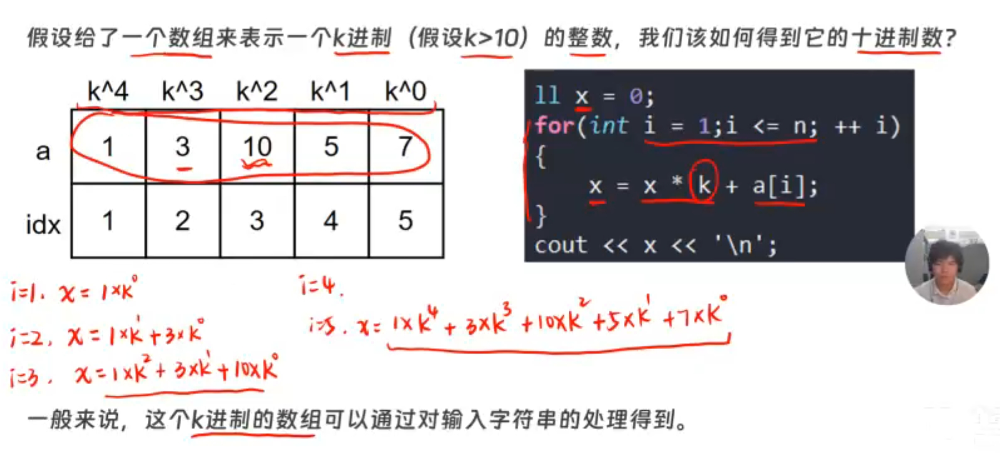
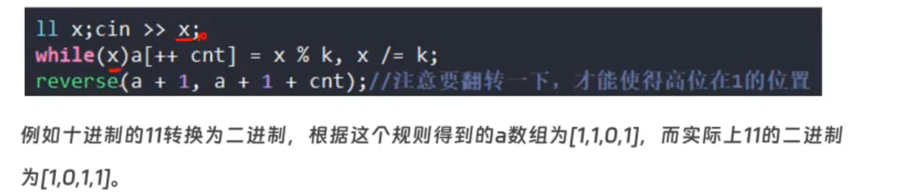

---
title:
tags:
related: []
data: 2026-03-08T11:03:00
---

### 🎯 
> 


表示任意进制的整数  转十进制



十转任意




## 模版
```cpp
#include <iostream>
#include <string>
#include <algorithm> // reverse 必须用这个头文件
using namespace std;

// ==================== 🛠️ 基础零件：字符与数字双向转换 ====================

// 把读到的字符变成真实数字（例如：'5' -> 5， 'A' -> 10）
int char_to_num(char c) {
    if (c >= '0' && c <= '9') return c - '0';
    return c - 'A' + 10; // 应对 11进制~36进制 里的字母
}

// 把算出的真实数字变成字符（例如：5 -> '5'， 10 -> 'A'）
char num_to_char(int n) {
    if (n >= 0 && n <= 9) return n + '0';
    return n - 10 + 'A'; // 应对 11进制~36进制 里的字母
}


// ==================== 🗡️ 模板一：任意进制转十进制 ====================

/* * 🧠 核心口诀：【从左到右扫字符，字转数字当新数，乘基腾位加新数！】
 * 解释：
 * 1. 遍历字符串必须从下标 0 (最左边) 开始。
 * 2. 拿到字符后，立刻用 char_to_num 变成能用来做算术的真实数字。
 * 3. 把旧结果 乘以基数k (整体左移腾出个位)，再加上刚才转换出的新数字！
 */
long long any_to_dec(string s, int k) {
    long long res = 0; // 空箱子
    
    // 从左到右扫字符
    for (int i = 0; i < s.length(); ++i) {
        // 字转数字当新数
        int cur_num = char_to_num(s[i]); 
        
        // 乘基腾位加新数！
        res = res * k + cur_num; 
    }
    
    return res;
}


// ==================== 🛡️ 模板二：十进制转任意进制 ====================

/* * 🧠 核心口诀：【特判数0返符0，模基抠出新个位，数转字符拼末尾，除基砍位变小号，最后别忘必翻转！】
 * 解释：
 * 1. 遇到真实数字 0，直接返回字符串 "0" (防止死角)。
 * 2. n % k 算出最低位（个位）的真实数字。
 * 3. 必须立刻用 num_to_char 把它变成字符，然后追加到字符串最后面。
 * 4. n / k 把刚才抠出来的最低位砍掉，数字变小，继续下一次循环。
 * 5. 因为是从最低位开始抠的，所以最后一定要 reverse 把字符串倒过来！
 */
string dec_to_any(long long n, int k) {
    // 特判数0返符0 (防爆盾)
    if (n == 0) return "0"; 
    
    string res = ""; // 收集字符的空字符串
    
    while (n > 0) {
        // 模基抠出新个位
        int rem = n % k; 
        
        // 数转字符拼末尾
        res += num_to_char(rem); 
        
        // 除基砍位变小号
        n /= k; 
    }
    
    // 最后别忘必翻转！
    reverse(res.begin(), res.end()); 
    
    return res;
}


// ==================== 🎮 测试场 ====================
int main() {
    // 测试 1：2进制的 1100 转 10进制
    cout << "2进制的 1100 是十进制的: " << any_to_dec("1100", 2) << "\n"; // 输出 12
    
    // 测试 2：16进制的 FF 转 10进制
    cout << "16进制的 FF 是十进制的: " << any_to_dec("FF", 16) << "\n"; // 输出 255
    
    // 测试 3：10进制的 255 转 16进制
    cout << "10进制的 255 是十六进制的: " << dec_to_any(255, 16) << "\n"; // 输出 FF
    
    // 测试 4：特判测试 
    cout << "10进制的 0 转 8进制是: " << dec_to_any(0, 8) << "\n"; // 输出 0
    
    return 0;
}

```

## ✍️ 标准代码

输入n 进制转换为 为 m 进制；

```cpp
#include <bits/stdc++.h>

using namespace std;

using ll = long long;

const int N = 999;

int a[N];

int main()

{

  int t;cin >> t;

  for(int i = 0;i < t;++i)

  {

    int m,n;cin >> n >> m;

    string s;cin >> s;

    s = '#' + s;

    ll x = 0;

    for(int i = 1;i < s.size();++i)

    {

      a[i] = (s[i] <= '9') ? s[i] - '0' : s[i] - 'A' + 10; 

      x = x * n + a[i];

    }

    string ans;

    while(x) 

    {

      int res = x % m;

      ans += (res < 10) ? res + '0' : res + 'A' - 10,x /= m;

    }

    reverse(ans.begin(),ans.end());

    cout << ans <<'\n';
  }

  return 0;

}
```
