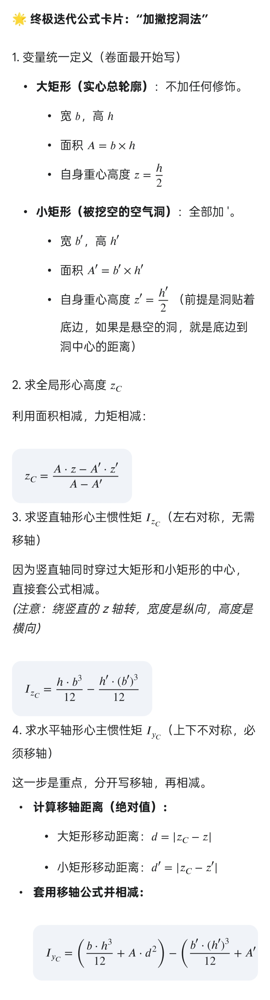

# 材料力学第一章：截面法 · 极简复习笔记

---

## 一、核心套路：一刀两断，假设为正

**截面法**就是把构件假想砍开，取一部分出来。
为了让它静止，被砍掉的另一半必然施加**内力**。

内力默认有三个：轴力 $F_N$、剪力 $F_S$、弯矩 $M$。

**符号潜规则**（先闭眼假设正方向）：
- 力：向右 $+$，向上 $+$
- 力矩：**逆时针 $+$**，顺时针 $-$

列平衡方程时，未知内力一律假设为**正方向**。
算出来是负号？
→ 说明真实方向跟你假设的**相反**，完美。

---

## 二、力矩平衡：刀砍哪里，就对哪里取矩

外力 $F$ 向上，力臂 $a$，想逆时针掀翻构件。
逆时针力矩为 $+Fa$。

假设未知内部弯矩为 $+M$。

$$
\sum M_O = 0 \quad\Rightarrow\quad M + Fa = 0
$$

得到：

$$
M = -Fa
$$

**负号意思**：内部实际弯矩是**顺时针**的，拼命抵消外力的逆时针趋势。

---

## 三、二力杆：看见铰接就偷着乐

### 判据（两条全满足就是二力杆）
- 两端**铰链**连接（圆圈）
- 杆中间**没有任何外力**，自重不计

### 性质
**只有沿杆轴线的拉力或压力。**
剪力 $= 0$，弯矩 $= 0$，别傻乎乎列三个未知数。

### 计算捷径：转换研究对象
不要直接切二力杆，去分析跟它相连的梁。

**例子**：横梁 $AB$ 受向下外力 $F$，斜杆 $BC$ 是二力杆。

- 斜杆对 $B$ 点拉力 $F_{N1}$ 沿杆轴，仰角 $\alpha$
- 对 $A$ 点取矩：$(F_{N1} \sin \alpha) \cdot l - F \cdot x = 0$

解出：

$$
F_{N1} = \frac{F x}{l \sin \alpha}
$$

> **避坑**：初学者容易切开斜杆，然后对着切开的截面画剪力、弯矩，直接掉坑。

---

## 四、梁的内力：求弯矩必须对截面自身取矩

梁不同二力杆，**三个内力都要有**。
尤其弯矩，刀砍在哪，就**对刀口那一点**取矩。

### 例：截面 2-2 的弯矩 $M_2$

1. 切右半段，长度 $l-x$
2. 右端 $B$ 受力：$F_{N1}$，分解出竖直分力 $F_{N1} \sin \alpha$
3. 竖直分力对截面中心取矩：力臂 $(l-x)$，产生逆时针力矩

$$
M_2 = F_{N1} \sin \alpha \cdot (l-x)
$$

4. 代入 $F_{N1} = \dfrac{F x}{l \sin \alpha}$，$\sin \alpha$ 约掉：

$$
M_2 = \frac{x(l-x)}{l} F
$$

---

## 五、切应变 $\gamma$：小变形就玩几何近似

### 核心前提：小变形假设
角度极小时，$\gamma \approx \tan \gamma$，直接用对边比邻边。

### PPT 思路：直角两边各转了多少

求 $B$ 点角度改变，就盯着原来那个 $90^\circ$ 直角。

1. 只看一边 $BC$：原长 $l_{BC} = \dfrac{120}{\cos 45^\circ}$
2. $B$ 向上位移 $0.03$，垂直 $BC$ 的分量 $= 0.03 \cos 45^\circ$
3. 单边转角 $\gamma_1 = \dfrac{\text{垂直位移}}{l_{BC}} = \dfrac{0.03 \cos^2 45^\circ}{120} = \dfrac{0.015}{120}$
4. 左右对称，总剪切角：

$$
\gamma = 2\gamma_1 = \frac{0.03}{120} = 2.5 \times 10^{-4} \, \text{rad}
$$

### 特殊情况才出现的巧合
因为原始角 $45^\circ$，$\cos^2 45^\circ = 0.5$，所以系数恰巧消掉。
**如果原始角不是 45°，别想直接拿位移 $0.03$ 除高度。**
必须老老实实分解，或用微分法：对 $\tan\theta$ 两边求导。

---

## 六、避坑速查

| 错误做法 | 正确做法 |
|---------|---------|
| 切二力杆，画剪力、弯矩 | 认出二力杆，只画轴力，或转换研究对象去算梁 |
| 求 2-2 截面弯矩，对远端 $C$ 点取矩 | **刀口对准哪，就对哪取矩** |
| 看到 $M+Fa=0$，疑惑逆时针怎么来 | 记住先假设所有未知力矩为正（逆时针），负号代表实际反向 |
| 求切应变时，直接拿位移除以原长无论角度 | 只能在小变形下，且必须先分解出垂直杆件的位移分量 |
| 靠凑答案得出 $\frac{0.03}{120}$，下次照抄 | 理解是单边转角乘以 2，换一个角度就失灵 |

---

> **最后口诀**：  
> 截面法，假正方向先列上。  
> 二力杆，只有轴力别多想。  
> 求弯矩，刀口取矩不能忘。  
> 小变形，正切近似用得爽。

# 材料力学 第三章 扭转变形

## 1. 扭矩图的“正负”迷思：为什么讲解和做题方向不同？
- **讲解图**（物理真相）：为展示抵抗，内力扭矩 $T$ 与外力偶 $M_e$ 画得反向。
- **例题图**（解题套路）：永远假设未知扭矩为**正方向**，画同向是巧合，全靠方程算出正负号决定真实方向。

> 口诀：**画图全画正，列式让负号说话！**

- 正方向由**切口外法线**决定（右手法则：大拇指背离截面为正）。
- 保留左半段时外法线向右 → 正扭矩拇指右。
- 保留右半段时外法线向左 → 正扭矩拇指左，所以画出来看似反向，实则仍是正方向假设。

**易错点：** 拿全局的“向右”当永远正方向，实际**正方向粘着切口走**。

---

## 2. 截面法避坑：漏段问题
- 轴上每个外力偶 $M_e$ 都会把轴分成不同扭矩段落，**有几个 $M_e$ 就切几段**，最边上两段最容易漏掉。

> 提醒：别嫌烦，从左到右一刀刀切，远离漏判危险截面。

---

## 3. 扭转切应力分布（材料“被拧疼”的规律）
- **实心圆轴**：中心 $\rho = 0$ 应力为零，表面 $\rho = R$ 应力最大，沿半径线性分布。
- **空心圆轴**：中心附近材料摸鱼，掏空后应力从内壁线性增到外壁，减轻重量但强度牺牲不多。

$$
\tau_{\rho} = \frac{T \cdot \rho}{I_p}, \quad \tau_{\max} = \frac{T}{W_t}
$$

---

## 4. 极惯性矩 $I_p$ 与抗扭截面模量 $W_t$
- $I_p$：截面抗扭“倔强值”，直径四次方，稍粗一点刚度暴涨。
- $W_t = I_p / R$：专为算最大应力打包的系数。

**实心圆：**
$$
I_p = \frac{\pi D^4}{32}, \quad W_t = \frac{\pi D^3}{16}
$$
**空心圆（$\alpha = d/D$）：**
$$
I_p = \frac{\pi D^4}{32}(1-\alpha^4), \quad W_t = \frac{\pi D^3}{16}(1-\alpha^4)
$$

---

## 5. 计算时的“黄金法则”——单位统一
**绝对铁律：** 力全换 $\text{N}$，长度全换 $\text{mm}$，算出的应力自动为 $\text{MPa}$（$\text{N/mm}^2$）。

- 扭矩 $T$：从 $\text{kN·m}$ 换成 $\text{N·mm}$ 乘 $10^6$。
- $G$：从 $\text{GPa}$ 变 $\text{MPa}$ 乘 $10^3$。

> **错误做法**：用 $\text{kN·m}$ 直接与 $\text{mm}$ 计算，小数点点到崩溃。  
> **正确做法**：先用 $ \times 10^6 $ 化成 $\text{N·mm}$，再代入，秒出 $\text{MPa}$。

---

## 6. 功率、转速求扭矩——“黄金公式”
$$
T = 9549 \frac{P}{n}
$$
- $T$：扭矩 ($\text{N·m}$)，$P$：功率 ($\text{kW}$)，$n$：转速 ($\text{r/min}$)。
- 常数 $9549$ 包含所有单位换算，直接背下。

**易错点：** 先用此公式得到 $\text{N·m}$，再乘 $10^3$ 变 $\text{N·mm}$ 才能算应力！

---

## 7. 扭转角：总角 $\phi$ 与单位角 $\phi'$ 傻傻分不清
- **总扭转角** $\phi$（截面相对拧转多少）：
$$
\phi = \frac{T L}{G I_p} \quad (\text{rad})
$$
- **单位长度扭转角** $\phi'$（每米拧多少度，衡量刚度的标尺）：
$$
\phi' = \frac{T}{G I_p} \quad (\text{rad/mm})
$$
换算成工程常用单位 $^\circ/\text{m}$ 必须：
1. 乘以 $1000$（把 $\text{mm}$ 变 $\text{m}$）
2. 乘以 $\frac{180}{\pi}$（弧度变角度）

**一眼辨公式：**  
- 题目问“相对扭转角”，必乘长度 $L$。  
- 题目给许用值 $[\phi']$ 带 $/\text{m}$，必用不带 $L$ 的公式，且 **分子乘 $1000 \times 180/\pi$**。

---

## 8. 轴的设计：强度 + 刚度双重拷问
1. **强度要求**：$\tau_{\max} = \dfrac{T}{W_t} \le [\tau]$，推得直径下限：
$$
d \ge \sqrt[3]{\frac{16 T}{\pi [\tau]}}
$$
2. **刚度要求**：$\phi' \le [\phi']$，当 $[\phi']$ 单位为 $^\circ/\text{m}$ 时，必须用下式：
$$
d \ge \sqrt[4]{\frac{32 T \times 180 \times 1000}{G \pi^2 [\phi']}}
$$

> 致命陷阱：刚度公式里最容易漏掉 $\times 1000$，导致直径差出数量级！那是把 $^\circ/\text{m}$ 化成 $^\circ/\text{mm}$ 的系数。

**最终直径**取强度与刚度算出的**较大者**，且各段按最严要求取值。

---

## 9. 扭矩图优化：主动轮放中间
- 主动轮在端部 → 全扭矩毒打一段轴。
- 主动轮移至中间 → 扭矩分两边，最大值显著降低，可缩小直径省材料。

**工程直觉：** 马达别顶头放，塞中间让两边分摊，轴受力最均匀。

---

## 10. 避坑集锦
- **剪切胡克定律**：$\tau = G \gamma$，切应变无单位。
- **最大切应力捷径**：$\tau_{\max} = \tau_{\rho} \times \dfrac{R}{\rho}$，线性比例最快。
- **空心轴公式**：打折系数 $(1-\alpha^4)$，别忘！
- **分布扭矩段算扭转角**：若扭矩线性递减，等效用平均扭矩，即转角为恒定扭矩时的**一半**。

> 口诀：应力乘半径比，转角看平均。单位强行统一，刚度莫忘千与弧度度。

# 材料力学 第四章 拉伸应力与弯曲内力

**核心任务**：用截面法熟练计算梁任意截面的 **剪力 $F_s$** 和 **弯矩 $M$**，并正确画出内力图。

## 两张根本不同的“正负号表”

极易丢分的混淆点就在这里：

- **内力正负号 (作图用)**
  - 剪力：左上右下为正 → 微段左侧向上、右侧向下的剪力为正。
  - 弯矩：使梁下方受拉为正 → 弯曲呈“$\smile$”笑脸，下端纤维拉长。

- **静力学平衡符号 (列方程用)**
  - 力：**向上为正，向下为负**。
  - 力矩：**逆时针转为正，顺时针转为负**。  
  这与你中学坐标轴一致，**永远和内力正负号分开**。

> 口诀：切开微段看方向定内力正负，列方程时回归坐标系正负，**两个系统绝不混用**。

## 截面法求内力的死板步骤

无论多复杂的载荷，一律用这四步走：

### 1. 切开，取隔离体
假想在位置 $x$ 一刀切开，**习惯性取左半段**（也可取右段，但取左段均布载荷更好算）。

### 2. 按正方向画内力箭头 (关键)
- 切面在右边 → 剪力 $F_s$ 箭头 **死板向下**，弯矩 $M$ 箭头 **死板逆时针**。  
- 切面在左边 → 剪力 $F_s$ 箭头 **死板向上**，弯矩 $M$ 箭头 **死板顺时针**。

> 口诀：取左边，切面在右，$F_s$ 朝下，$M$ 逆时针。取右边，切面在左，$F_s$ 朝上，$M$ 顺时针。

### 3. 列静力平衡方程
- $\sum F_y = 0$：所有力按“向上正”相加。
- $\sum M_O = 0$（取切面中心 $O$ 为矩心）：所有力矩按“逆时针正”相加。  
> **注意**：剪力 $F_s$ 通过切面中心，力臂为 0，**自然不出现**在弯矩方程中，不是漏掉了。

### 4. 解出 $F_s$ 和 $M$
解出的正负直接代表内力图上的正负：
- **正剪力 → 画在轴上方**；
- **正弯矩 → 表示下侧受拉**（按你的教材习惯决定画在上方还是下方）。

## 典型分段推导回放

以 AC 段（$0<x<6$，左端有$F_{Ay}=8$ kN 向上）为例，取左边段：

- 剪力方程：
  $\sum F_y = F_{Ay} - F_s = 0 \;\Rightarrow\; 8 - F_s = 0 \;\Rightarrow\; F_s = 8$ kN
- 弯矩方程：
  对切口取矩：
  $\sum M_O = -F_{Ay} \cdot x + M = 0 \;\Rightarrow\; -8x + M = 0 \;\Rightarrow\; M = 8x$

CD 段（$6<x<9$，左段多一个向下的 $10$ kN）：
- 剪力：$F_{Ay} - 10 - F_s = 0 \;\Rightarrow\; 8-10-F_s=0 \;\Rightarrow\; F_s = -2$ kN
- 弯矩：  
  $\sum M_O = -F_{Ay}x + 10(x-6) + M = 0$  
  代入 $F_{Ay}=8$，化简：$-8x + 10x - 60 + M = 0$  
  $\Rightarrow 2x - 60 + M = 0 \;\Rightarrow\; M = -2x + 60$

> 注意：看似消失的 $F_{Ay}$ 一直藏在 **$8x$** 里，合并同类项后才成了 $-2x$。

## 均布载荷下极易踩的坑

- **总合力**：$Q = q \times \text{段长}$，作用点在 **段的正中间**。
- **取右段时**：段长 $= \text{总长} - x$，合力 $Q = q(\text{总长}-x)$，力臂 $= \frac{\text{总长}-x}{2}$，展开极易出错。  
  建议：**均布载荷题优先取左段**，段长就是 $x$，合力 $= qx$，力臂 $= \frac{x}{2}$，简单百倍。

- **移项必须变号**：  
  $- \frac{q x^2}{2} + M = 0$ 移项后为 $M = +\frac{q x^2}{2}$，绝不能记成负号。

## 直击易错点

**错误做法**：  
- 支座反力求错（忘记所有外力，力臂用全长代替一半长度）。  
- 保留右段时，把均布载荷合力写成 $q x$，力臂用 $x$。  
- 平衡方程移项后忘记变号，或把内力箭头方向当平衡符号直接代入。

**正确做法**：  
- 先独立求支反力，**对某点列矩时，每个力的力臂必须是从矩心到作用线的垂直距离**。  
- 取右段时，**段内载荷合力的力臂是 $\frac{\text{段长}}{2}$**，段长 $= \text{总长}-x$。  
- 方程严格遵守 **坐标轴符号体系**，移项强制变号，与内力正负号无关。

**最狠口诀**：  
切面箭头跟正规范，方程符号跟坐标系，解出什么画什么。

# 材料力学 第五章 弯曲应力

## 一、核心概念与公式

### 1. 弯曲正应力强度条件
梁弯曲时，距离中性轴越远，应力越大。危险点在上、下边缘。

$$
\sigma_{max} = \frac{M_{max}}{W_z} \le [\sigma]
$$

- $M_{max}$：全梁最大弯矩（由弯矩图找）
- $W_z$：抗弯截面系数，衡量截面抗弯能力

> **矩形截面（宽 $b$，高 $h$）**
>
> $$
> W_z = \frac{b \cdot h^2}{6}
> $$
>
> 高度 $h$ 带平方！增加高度比增加宽度更有效。

> **圆形截面（直径 $D$）**
>
> 实心：$W_z = \frac{\pi D^3}{32}$
>
> 空心（内径 $d$，外径 $D$，$\alpha = d/D$）：
>
> $$
> W_z = \frac{\pi D^3}{32}(1 - \alpha^4)
> $$

> **惯性矩（对形心轴）**
>
> 矩形：$I_z = \frac{b h^3}{12}$ （原点在形心）
>
> 若轴在边缘：$I_z = \frac{b h^3}{3}$ （可用平行移轴公式从中心推出）

### 2. 单位换算外挂（直出 MPa）
核心原则：**力用 N，长度用 mm**，算出的应力就是 MPa。

- 弯矩单位是 kN·m 时，**直接乘 $10^6$** 变成 N·mm。
- 截面尺寸直接用 mm，$W_z$ 单位就是 mm³，分母不需要 $10^{-9}$ 之类。

> **易错点**：
> 见到 kN·m 就乘 $10^6$，算出的应力直接标 MPa。
> 但求未知力 $F$ 时，图上标 m，$F$ 默认就是 kN，弯矩是 $F \times$ 米数，单位 kN·m。代入应力公式时再给整个弯矩表达式乘 $10^6$。解出的 $F$ 就是 kN。

## 二、绘制弯矩图的“切一刀”大法

画弯矩图核心：**从右往左（悬臂梁）或取隔离体**。

**正负号规定**（工程习惯）：
- 使梁弯成**笑脸 ∪**（底部受拉）→ 正弯矩。
- 使梁弯成**哭脸 ∩**（顶部受拉）→ 负弯矩。

> **哭脸/笑脸与拉压关系：**
>
> - **哭脸 ∩**（如悬臂梁自由端受向下力）：**上边缘受拉，下边缘受压**。
> - **笑脸 ∪**（简支梁跨中受向下力）：**下边缘受拉，上边缘受压**。

**步骤**：
1. 求支座反力（对某点取矩 $\sum M = 0$）。
2. 在最危险截面处“切一刀”，只看一侧，计算该侧所有力对切口的力矩之和。
3. 集中力直接力×距离；**均布载荷要等效为一个集中力，作用在分布段的中点**，力臂从中点量到切口。

> **均布载荷取矩常见错误**：力臂误用分布段的端点距离，必须用中点！

## 三、平行移轴公式（用于非形心轴惯性矩）

$$
I = I_C + A \cdot d^2
$$

- $I_C$：对自己形心轴的惯性矩（用分母 12 的公式）
- $A$：面积
- $d$：该块矩形自己的形心到目标轴的距离

应用：T 形、工字形、槽钢等截面，先分割为矩形，分别移轴再求和或相减。

**挖洞法**：复杂形状 = 大矩形 − 小矩形，惯性矩和面积分别相减，但必须**都移轴到同一个参考轴**后再减。

## 四、综合题型套路

### 1. 铸铁梁（拉压许用应力不同）与非对称截面
铸铁 $[\sigma_t] \ll [\sigma_c]$（怕拉不怕压）。若截面不对称（如 T 形），中性轴偏一边。

**必须验算四个危险点**：
- 最大正弯矩截面（笑脸）：上边缘受压，下边缘受拉
- 最大负弯矩截面（哭脸）：上边缘受拉，下边缘受压
- 对每个危险点，应力公式用原始形式：

$$
\sigma = \frac{M \cdot y}{I}
$$

其中 $y$ 是该点到中性轴的距离。**分别与各自的许用值比较**，取最危险的作为许可载荷。

> **口诀**：弯矩图画完，最大正、负弯矩截面各切一刀，上拉下压，下拉上压，四种组合列表验算，谁最小谁控制。

### 2. 等强度设计（合理长度）
若结构有上下两根梁，要求“合理”，即**两梁最大弯曲正应力同时达到许用值**：

$$
\sigma_1 = \sigma_2
$$

分别写出各自的 $M_{max}$ 与 $W$ 的关系，解方程得到几何关系。

## 五、解题标准流程（模板）

1. **外力分析**：求支座反力，长度单位用 m，力单位用 kN（若已知力为 kN）。
2. **切一刀写弯矩方程**或直接找危险截面弯矩，单位 kN·m。
3. **计算截面几何性质**：$I$、$W$，注意分割图形、移轴，单位换算成 mm⁴ 或 mm³。
4. **代入强度条件**：弯矩整体乘 $10^6$ 变成 N·mm，$\sigma = \frac{M}{W}$ 或 $\frac{M y}{I}$，结果天然为 MPa。
5. **比较**：拉应力与 $[\sigma_t]$ 比，压应力与 $[\sigma_c]$ 比（铸铁）；或直接与统一许用应力比。

> **特别注意**：求未知力时，设 $F$ 为 kN，弯矩列式直接用图上米数，**代入公式时再乘 $10^6$**，解得 $F$ 就是 kN。全程不必强行早换单位，避免大数字和混乱。

# 材料力学 第六章 应力状态与强度理论

## 一、核心基础：单元体符号规定

> 符号是丢分重灾区，必须像背乘法口诀一样死记。

**正应力** $\sigma$：拉应力（箭头向外拔）为正 $+$，压应力（箭头向里推）为负 $-$。

**剪应力** $\tau_{xy}$：让单元体**顺时针**旋转为正 $+$，逆时针为负 $-$。

**角度** $\alpha$：从 $x$ 轴正方向（右侧面外法线）逆时针转向斜面法线为正。

## 二、斜截面应力变换公式

任意斜截面上的应力靠两个必背公式算出：

$$
\sigma_{\alpha} = \frac{\sigma_x + \sigma_y}{2} + \frac{\sigma_x - \sigma_y}{2} \cos 2\alpha - \tau_{xy} \sin 2\alpha
$$

$$
\tau_{\alpha} = \frac{\sigma_x - \sigma_y}{2} \sin 2\alpha + \tau_{xy} \cos 2\alpha
$$

> 口诀：平均应力加半差乘余弦，再减剪应力乘正弦。

## 三、致命角度：一眼看穿 $\alpha$ 的绝招

### 1. 万能三步法（不看图，用几何）
1. 看清图上标的角度是**哪两条线的夹角**。
2. 求出**斜面与水平线**的夹角。
3. 法线角 $\theta = 90^\circ - (\text{斜面与水平夹角})$。

### 2. 秒杀口诀（直接代入）
**考题里 90% 的情况，$\alpha$ 就是斜面与竖直方向的夹角。**
- 图 (a)：$30^\circ$ 标在斜面与水平底边之间 → 斜面与竖直方向夹角 $60^\circ$，顺时针为负 → $\alpha = -60^\circ$。
- 图 (b)：$30^\circ$ 标在斜面与右侧竖边之间 → 就是与竖直方向角 → $\alpha = +30^\circ$。

> 正负号方向：往右斜一面砍，顺时针转加负号；逆时针转加正号。

## 四、主应力与最大剪应力

**主平面**：剪应力 $\tau_\alpha = 0$ 的斜截面。  
**主应力**：主平面上的正应力，按大小排 $\sigma_1 \ge \sigma_2 \ge \sigma_3$。

平面应力状态主应力公式：

$$
\sigma_{\text{max/min}} = \frac{\sigma_x + \sigma_y}{2} \pm \sqrt{\left(\frac{\sigma_x - \sigma_y}{2}\right)^2 + \tau_{xy}^2}
$$

> 记忆：平均值加减 半差平方加剪应力平方的开方。

主平面位置：

$$
\tan 2\alpha_0 = \frac{2\tau_{xy}}{\sigma_x - \sigma_y}
$$

**最大剪应力**（必考）：

$$
\tau_{\max} = \frac{\sigma_1 - \sigma_3}{2}
$$

## 五、空间应力状态的降维打击

三向应力状态题目的核心套路：**先找纯净面**。

> 口诀：横看成岭侧成峰，没剪应力的面直接掏出来当主应力。

**步骤：**
1. 找出哪个面只有正应力、没有切向应力 → 该方向应力就是**一个主应力**。
2. 去掉这个方向，剩下的应力分量当平面问题，套二维主应力公式。
3. 把三个数放一起排序，$\sigma_1 \ge \sigma_2 \ge \sigma_3$，求 $\tau_{\max}$。

**例题套路示范**（图 (b)）：
- 左右侧面只有 $\sigma_x = 50\,\mathrm{MPa}$，无剪应力 → 直接得一个主应力 $50$。
- 剩下 $\sigma_y=-20, \sigma_z=30, \tau_{yz}=40$，代入平面公式得 $52.2$ 和 $-42.2$。
- 排序：$52.2 > 50 > -42.2$ → $\sigma_1=52.2,\ \sigma_3=-42.2$。
- $\tau_{\max}=\frac{52.2-(-42.2)}{2}=47.2\,\mathrm{MPa}$。

## 六、强度理论速成（期末必拿分）

**第一强度理论**（最大拉应力）：$\sigma_{r1} = \sigma_1 \le [\sigma]$  
- 用于**脆性材料**（铸铁），只关心最大拉应力。

**第三强度理论**（最大切应力）：$\sigma_{r3} = \sigma_1 - \sigma_3 \le [\sigma]$  
- 用于**塑性材料**（钢）。

**校核步骤：**
1. 排出 $\sigma_1, \sigma_2, \sigma_3$。
2. 根据材料选公式。
3. 计算相当应力，与许用应力 $[\sigma]$ 比较。

> 易错点：千万别给塑性材料用第一强度理论，也别把 $\sigma_{r3}$ 写成 $(\sigma_1+\sigma_3)/2$。

## 七、大题万能解题流水线

1. **从杆件受力抠出单元体**：拉伸给 $\sigma$，扭转给 $\tau$，弯曲给 $\sigma$ + 剪切。
2. **写清应力分量** $\sigma_x,\ \sigma_y,\ \tau_{xy}$（压应力带负号，扭转按顺/逆定正负）。
3. **斜截面题**：按口诀定 $\alpha$，代入斜截面公式。
4. **主应力题**：套主应力长公式 → 排序 → 求 $\tau_{\max}$。
5. **强度校核**：选理论 → 比较 → 下结论。

> 只要把以上流水线练熟，这一章所有大题都是送分题。
# 材料力学 第七章 压杆稳定性

## 一、核心逻辑与三步走框架

这一章不看强度（会不会压碎），看**稳定性**（会不会压弯/失稳）。

**“太细太长的杆子，还没压碎就先折了。”**

做题永远是死板的三步走：
> 算柔度 $\lambda$ → 判类型（大/中/小） → 选公式求临界力。

---

**概念扫盲**
*   **临界压力 $F_{cr}$**：杆子保持稳定的最大轴向压力。
*   **临界应力 $\sigma_{cr}$**：$\sigma_{cr} = \frac{F_{cr}}{A}$。
*   **长度系数 $\mu$**：与约束有关。两端铰支 $\mu=1$，一端固定一端自由 $\mu=2$，两端固定 $\mu=0.5$，一端固定一端铰支 $\mu=0.7$。

---

## 二、第一步：算柔度 $\lambda$（定杆子的“细长程度”）

$$
\lambda = \frac{\mu l}{i}
$$

*   $l$：杆的实际长度。
*   $\mu$：长度系数，考试直接给或按约束查。
*   **$i$ 惯性半径**：$i = \sqrt{\frac{I}{A}}$（$I$ 是截面惯性矩，$A$ 是面积）。

**🔥 矩形截面惯性矩记忆法**
> 谁被轴切断，谁就立三次方。
> $I = \frac{1}{12} \times$ 平行轴的边 $\times$ 垂直轴的边的立方。

*   **大坑提醒**：矩形压杆会挑**最软的方向**弯曲。求柔度时必须用 **最小的 $I$ 或 $i$**。
    *   矩形找最小惯性半径，直接用短边 $b$ 套简算：$i_{min} = \frac{b}{\sqrt{12}} \approx \frac{b}{3.46}$。
*   **圆形截面简算**：
    *   实心圆：$i = \frac{d}{4}$（$d$ 为直径）。
    *   空心圆管：$i = \frac{\sqrt{D^2 + d^2}}{4}$（$D$ 外径，$d$ 内径）。

---

## 三、第二步：判类型（查户口）

拿算出的 $\lambda$ 和两个临界值比大小。**这两个临界值题目通常直接给，或用公式算。**

*   **大柔度边界 $\lambda_p$**：$\lambda_p = \sqrt{\frac{\pi^2 E}{\sigma_p}}$ （$\sigma_p$ 为比例极限）。
*   **中柔度下限 $\lambda_s$**：$\lambda_s = \frac{a - \sigma_s}{b}$ （Q235钢：$a=304\text{MPa}, b=1.12\text{MPa}, \sigma_s=240\text{MPa}$）。

> **分类标准**：
> 1.  $\lambda \ge \lambda_p$ → **大柔度杆**（细长杆，失稳破坏，用欧拉公式）。
> 2.  $\lambda_s \le \lambda \lt \lambda_p$ → **中柔度杆**（中长杆，失稳+塑性，用直线公式）。
> 3.  $\lambda \lt \lambda_s$ → **小柔度杆**（粗短杆，直接压碎，屈服强度问题）。

---

## 四、第三步：选公式求临界力/应力

**1. 大柔度杆的“欧拉公式”**
弹性失稳，因在弹性阶段，公式带 $E$（弹性模量）。
$\lambda$ 越大（越细长），能扛的 $\sigma_{cr}$ 越小，所以 $\lambda$ 在分母且平方。
$$
\sigma_{cr} = \frac{\pi^2 E}{\lambda^2}
$$
$$
F_{cr} = \sigma_{cr} \cdot A
$$

**2. 中柔度杆的“直线经验公式”**
$$
\sigma_{cr} = a - b\lambda
$$
就是一个直线方程 $y = -kx + b$。**Q235钢常数必须背：$a=304\text{MPa}, b=1.12\text{MPa}$**。

**3. 小柔度杆**
不会失稳，直接等于屈服极限或强度极限。
$$
\sigma_{cr} = \sigma_s
$$

---

## 五、第四步：稳定性校核

**工作安全系数必须达标：**
$$
n = \frac{F_{cr}}{F_{max}} \ge n_{st}
$$
*   $F_{max}$：杆子实际承受的最大工作压力。
*   $n_{st}$：规定的稳定安全系数（题目会给）。

或是用许用压力校核：
$$
F_{max} \le \frac{F_{cr}}{n_{st}}
$$

---

## 六、数值计算避坑指南

**错误做法 vs 正确做法**

*   **矩形截面惯性矩取长边立方**
错误！杆子失稳必然朝最易弯曲方向，必须取短边立方求 $i_{min}$，用最大柔度算。
*   **单位不统一直接开算**
错误！比如 $E=210\text{GPa}$，长度是 $\text{mm}$，力是 $\text{N}$，必须统一为 $\text{MPa}$ 和 $\text{mm}^2$ 再算，避免量级爆炸。
*   **看到没给 $a, b$ 就发懵**
错误！只要看到“Q235钢”，直接默写：$a=304\text{MPa}, b=1.12\text{MPa}$。这是潜规则考点。

---

## 七、题型通解示例

**反向设计题（已知受力求尺寸）套路：**

1.  **先盲猜大柔度**：用欧拉公式 $F_{cr} = F \cdot n_{st} = \frac{\pi^2 E I}{(\mu l)^2}$ 反解出所需惯性矩 $I$，进而求出尺寸 $D$。
2.  **必须校验“打脸”**：拿求出的 $D$ 反算实际 $\lambda$，与 $\lambda_p$ 比大小。
3.  **假设成立** → 安全，直接用。
4.  **假设翻车**（如算出是中柔度杆） → 立刻改用直线公式 $\sigma_{cr} = a - b\lambda$，结合 $F \cdot n_{st} = \sigma_{cr} A$ 重新列方程求 $D$。