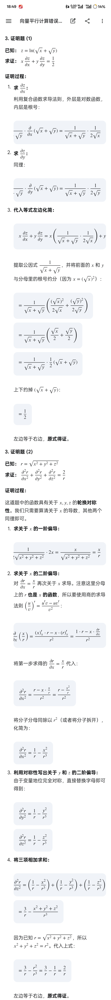

# 期中自测题
#### **原题 (7)**
$D$ 为 $\{(x,y) \mid (x-2)^2+(y-1)^2 \le 1\}$，比较下面两个积分的大小关系：

$$
I_1 = \iint_D (x+y)^2 d\sigma
$$

$$
I_2 = \iint_D (x+y)^3 d\sigma
$$

**错因分析**
误判了 $x+y$ 在圆域内的取值范围，将其误认为小于 $1$，导致被积函数大小关系比较错误。

**标准解答**
1. 首先确定被积函数 $x+y$ 在积分区域 $D$ 上的取值范围。引入极坐标变换求极值点。
2. 令 $x = 2 + r\cos\theta$，$y = 1 + r\sin\theta$，其中 $0 \le r \le 1$。代入求 $x+y$ 的表达式：

$$
\begin{aligned}
& x+y \\
&= 3 + r(\cos\theta + \sin\theta) \\
&= 3 + \sqrt{2}r\sin\left(\theta+\frac{\pi}{4}\right)
\end{aligned}
$$

3. 取最小值时满足 $r=1$ 且 $\sin$ 值为 $-1$，最小值为 $3-\sqrt{2} \approx 1.586$。因此在整个闭区域 $D$ 内，恒有 $x+y > 1$。
4. 因为当底数 $u>1$ 时 $u^3 > u^2$ 恒成立，根据二重积分的保号性质，得出 $I_1 < I_2$。

---
#### **原题 (12)**
计算二重积分：

$$
\iint_{x^2+y^2 \le 1} (xy + 1) d\sigma
$$

**错因分析**
盲目使用直角坐标化为二次积分进行硬算，计算过程出错。完全没有观察到积分区域的对称性与被积函数的奇偶性质。

**标准解答**
1. 观察到积分区域为原点极点的单位圆盘，关于坐标轴完全对称，应当优先考虑利用对称性拆解被积函数。
2. **(利用积分区域对称性极简化)** 根据线性性质将原积分拆分为两部分：

$$
\begin{aligned}
& \iint_{D} (xy + 1) d\sigma \\
&= \iint_{D} xy d\sigma + \iint_{D} 1 d\sigma
\end{aligned}
$$

3. 对于第一项，由于 $xy$ 是关于 $x$ 的奇函数，且区域 $D$ 关于 $y$ 轴对称，该项积分为 $0$。
4. 对于第二项，其几何意义为单位圆盘的面积，积分为 $\pi$。两项相加，最终结果为 $\pi$。

---
#### **原题 (14)**
设函数 $f(x,y) = (1+xy)^y$，求 $f_y(1,1)$。

**错因分析**
陷入了求导运算陷阱，把底数和指数都含 $y$ 的“幂指函数”当作简单的“幂函数”去求偏导，错误地在求导时将指数上的 $y$ 视作了常数。

**标准解答**
1. 面对幂指函数，必须先利用对数恒等式 $a^b = e^{b\ln a}$ 进行等价变形，化为以自然对数底数 $e$ 为底的指数函数。
2. 将原函数化为指数形式：

$$
\begin{aligned}
& f(x,y) \\
&= e^{y \ln(1+xy)}
\end{aligned}
$$

3. 利用复合函数求导法则与乘积求导法则，对 $y$ 求一阶偏导数：

$$
\begin{aligned}
& f_y(x,y) \\
&= e^{y \ln(1+xy)} \cdot \frac{\partial}{\partial y}[y \ln(1+xy)] \\
&= (1+xy)^y \left[ \ln(1+xy) + y \cdot \frac{x}{1+xy} \right] \\
&= (1+xy)^y \left[ \ln(1+xy) + \frac{xy}{1+xy} \right]
\end{aligned}
$$

4. 将坐标点 $x=1, y=1$ 代入上述偏导数公式，得到最终结果 $2\ln 2 + 1$。

---
#### **原题 (19)**
计算下列二重积分，其中 $D$ 由直线 $y=x$ 及抛物线 $x=y^2$ 所围成：

$$
I = \iint_D \frac{\sin y}{y} d\sigma
$$

**错因分析**
正确选择了先对 $x$ 积分的次序，但在外层对 $y$ 进行分部积分（IBP）时，符号处理与计算合并过程混乱，导致最终结果归零。

**标准解答**
1. 由于被积函数 $\frac{\sin y}{y}$ 无法写出初等原函数，必须采用先对 $x$ 后对 $y$ 的积分次序，积分区域确定为 $y \in [0,1]$，$x \in [y^2, y]$。
2. 先计算内层对 $x$ 的积分：

$$
\begin{aligned}
& \int_0^1 dy \int_{y^2}^y \frac{\sin y}{y} dx \\
&= \int_0^1 \frac{\sin y}{y} (y - y^2) dy \\
&= \int_0^1 (1 - y)\sin y dy
\end{aligned}
$$

3. 对上述结果使用一元函数分部积分法，令 $u = 1-y$，$dv = \sin y dy$：

$$
\begin{aligned}
& \int_0^1 (1 - y)\sin y dy \\
&= \left[ (y-1)\cos y \right]_0^1 - \int_0^1 \cos y dy \\
&= (0 - (-1)) - \left[ \sin y \right]_0^1 \\
&= 1 - \sin 1
\end{aligned}
$$

# 期末复习题

## 多元函数微分学

#### 错题1

题目：

求极限：

$\lim\limits_{(x,y)\to(0,0)}(x+y)\sin\frac{1}{x^2+y^2}$

错因：没有利用有界函数写清楚

标准解答：

因为 $-1\leq \sin\frac{1}{x^2+y^2}\leq 1$，所以

$|(x+y)\sin\frac{1}{x^2+y^2}|\leq |x+y|$

又因为

$|x+y|\leq |x|+|y|$

当 $(x,y)\to(0,0)$ 时，$|x|+|y|\to 0$，所以由夹逼准则可得

$\lim\limits_{(x,y)\to(0,0)}(x+y)\sin\frac{1}{x^2+y^2}=0$

#### 错题2

题目：

求极限：

$\lim\limits_{(x,y)\to(-2,0)}\frac{\sin(x^2y)}{y}$

错因：没有用好第一个重要极限 应该凑sin里面的，而不是随便为 0就行

标准解答：

将原式变形为

$\frac{\sin(x^2y)}{y}=x^2\cdot\frac{\sin(x^2y)}{x^2y}$

当 $(x,y)\to(-2,0)$ 时，

$x^2\to 4$

且

$x^2y\to 0$

所以

$\frac{\sin(x^2y)}{x^2y}\to 1$

因此

$\lim\limits_{(x,y)\to(-2,0)}\frac{\sin(x^2y)}{y}=4\cdot 1=4$
#### 错题3

题目：

求函数 $z=xe^{xy}$ 的全微分。

错因：单纯求偏导求错了

标准解答：

函数 $z=xe^{xy}$ 的全微分为

$dz=z_xdx+z_ydy$

先求 $z_x$：

$z_x=\frac{\partial}{\partial x}(xe^{xy})$

这里对 $x$ 求偏导，$y$ 看作常数。由乘积求导法则得

$z_x=e^{xy}+x\cdot e^{xy}\cdot y$

所以

$z_x=e^{xy}+xye^{xy}$

再求 $z_y$：

$z_y=\frac{\partial}{\partial y}(xe^{xy})$

这里对 $y$ 求偏导，$x$ 看作常数，所以

$z_y=x\cdot e^{xy}\cdot x=x^2e^{xy}$

因此

$dz=(e^{xy}+xye^{xy})dx+x^2e^{xy}dy$

#### 错题4

题目：太复杂不敢写

设 $z=f(x^2,\frac{x}{y})$，其中 $f$ 具有二阶连续偏导数，求 $\frac{\partial^2z}{\partial x^2}$，$\frac{\partial^2z}{\partial x\partial y}$，$\frac{\partial^2z}{\partial y^2}$。

错因：

标准解答：

令

$u=x^2,\quad v=\frac{x}{y}$

则

$z=f(u,v)$

先写出 $u,v$ 的偏导：

$u_x=2x,\quad u_y=0$

$v_x=\frac{1}{y},\quad v_y=-\frac{x}{y^2}$

先求一阶偏导。

对 $x$ 求偏导：

$z_x=f_1u_x+f_2v_x$

所以

$z_x=2xf_1+\frac{1}{y}f_2$

对 $y$ 求偏导：

$z_y=f_1u_y+f_2v_y$

因为 $u_y=0$，所以

$z_y=-\frac{x}{y^2}f_2$

下面求二阶偏导。

先求 $z_{xx}$。

由

$z_x=2xf_1+\frac{1}{y}f_2$

对 $x$ 求偏导。

第一部分：

$\frac{\partial}{\partial x}(2xf_1)=2f_1+2x\frac{\partial f_1}{\partial x}$

其中

$\frac{\partial f_1}{\partial x}=f_{11}u_x+f_{12}v_x=2xf_{11}+\frac{1}{y}f_{12}$

所以

$\frac{\partial}{\partial x}(2xf_1)=2f_1+4x^2f_{11}+\frac{2x}{y}f_{12}$

第二部分：

$\frac{\partial}{\partial x}(\frac{1}{y}f_2)=\frac{1}{y}\frac{\partial f_2}{\partial x}$

其中

$\frac{\partial f_2}{\partial x}=f_{21}u_x+f_{22}v_x=2xf_{12}+\frac{1}{y}f_{22}$

所以

$\frac{\partial}{\partial x}(\frac{1}{y}f_2)=\frac{2x}{y}f_{12}+\frac{1}{y^2}f_{22}$

因此

$z_{xx}=4x^2f_{11}+\frac{4x}{y}f_{12}+\frac{1}{y^2}f_{22}+2f_1$

再求 $z_{xy}$。

由

$z_x=2xf_1+\frac{1}{y}f_2$

对 $y$ 求偏导。

第一部分：

$\frac{\partial}{\partial y}(2xf_1)=2x\frac{\partial f_1}{\partial y}$

其中

$\frac{\partial f_1}{\partial y}=f_{11}u_y+f_{12}v_y=0+f_{12}(-\frac{x}{y^2})$

所以

$\frac{\partial}{\partial y}(2xf_1)=-\frac{2x^2}{y^2}f_{12}$

第二部分：

$\frac{\partial}{\partial y}(\frac{1}{y}f_2)=-\frac{1}{y^2}f_2+\frac{1}{y}\frac{\partial f_2}{\partial y}$

其中

$\frac{\partial f_2}{\partial y}=f_{21}u_y+f_{22}v_y=0+f_{22}(-\frac{x}{y^2})$

所以

$\frac{\partial}{\partial y}(\frac{1}{y}f_2)=-\frac{1}{y^2}f_2-\frac{x}{y^3}f_{22}$

因此

$z_{xy}=-\frac{2x^2}{y^2}f_{12}-\frac{x}{y^3}f_{22}-\frac{1}{y^2}f_2$

最后求 $z_{yy}$。

由

$z_y=-\frac{x}{y^2}f_2$

对 $y$ 求偏导。

$z_{yy}=\frac{2x}{y^3}f_2-\frac{x}{y^2}\frac{\partial f_2}{\partial y}$

又因为

$\frac{\partial f_2}{\partial y}=-\frac{x}{y^2}f_{22}$

所以

$z_{yy}=\frac{2x}{y^3}f_2+\frac{x^2}{y^4}f_{22}$

综上：

$z_{xx}=4x^2f_{11}+\frac{4x}{y}f_{12}+\frac{1}{y^2}f_{22}+2f_1$

$z_{xy}=-\frac{2x^2}{y^2}f_{12}-\frac{x}{y^3}f_{22}-\frac{1}{y^2}f_2$

$z_{yy}=\frac{x^2}{y^4}f_{22}+\frac{2x}{y^3}f_2$

其中 $f_1,f_2,f_{11},f_{12},f_{22}$ 均在 $(x^2,\frac{x}{y})$ 处取值。

## 重积分

#### 错题1

题目：

计算二重积分 $\iint_D xy,dxdy$，其中 $D$ 由曲线 $y=x$，$x=2$，$y=\frac{1}{x}$ 所围成的区域。

错因：忘记了一个减号

标准解答：

由 $y=x$ 与 $y=\frac{1}{x}$ 求交点：

$x=\frac{1}{x}$

$x^2=1$

在题目所给区域内取 $x=1$，所以积分区域可表示为：

$1\le x\le 2,\quad \frac{1}{x}\le y\le x$

因此：

$\iint_D xy,dxdy=\int_1^2 dx\int_{\frac{1}{x}}^x xy,dy$

先对 $y$ 积分：

$\int_{\frac{1}{x}}^x xy,dy=x\cdot\frac{y^2}{2}\Big|_{\frac{1}{x}}^x$

$=\frac{x}{2}\left(x^2-\frac{1}{x^2}\right)$

$=\frac{1}{2}\left(x^3-\frac{1}{x}\right)$

所以：

$\iint_D xy,dxdy=\int_1^2 \frac{1}{2}\left(x^3-\frac{1}{x}\right),dx$

$=\frac{1}{2}\left(\frac{x^4}{4}-\ln x\right)\Big|_1^2$

$=\frac{1}{2}\left(4-\ln2-\frac{1}{4}\right)$

$=\frac{15}{8}-\frac{1}{2}\ln2$

答案：

$\frac{15}{8}-\frac{1}{2}\ln2$

#### 错题2

题目：

计算三重积分 $\iiint_\Omega z,dv$，其中 $\Omega$ 是由抛物面 $z=x^2+y^2$ 与平面 $z=1$ 所围成的闭区域。

错因：求截面面积的时候 忘记是一个抛物面 截面圆的半径z没有平方

标准解答：

由抛物面方程：

$z=x^2+y^2$

可得在高度为 $z$ 的水平截面上：

$x^2+y^2=z$

因此截面是半径为 $\sqrt z$ 的圆，截面积为：

$S(z)=\pi(\sqrt z)^2=\pi z$

又因为区域由 $z=x^2+y^2$ 与 $z=1$ 围成，所以：

$0\le z\le 1$

用截面积法计算：

$\iiint_\Omega z,dv=\int_0^1 z\cdot S(z),dz$

$=\int_0^1 z\cdot \pi z,dz$

$=\pi\int_0^1 z^2,dz$

$=\pi\cdot\frac{z^3}{3}\Big|_0^1$

$=\frac{\pi}{3}$

答案：

$\frac{\pi}{3}$

# 第八章
## 向量及其线性运算
#### **原题 (填空题1(1))**
与向量 $\vec{a}=(6, -15, 12)$ 平行，方向相反且长度为 $75$ 的向量为 _______.

**错因分析**
采用列坐标比例方程组求值的思路本身可行，但在多变量代换及带根号的二次方程求解时产生了运算冗余和计算失误。未优先选用向量共线的代数等价形式（单变量数乘参数化），导致未能在第一步实现有效降维，陷入了极易出错的繁杂代数变形中。

**法一**
1. （坐标比例方程代换）：设所求向量为 $(x, y, z)$，由两向量平行可知对应坐标成比例：

$$
\begin{aligned}
& \frac{x}{6} \\
&= \frac{y}{-15} \\
&= \frac{z}{12}
\end{aligned}
$$

2. 提取变量关系：以 $x$ 为基准变量表达其余坐标：

$$
\begin{aligned}
& y \\
&= -\frac{5}{2}x
\end{aligned}
$$

$$
\begin{aligned}
& z \\
&= 2x
\end{aligned}
$$

3. 代入模长约束并求解：根据向量长度为 $75$ 列出等式并化简：

$$
\begin{aligned}
& \sqrt{x^2 + y^2 + z^2} \\
&= \sqrt{x^2 + (-\frac{5}{2}x)^2 + (2x)^2} \\
&= \sqrt{\frac{45}{4}x^2} \\
&= \frac{3\sqrt{5}}{2}|x| \\
&= 75
\end{aligned}
$$

4. 确定正负与最终坐标：解得 $|x| = 10\sqrt{5}$。由于方向相反，且原基底向量 $x$ 坐标为正($6$)，故所求 $x$ 必为负。代回坐标关系得最终向量：

$$
\begin{aligned}
& (x, y, z) \\
&= (-10\sqrt{5}, 25\sqrt{5}, -20\sqrt{5})
\end{aligned}
$$
法二：
5. **（推荐：数乘降维替换）**：设所求向量为 $\vec{v} = k\vec{a}$，因方向相反，必有 $k < 0$。此法将三元方程组直接压缩为对单一标量 $k$ 的求解。

6. 计算原基底向量模长：

$$
\begin{aligned}
& |\vec{a}| \\
&= \sqrt{6^2 + (-15)^2 + 12^2} \\
&= \sqrt{36 + 225 + 144} \\
&= \sqrt{405} \\
&= 9\sqrt{5}
\end{aligned}
$$

7. 构建模长缩放方程求 $k$：

$$
\begin{aligned}
& |\vec{v}| \\
&= |k||\vec{a}| \\
&= |k| \cdot 9\sqrt{5} \\
&= 75
\end{aligned}
$$

$$
\begin{aligned}
& |k| \\
&= \frac{75}{9\sqrt{5}} \\
&= \frac{5\sqrt{5}}{3}
\end{aligned}
$$

8. 结合方向约束求最终解：因 $k < 0$，故 $k = -\frac{5\sqrt{5}}{3}$。直接对原向量所有坐标执行标量乘法：

$$
\begin{aligned}
& \vec{v} \\
&= -\frac{5\sqrt{5}}{3}(6, -15, 12) \\
&= (-10\sqrt{5}, 25\sqrt{5}, -20\sqrt{5})
\end{aligned}
$$

## 第九章
## 第二节

### 高阶偏导

证明：

### 可微证明例题
#### **期中复习题2.**
设函数：

$$
\begin{aligned}
& f(x,y) \\
&= \begin{cases} 
\frac{xy}{\sqrt{x^2+y^2}}, & x^2+y^2 \neq 0 \\ 
0, & x^2+y^2 = 0 
\end{cases}
\end{aligned}
$$

判断该函数在 $(0,0)$ 点处的连续性、求一阶偏导数，并判断是否可微。

**错因分析**
连续性判断逻辑断层：试图用 $y=kx$ 趋近原点证明极限，但这仅涵盖了直线路径，无法排除非线性曲线路径的差异，必须采用绝对值夹逼法。偏导数求解未回归定义：对于分段函数的特殊分界点，直接对表达式强行公式求导是违规操作，必须固定单变量后使用基础极限定义。可微性判断模糊：未能正确套用多变量全微分近似的误差极限定理。

**标准解答**
1. 判断连续性：强行套用绝对值进行放缩，剥离有界项。

$$
\begin{aligned}
& \left| \frac{xy}{\sqrt{x^2+y^2}} \right| \\
&= |x| \cdot \left| \frac{y}{\sqrt{x^2+y^2}} \right| \\
&\le |x| \cdot 1
\end{aligned}
$$

当 $(x,y) \to (0,0)$ 时，$\lim |x| = 0$。根据夹逼定理，原函数极限为 $0$，等于函数在该点的值，故函数连续。
2. **回归基础定义（降维逼近）求偏导：固定变量 $y=0$，考察 $x$ 方向的增量。

$$
\begin{aligned}
& f_x(0,0) \\
&= \lim_{x\to0} \frac{f(x,0) - 0}{x} \\
&= \lim_{x\to0} \frac{0}{x} = 0
\end{aligned}
$$

同理可证 $f_y(0,0) = 0$。
3. 判断可微性：套用[高等数学-下](高等数学-下.md#全微分极限定理)，取路径 $y=kx$ 考察极限是否存在。

$$
\begin{aligned}
& \lim_{(x,y)\to0} \frac{f(x,y)-0}{\sqrt{x^2+y^2}} \\
&= \lim_{x\to0} \frac{kx^2}{x^2 + k^2 x^2} \\
&= \frac{k}{1+k^2}
\end{aligned}
$$

由于最终结果依赖于路径斜率 $k$，故极限不存在，判定为不可微。

---

## 第三节 全微分

## 第四节
### 面对复杂的技巧

## 第五节 隐函数求导

#### **原题 (5)**

设隐函数由方程 $z^3 - 3xyz = a^3$ 确定，求：

$$\frac{\partial^2 z}{\partial x \partial y}$$

**错因分析**

采用模块化求导策略（即将一阶导数视作新的三元函数应用链式法则）的方向完全正确。但在计算二阶混合偏导数时，因为涉及复杂的商的求导法则，未能在最终步骤完成分式的通分与合并同类项，导致化简过程半途而废。

**标准解答**

设方程为：

$$\begin{aligned} F(x,y,z) &= z^3 - 3xyz - a^3 \\ &= 0 \end{aligned}$$

求方程两边的一阶偏导数：

$$\begin{aligned} F_x &= -3yz \\ F_y &= -3xz \\ F_z &= 3z^2 - 3xy \end{aligned}$$

根据隐函数求导公式，得到一阶偏导数：

$$\begin{aligned} \frac{\partial z}{\partial x} &= -\frac{F_x}{F_z} \\ &= \frac{yz}{z^2 - xy} \end{aligned}$$

$$\begin{aligned} \frac{\partial z}{\partial y} &= -\frac{F_y}{F_z} \\ &= \frac{xz}{z^2 - xy} \end{aligned}$$

求二阶混合偏导数。将一阶导数视作关于 $x, y, z$ 的函数 $g(x,y,z)$，应用链式法则对 $y$ 求导：

$$\begin{aligned} \frac{\partial^2 z}{\partial x \partial y} &= \frac{\partial}{\partial y} \left( \frac{yz}{z^2 - xy} \right) \\ &\quad + \frac{\partial}{\partial z} \left( \frac{yz}{z^2 - xy} \right) \cdot \frac{\partial z}{\partial y} \end{aligned}$$

分别计算两部分偏导：

$$\begin{aligned} \frac{\partial}{\partial y} \left( \frac{yz}{z^2 - xy} \right) &= \frac{z(z^2 - xy) - yz(-x)}{(z^2 - xy)^2} \\ &= \frac{z^3}{(z^2 - xy)^2} \end{aligned}$$

$$\begin{aligned} \frac{\partial}{\partial z} \left( \frac{yz}{z^2 - xy} \right) &= \frac{y(z^2 - xy) - yz(2z)}{(z^2 - xy)^2} \\ &= \frac{-y(z^2 + xy)}{(z^2 - xy)^2} \end{aligned}$$

代入合并化简：

$$\begin{aligned} \frac{\partial^2 z}{\partial x \partial y} &= \frac{z^3}{(z^2 - xy)^2} + \frac{-y(z^2 + xy)}{(z^2 - xy)^2} \cdot \left(\frac{xz}{z^2 - xy}\right) \\ &= \frac{z^3(z^2 - xy) - xyz(z^2 + xy)}{(z^2 - xy)^3} \\ &= \frac{z(z^4 - 2xyz^2 - x^2y^2)}{(z^2 - xy)^3} \end{aligned}$$

---

#### **原题 (6)**

设隐函数由方程 $e^z - xyz = 0$ 确定，求：

$$\frac{\partial^2 z}{\partial x^2}$$

**错因分析**

一阶导数计算正确。但在进行二阶求导时，直接对包含指数函数 $e^z$ 的繁杂分式强行展开链式法则，导致后续代数计算过于庞大。忽略了在求高阶导数前，利用原方程替换并消去复杂项（如指数项）的关键优化步骤。

**标准解答**

设方程为：

$$\begin{aligned} F(x,y,z) &= e^z - xyz \\ &= 0 \end{aligned}$$

计算一阶偏导数：

$$\begin{aligned} F_x &= -yz \\ F_z &= e^z - xy \end{aligned}$$

$$\begin{aligned} \frac{\partial z}{\partial x} &= -\frac{F_x}{F_z} \\ &= \frac{yz}{e^z - xy} \end{aligned}$$

状态压缩（关键优化）：利用原方程 $e^z = xyz$，将其代入一阶偏导数中进行降维替换，消去指数项：

$$\begin{aligned} \frac{\partial z}{\partial x} &= \frac{yz}{xyz - xy} \\ &= \frac{yz}{xy(z-1)} \\ &= \frac{z}{x(z-1)} \end{aligned}$$

利用化简后的多项式分式，直接对 $x$ 求二阶偏导数（注意 $z$ 是关于 $x$ 的函数，需应用链式法则与商的求导法则）：

$$\begin{aligned} \frac{\partial^2 z}{\partial x^2} &= \frac{\partial}{\partial x} \left( \frac{z}{x(z-1)} \right) \\ &= \frac{1}{[x(z-1)]^2} \Bigg( \frac{\partial z}{\partial x} \cdot x(z-1) \\ &\quad - z \cdot \left[ 1 \cdot (z-1) + x \cdot \frac{\partial z}{\partial x} \right] \Bigg) \end{aligned}$$

将化简后的一阶偏导数再次代入上式分子中展开：

$$\begin{aligned} \frac{\partial^2 z}{\partial x^2} &= \frac{1}{x^2(z-1)^2} \Bigg[ \left(\frac{z}{x(z-1)}\right) \cdot x(z-1) \\ &\quad - z(z-1) - zx \cdot \left(\frac{z}{x(z-1)}\right) \Bigg] \\ &= \frac{ z - z^2 + z - \frac{z^2}{z-1} }{ x^2(z-1)^2 } \\ &= \frac{ 2z - z^2 - \frac{z^2}{z-1} }{ x^2(z-1)^2 } \\ &= \frac{ \frac{(2z - z^2)(z-1) - z^2}{z-1} }{ x^2(z-1)^2 } \\ &= \frac{ -z(z^2 - 2z + 2) }{ x^2(z-1)^3 } \end{aligned}$$

---

#### **原题 (3)**

设 $\Phi(u, v)$ 具有连续偏导数，证明：由方程

$$\Phi(cx-az, cy-bz) = 0$$

所确定的函数 $z=z(x,y)$ 满足：

$$a\frac{\partial z}{\partial x} + b\frac{\partial z}{\partial y} = c$$

**错因分析**

混淆了隐函数求导的“公式法”与“等式两边直接求导法”（即变量作用域冲突）。在使用隐函数公式时，必须将 $x, y, z$ 严格视为独立变量；但推导时却错误地在求 $F_x$ 时保留了 $z$ 对 $x$ 的依赖关系，导致表达式中产生了嵌套。此外，未显式包装三元外层函数，直接对仅含两个自变量的 $\Phi$ 求偏导，导致维度定义不合法。

**标准解答**

声明三元复合函数以补齐维度，并设中间变量。令：

$$\begin{aligned} F(x, y, z) &= \Phi(cx-az, cy-bz) \\ &= 0 \end{aligned}$$

并设 $u = cx-az, v = cy-bz$。将 $x, y, z$ 视为完全独立的变量，分别求 $F$ 对三个变量的偏导数：

$$\begin{aligned} F_x &= \frac{\partial \Phi}{\partial u} \frac{\partial u}{\partial x} + \frac{\partial \Phi}{\partial v} \frac{\partial v}{\partial x} \\ &= c\Phi_1' \end{aligned}$$

$$\begin{aligned} F_y &= \frac{\partial \Phi}{\partial u} \frac{\partial u}{\partial y} + \frac{\partial \Phi}{\partial v} \frac{\partial v}{\partial y} \\ &= c\Phi_2' \end{aligned}$$

$$\begin{aligned} F_z &= \frac{\partial \Phi}{\partial u} \frac{\partial u}{\partial z} + \frac{\partial \Phi}{\partial v} \frac{\partial v}{\partial z} \\ &= -a\Phi_1' - b\Phi_2' \end{aligned}$$

应用多元隐函数求导公式（剥离依赖关系直接套用）：

$$\begin{aligned} \frac{\partial z}{\partial x} &= -\frac{F_x}{F_z} \\ &= -\frac{c\Phi_1'}{-a\Phi_1' - b\Phi_2'} \\ &= \frac{c\Phi_1'}{a\Phi_1' + b\Phi_2'} \end{aligned}$$

$$\begin{aligned} \frac{\partial z}{\partial y} &= -\frac{F_y}{F_z} \\ &= -\frac{c\Phi_2'}{-a\Phi_1' - b\Phi_2'} \\ &= \frac{c\Phi_2'}{a\Phi_1' + b\Phi_2'} \end{aligned}$$

将求得的偏导数代入待证等式的左边进行合并化简，得证：

$$\begin{aligned} a\frac{\partial z}{\partial x} + b\frac{\partial z}{\partial y} &= a\left(\frac{c\Phi_1'}{a\Phi_1' + b\Phi_2'}\right) + b\left(\frac{c\Phi_2'}{a\Phi_1' + b\Phi_2'}\right) \\ &= \frac{ac\Phi_1' + bc\Phi_2'}{a\Phi_1' + b\Phi_2'} \\ &= \frac{c(a\Phi_1' + b\Phi_2')}{a\Phi_1' + b\Phi_2'} \\ &= c \end{aligned}$$

---
#### **复习题  1.(2)**
设函数关系由下式确定，求二次混合偏导数：

$$
\begin{aligned}
& z^3 - 3xyz \\
&= a^3
\end{aligned}
$$

求 $\frac{\partial^2 z}{\partial x \partial y}$。

**错因分析**
复合函数链式法则意识缺失。在对已求出的一阶偏导商式进行二次 $y$ 偏导时，将隐函数 $z$ 误当做了常数直接跳过。隐函数体系下 $z = z(x,y)$，所以在对 $y$ 求导时，所有的 $z$ 项都必须“挂载” $\frac{\partial z}{\partial y}$ (即 $z_y$) 这个尾巴。

**标准解答**
1. 设 $F(x,y,z) = z^3 - 3xyz - a^3 = 0$，由隐函数定理求一阶偏导：

$$
\begin{aligned}
& z_x \\
&= -\frac{F_x}{F_z} \\
&= \frac{yz}{z^2-xy}
\end{aligned}
$$

同理可求得 $z_y = \frac{xz}{z^2-xy}$。
2. **严格套用商导数与链式法则（挂载偏导尾巴）**求二次偏导：

$$
\begin{aligned}
& \frac{\partial^2 z}{\partial x \partial y} \\
&= \frac{\partial}{\partial y} \left( \frac{yz}{z^2-xy} \right)
\end{aligned}
$$

在此步骤中，分子 $yz$ 对 $y$ 的导数应为 $z + y \cdot z_y$；分母 $z^2-xy$ 对 $y$ 的导数应为 $2z \cdot z_y - x$。
3. 将展开式结合，并将 $z_y$ 结果代回进行强制通分合并：

$$
\begin{aligned}
& \frac{\partial^2 z}{\partial x \partial y} \\
&= \frac{1}{(z^2-xy)^2} \cdot \\
&\quad [z^3 - (yz^2+xy^2)z_y]
\end{aligned}
$$

将 $z_y$ 完整代入分子括号内并展开化简，得到最终形态：

$$
\begin{aligned}
& \frac{\partial^2 z}{\partial x \partial y} \\
&= \frac{1}{(z^2-xy)^3} \cdot \\
&\quad [z(z^4 - 2xyz^2 - x^2y^2)]
\end{aligned}
$$
### 第六节

#### **原题 (5)**

设直线：

$$\begin{cases} x + y + b = 0 \\ x + ay - z - 3 = 0 \end{cases}$$

在平面 $\pi$ 上，而平面 $\pi$ 与曲面 $z = x^2 + y^2$ 相切于点 $(1, -2, 5)$。求 $a, b$ 的值。

**错因分析**

解题进程中断的根本原因在于缺乏对“位置约束”的代数转化能力：未能写出切平面 $\pi$ 的显式方程，且对“平面束（线性组合）”思想不熟悉，导致无法通过比对平面方程的系数和常数项来解出平移参数 $b$。

**标准解答**

求解切平面 $\pi$ 的具体方程：设曲面

$$\begin{aligned} F(x,y,z) &= x^2 + y^2 - z \\ &= 0 \end{aligned}$$

计算在切点 $(1,-2,5)$ 处的法向量：

$$\begin{aligned} F_x &= 2x = 2 \\ F_y &= 2y = -4 \\ F_z &= -1 \\ \implies \vec{n} &= (2, -4, -1) \end{aligned}$$

利用点法式写出切平面 $\pi$ 的方程并展开化简：

$$\begin{aligned} 2(x - 1) - 4(y + 2) - 1(z - 5) &= 0 \\ \implies 2x - 4y - z - 5 &= 0 \end{aligned}$$

运用克莱姆法则求解隐函数方程组以获取方向向量，并解出参数 $a$。将直线方程组两边对 $x$ 求导：

$$\begin{cases} 1 \cdot \frac{dy}{dx} + 0 \cdot \frac{dz}{dx} = -1 \\ a \cdot \frac{dy}{dx} - 1 \cdot \frac{dz}{dx} = -1 \end{cases}$$

计算系数行列式 $D$ 及各偏导数：

$$\begin{aligned} D &= \begin{vmatrix} 1 & 0 \\ a & -1 \end{vmatrix} \\ &= -1 \neq 0 \end{aligned}$$

$$\begin{aligned} \frac{dy}{dx} &= \frac{\begin{vmatrix} -1 & 0 \\ -1 & -1 \end{vmatrix}}{D} \\ &= \frac{1}{-1} \\ &= -1 \end{aligned}$$

$$\begin{aligned} \frac{dz}{dx} &= \frac{\begin{vmatrix} 1 & -1 \\ a & -1 \end{vmatrix}}{D} \\ &= \frac{-1+a}{-1} \\ &= 1-a \end{aligned}$$

由此得到直线方向向量 $\vec{s} = (1, -1, 1-a)$。由于直线躺在平面 $\pi$ 上，方向向量必与平面法向量垂直：

$$\begin{aligned} \vec{s} \cdot \vec{n} &= 0 \\ 2(1) - 4(-1) - 1(1-a) &= 0 \\ \implies 2 + 4 - 1 + a &= 0 \\ \implies a &= -5 \end{aligned}$$

利用平面束思想求解 $b$（关键优化）：将 $a=-5$ 代回原直线方程组。由于该直线整体包含于平面 $\pi$ 内，定义该直线的两个方程的线性组合必然能拼凑出平面 $\pi$ 的方程。观察系数，将两式直接相加：

$$\begin{aligned} (x + y + b) + (x - 5y - z - 3) &= 2x - 4y - z + (b - 3) \\ &= 0 \end{aligned}$$

将拼凑出的方程与步骤 1 中的切平面 $\pi$ 方程进行对比，常数项必然相等：

$$\begin{aligned} b - 3 &= -5 \\ \implies b &= -2 \end{aligned}$$

---

### 第七节 方向导数与梯度

#### **期中复习题 (2)**
已知函数 $f(x,y,z) = x^3 - xy^2 - z$，点 $P(1,1,0)$，求：
(1) $f(x,y,z)$ 在点 $P$ 处沿方向角为 $\alpha = \frac{\pi}{3}, \beta = \frac{\pi}{4}, \gamma = \frac{\pi}{3}$ 的方向的方向导数。
(2) $f(x,y,z)$ 在点 $P$ 处增加最快的方向。
(3) $f(x,y,z)$ 在点 $P$ 处方向导数的最大值。

**错因分析**
第一问中偏导数计算将对 $y$ 的偏导错算为 $-x$（未正确应用求导法则，应为 $-2xy$），导致后续的梯度向量和点乘结果完全错误。第二问与第三问留白，由于概念遗忘，未能建立“方向导数最大化”与“梯度”之间的几何关联。

**标准解答**
1. 求单位方向向量：利用给定的方向角的余弦值，写出该方向的单位向量。

$$
\begin{aligned}
& \vec{e}_l \\
&= \left(\cos \frac{\pi}{3}, \cos \frac{\pi}{4}, \cos \frac{\pi}{3}\right) \\
&= \left(\frac{1}{2}, \frac{\sqrt{2}}{2}, \frac{1}{2}\right)
\end{aligned}
$$

2. 求解函数梯度（**关键步骤**）：分别求取偏导数并代入点 $P$ 的坐标。注意求导时将非求导变量视作常数。

$$
\begin{aligned}
& \nabla f(x,y,z) \\
&= (3x^2 - y^2, -2xy, -1)
\end{aligned}
$$

$$
\begin{aligned}
& \nabla f|_P \\
&= (3(1)^2 - 1^2, -2(1)(1), -1) \\
&= (2, -2, -1)
\end{aligned}
$$

3. 求解第(1)问：将梯度向量与单位方向向量进行点乘，得到方向导数。

$$
\begin{aligned}
& \frac{\partial f}{\partial l} \\
&= \nabla f|_P \cdot \vec{e}_l \\
&= (2, -2, -1) \cdot \left(\frac{1}{2}, \frac{\sqrt{2}}{2}, \frac{1}{2}\right) \\
&= 1 - \sqrt{2} - \frac{1}{2} \\
&= \frac{1}{2} - \sqrt{2}
\end{aligned}
$$

4. 求解第(2)问：根据几何意义，函数值在某点增加最快的方向，就是该点梯度的方向。

$$
\begin{aligned}
& \text{最快增加方向} \\
&= \nabla f|_P \\
&= (2, -2, -1)
\end{aligned}
$$

5. 求解第(3)问：方向导数的最大值，即等于该点处梯度向量的模长。

$$
\begin{aligned}
& |\nabla f|_P| \\
&= \sqrt{2^2 + (-2)^2 + (-1)^2} \\
&= \sqrt{4 + 4 + 1} \\
&= \sqrt{9} \\
&= 3
\end{aligned}
$$

#### **原题 (4)**

求函数

$$z = 1 - \left(\frac{x^2}{a^2} + \frac{y^2}{b^2}\right)$$

在点

$$P\left(\frac{a}{\sqrt{2}}, \frac{b}{\sqrt{2}}\right)$$

处沿曲线

$$\frac{x^2}{a^2} + \frac{y^2}{b^2} = 1$$

在这点的内法线方向的方向导数。

**错因分析**

在计算目标函数 $z$ 的梯度时遗漏了原方程的负号。混淆了曲线的导函数出来的是切向量，曲面的才是法向量。

**标准解答**

计算目标函数在该点的梯度向量：

$$\begin{aligned} \frac{\partial z}{\partial x} &= -\frac{2x}{a^2} \\ \frac{\partial z}{\partial y} &= -\frac{2y}{b^2} \end{aligned}$$

$$\nabla z|_P = \left(-\frac{\sqrt{2}}{a}, -\frac{\sqrt{2}}{b}\right)$$

利用隐函数求导得出切向量并转化为内法线方向。设曲线方程：

$$\begin{aligned} F(x,y) &= \frac{x^2}{a^2} + \frac{y^2}{b^2} - 1 \\ &= 0 \end{aligned}$$

求得导数：

$$\frac{dy}{dx} = -\frac{xb^2}{ya^2}$$

代入点 $P$ 得到切线斜率 $k = -\frac{b}{a}$，进而构造切向量：

$$\vec{\tau} = \left(1, -\frac{b}{a}\right)$$

将切向量**坐标交换并对后项变号**，得出垂直的法向量。因为点 $P$ 在第一象限，指向原点的“内侧”要求两坐标分量均为负，故整体取反得到内法线方向向量 $\vec{l}$：

$$\vec{l} = \left(-\frac{b}{a}, -1\right)$$

将内法线向量单位化，并与梯度点乘得出最终方向导数。计算模长：

$$\begin{aligned} |\vec{l}| &= \sqrt{\frac{b^2}{a^2} + 1} \\ &= \frac{\sqrt{a^2+b^2}}{a} \end{aligned}$$

得到单位方向向量：

$$\vec{e}_l = \left(-\frac{b}{\sqrt{a^2+b^2}}, -\frac{a}{\sqrt{a^2+b^2}}\right)$$

代入方向导数公式计算：

$$\begin{aligned} \frac{\partial z}{\partial l} &= \nabla z|_P \cdot \vec{e}_l \\ &= \left(-\frac{\sqrt{2}}{a}\right) \left(-\frac{b}{\sqrt{a^2+b^2}}\right) \\ &\quad + \left(-\frac{\sqrt{2}}{b}\right) \left(-\frac{a}{\sqrt{a^2+b^2}}\right) \\ &= \frac{\sqrt{2}b}{a\sqrt{a^2+b^2}} + \frac{\sqrt{2}a}{b\sqrt{a^2+b^2}} \\ &= \frac{\sqrt{2}}{\sqrt{a^2+b^2}} \left(\frac{a^2+b^2}{ab}\right) \\ &= \frac{\sqrt{2(a^2+b^2)}}{ab} \end{aligned}$$

---

#### **原题 (5)**

试证明函数：

$$f(x,y) = \begin{cases} \frac{xy}{x+y}, & x+y \neq 0 \\ 0, & x+y=0 \end{cases}$$

在点 $(0,0)$ 沿任意方向 $l$ 的方向导数存在，但不连续。

**错因分析**

面对理论证明题完全空白，缺乏对方向导数底层极限定义的掌握。未能理解“方向导数存在仅代表沿直线射线路径平滑逼近”，在证明不连续时，未能想到通过构造“恶意非线性曲线路径”来反证连续性。

**标准解答**

利用极限定义证明沿任意方向的方向导数存在：

设任意方向的单位向量为 $\vec{e}_l = (\cos\theta, \sin\theta)$。沿该方向移动正距离 $\rho$，应用方向导数定义计算 $(0,0)$ 处的单侧极限：

$$\frac{\partial f}{\partial l}(0,0) = \lim_{\rho \to 0^+} \frac{f(\rho\cos\theta, \rho\sin\theta) - f(0,0)}{\rho}$$

若 $\cos\theta + \sin\theta \neq 0$，代入非零分支表达式：

$$\begin{aligned} \frac{\partial f}{\partial l}(0,0) &= \lim_{\rho \to 0^+} \frac{ \frac{(\rho\cos\theta)(\rho\sin\theta)}{\rho\cos\theta + \rho\sin\theta} - 0 }{\rho} \\ &= \lim_{\rho \to 0^+} \frac{ \rho^2\cos\theta\sin\theta }{\rho^2(\cos\theta + \sin\theta)} \\ &= \frac{\cos\theta\sin\theta}{\cos\theta + \sin\theta} \end{aligned}$$

若 $\cos\theta + \sin\theta = 0$（即路径在 $x+y=0$ 这条直线上），根据分段定义函数值恒为 $0$，极限也为 $0$。因此无论何种角度，极限均存在且为具体的常数，即任意方向的方向导数均存在。

构造二次曲线路径证明函数不连续（核心突破口）：

要证明函数在点 $(0,0)$ 不连续，需寻找一条趋近于 $(0,0)$ 的路径，使沿该路径的极限不等于 $f(0,0)=0$。为使分母阶数被抵消，令路径为二次曲线 $y = x^2 - x$。当 $x \to 0$ 时，该路径逼近原点 $(0,0)$。将路径代入目标函数求极限：

$$\begin{aligned} \lim_{x \to 0} f(x, x^2-x) &= \lim_{x \to 0} \frac{x(x^2-x)}{x + (x^2-x)} \\ &= \lim_{x \to 0} \frac{x^3 - x^2}{x^2} \\ &= \lim_{x \to 0} (x - 1) \\ &= -1 \end{aligned}$$

对比极限值与该点定义的函数值，得出最终结论：

$$\begin{aligned} \lim_{(x,y) \to (0,0)} f(x,y) &= -1 \\ &\neq 0 \end{aligned}$$

由于沿特定曲线路径逼近时的极限不等于该点处已定义的函数值，因此该函数在点 $(0,0)$ 处不连续。

# 第十章 重积分

## 第一节 二重积分概念

#### **原题 2.(2)**

$$
\iint_D \left(1 - \sqrt{x^2+y^2}\right) dxdy
$$

其中 $D = \{(x,y) | x^2+y^2 \le 1\}$。

**错因分析**
未能敏锐识别出被积函数在积分区域上所表示的三维几何体，错失了利用二重积分的几何意义快速口算的途径，导致陷入常规极坐标计算的惯性思维。

**标准解答**
 1. 识别几何意义（**降维替换/几何化简**）：令 $z = 1 - \sqrt{x^2+y^2}$，变形可得 $z-1 = -\sqrt{x^2+y^2}$。结合积分区域 $x^2+y^2 \le 1$，可知该曲面是一个倒置的圆锥面。
 2. 映射物理模型：该二重积分的数值等于底面在 $xOy$ 平面上（半径为 $1$ 的圆盘）、顶点在 $(0,0,1)$ 的圆锥体体积。
 3. 应用基本公式快速求值：直接代入圆锥体积公式 $V = \frac{1}{3} S h$。

$$
\begin{aligned}
& V \\
&= \frac{1}{3} \cdot \left(\pi \cdot 1^2\right) \cdot 1 \\
&= \frac{\pi}{3}
\end{aligned}
$$

---
#### **原题 3.(2)**

比较 $I_1$ 与 $I_2$ 的大小，其中：

$$
\begin{aligned}
& I_1 \\
&= \iint_D (x+y-1) d\sigma
\end{aligned}
$$

$$
\begin{aligned}
& I_2 \\
&= \iint_D (x+y-1)^2 d\sigma
\end{aligned}
$$

积分区域 $D$ 由 $x+y=2, x=2, y=2$ 围成。

**错因分析**
陷入了“见积分必计算”的思维定势，忽略了二重积分的核心比较性质。未能通过分析被积函数的底数在给定区域内的取值范围来直接判定大小关系。

**标准解答**
 1. 确定积分区域的边界特征：区域 $D$ 为顶点 $(2,0), (0,2), (2,2)$ 围成的直角三角形。观察其在坐标系中的位置，其内部任意一点的横纵坐标之和最小落在边界 $x+y=2$ 上。
 2. 判定底数范围（**极值定界法**）：由区域特征可知 $x+y \ge 2$，从而推导出被积函数的底数 $u = x+y-1 \ge 1$。
 3. 利用单调性得出结论：在区域 $D$ 上，底数恒大于等于 $1$。对于大于 $1$ 的数，其高次幂必然大于低次幂，即 $(x+y-1) \le (x+y-1)^2$。根据积分比较定理，可直接断定 $I_1 < I_2$。

---
#### **原题 3.(3)**

比较 $I_1$ 与 $I_2$ 的大小，其中：

$$
\begin{aligned}
& I_1 \\
&= \iint_D \ln(x+y) d\sigma
\end{aligned}
$$

$$
\begin{aligned}
& I_2 \\
&= \iint_D [\ln(x+y)]^2 d\sigma
\end{aligned}
$$

积分区域 $D$ 为以 $(1,0), (1,1), (2,0)$ 为顶点的三角形闭区域。

**错因分析**
与上一题逻辑断点一致，缺乏对被积函数在特定区间内值域的评估意识。未能界定出对数函数的值域落在了特殊区间 $(0,1)$ 内部。

**标准解答**
 1. 评估区域极值：将三角形三个顶点代入自变量表达式 $x+y$，得到最小值为 $1$（位于点 $(1,0)$），最大值为 $2$（位于点 $(1,1)$ 和 $(2,0)$）。
 2. 锁定底数值域（**区间映射**）：由于整个区域内 $1 \le x+y \le 2$，根据对数函数的单调递增性，可推导出底数的值域为 $\ln 1 \le \ln(x+y) \le \ln 2$。
 3. 得出结论：已知 $\ln 1 = 0$，且 $\ln 2 \approx 0.693 < 1$，所以底数严格落在 $(0, 1)$ 区间内。在这个区间内，数值的平方会变得更小，即 $\ln(x+y) \ge [\ln(x+y)]^2$。根据积分比较定理，可判定 $I_1 > I_2$。

## 第二节 直角坐标系下二重积分计算
#### **原题 (选择题4)**
设 $D$ 是 $xOy$ 面上以 $A(1,1)$, $B(-1,1)$ 和 $C(-1,-1)$ 为顶点的三角形区域，$D_1$ 是 $D$ 在第一象限的部分区域。求积分 $\iint_D (xy + \cos x \sin y) d\sigma$。

**错因分析**
积分区域与顺序选取策略失误（未做前瞻判断）。习惯性采用 X 型区域（先对 $y$ 积分），导致被积函数中的 $\cos x \sin y$ 无法利用对称区间 $[-1, 1]$ 构造奇函数进行消除，反而生成了全为偶函数的复杂项，使降维优势丧失，运算陷入僵局。

**标准解答**
1. 拆解原式，对 $xy$ 部分采用 Y 型区域（先对 $x$ 积分）计算：

$$
\begin{aligned}
& \iint_D xy \, d\sigma \\
&= \int_{-1}^{1} y \, dy \int_{-1}^{y} x \, dx \\
&= \frac{1}{2} \int_{-1}^{1} (y^3 - y) \, dy \\
&= 0
\end{aligned}
$$

2. 对 $\cos x \sin y$ 部分同样采用 Y 型积分（**核心优化：利用奇函数在对称区间上的积分为零来快速降维**）：

$$
\begin{aligned}
& \iint_D \cos x \sin y \, d\sigma \\
&= \int_{-1}^{1} \sin y \, dy \int_{-1}^{y} \cos x \, dx \\
&= \int_{-1}^{1} (\sin^2 y + \sin y \sin 1) \, dy \\
&= 2 \int_{0}^{1} \sin^2 y \, dy
\end{aligned}
$$

3. 验证选项 (A)，计算 $D_1$ 区域（$y \in [0, 1], x \in [0, y]$）的对应积分，结果完全一致：

$$
2 \iint_{D_1} \cos x \sin y \, d\sigma
$$

---

#### **原题 (计算题4)**
计算 $\iint_D \cos(x+y) dxdy$，$D$ 是由 $x=0$, $y=\pi$, $y=x$ 围成的区域。

**错因分析**
微积分推导过程与逻辑完全正确，但在最终代入阶段发生基础算术失误。将 $\cos(2\pi)$ 错误代入为 $0$（正确值应为 $1$），导致最终的数值运算结果由正确的 $-2$ 偏移至 $-\frac{5}{2}$。

**标准解答**
1. 确定为 X 型区域，转化为累次积分并求内层积分：

$$
\begin{aligned}
& \iint_D \cos(x+y) \, dxdy \\
&= \int_{0}^{\pi} dx \int_{x}^{\pi} \cos(x+y) \, dy \\
&= \int_{0}^{\pi} \big[ \sin(x+y) \big]_{x}^{\pi} \, dx
\end{aligned}
$$

2. 展开诱导公式并计算外层积分：

$$
\begin{aligned}
& \int_{0}^{\pi} (\sin(x+\pi) - \sin 2x) \, dx \\
&= \int_{0}^{\pi} (-\sin x - \sin 2x) \, dx \\
&= \left[ \cos x + \frac{1}{2}\cos 2x \right]_{0}^{\pi}
\end{aligned}
$$

3. 严谨代入上下限求值：

$$
\begin{aligned}
& \left[ \cos x + \frac{1}{2}\cos 2x \right]_{0}^{\pi} \\
&= \left( \cos \pi + \frac{1}{2}\cos 2\pi \right) - \left( \cos 0 + \frac{1}{2}\cos 0 \right) \\
&= \left( -1 + \frac{1}{2} \right) - \left( 1 + \frac{1}{2} \right) \\
&= -2
\end{aligned}
$$
####**原题 3.(7)**

$$
\int_{0}^{2} dx \int_{x}^{2x} f(x,y) dy
$$

**错因分析**
遇到了经典的“需要分块”陷阱题。在交换积分次序由“先 $y$ 后 $x$”改为“先 $x$ 后 $y$”时，没有注意到右边界在 $y=2$ 处发生了改变，导致无法用单一的二次积分表示，必须将积分区域切分。

**标准解答**
1. 明确原区域：由 $x=2$，$y=x$，$y=2x$ 围成的三角形，最高点在 $(2, 4)$，右下角在 $(2, 2)$。
2. 交换积分次序（**分块处理**）：在 $y=0$ 到 $y=2$ 区间，水平线从 $x=\frac{y}{2}$ 穿入，$x=y$ 穿出；在 $y=2$ 到 $y=4$ 区间，水平线从 $x=\frac{y}{2}$ 穿入，但从垂直线 $x=2$ 穿出。
3. 写出最终分块相加的积分式：

$$
\begin{aligned}
& I \\
&= \int_{0}^{2} dy \int_{\frac{y}{2}}^{y} f(x,y) dx \\
&\quad + \int_{2}^{4} dy \int_{\frac{y}{2}}^{2} f(x,y) dx
\end{aligned}
$$

---
#### **原题 4.(2)**

$$
\int_{0}^{1} dx \int_{x}^{\sqrt{x}} \frac{\sin y}{y} dy
$$

**错因分析**
前半部分交换积分次序的推导完全正确。逻辑断点在于最后的定积分计算，没有想到或者未能熟练运用**分部积分法**来处理含有三角函数和多项式乘积的被积函数。

**标准解答**
1. 交换积分次序并计算内层积分：

$$
\begin{aligned}
& \int_{0}^{1} dx \int_{x}^{\sqrt{x}} \frac{\sin y}{y} dy \\
&= \int_{0}^{1} dy \int_{y^2}^{y} \frac{\sin y}{y} dx \\
&= \int_{0}^{1} \frac{\sin y}{y} (y - y^2) dy \\
&= \int_{0}^{1} \sin y (1-y) dy
\end{aligned}
$$

2. 运用分部积分法计算外层积分（**设 $u=1-y, dv=\sin y dy$**）：

$$
\begin{aligned}
& \int_{0}^{1} (1-y)\sin y dy \\
&= \left[ -(1-y)\cos y \right]_{0}^{1} \\
&\quad - \int_{0}^{1} (-\cos y)(-dy) \\
&= \left[ -(0) - (-1\cdot 1) \right] - \int_{0}^{1} \cos y dy \\
&= 1 - [\sin y]_{0}^{1} \\
&= 1 - \sin 1
\end{aligned}
$$

---
#### **原题 5.**

$$
f(x,y) = xy + \iint_D f(x,y) dx dy
$$

其中 $D$ 是由 $y=0, y=x^2, x=1$ 所围区域，求 $f(x,y)$。

**错因分析**
被带有积分号的方程伪装所迷惑。未能识破 $\iint_D f(x,y) dx dy$ 在确定区域上积分必定是一个常数这一本质特征，导致无从下手解方程。

**标准解答**
1. 提取常数并代入套娃（**降维替换**）：设常数 $A = \iint_D f(x,y) dx dy$，则函数变为 $f(x,y) = xy + A$。将其代回原积分式：

$$
\begin{aligned}
& A \\
&= \iint_D (xy + A) dx dy \\
&= \iint_D xy dx dy + A \iint_D 1 dx dy
\end{aligned}
$$

2. 分别计算两个具体的二重积分：

$$
\begin{aligned}
& \iint_D 1 dx dy \\
&= \int_{0}^{1} dx \int_{0}^{x^2} 1 dy \\
&= \int_{0}^{1} x^2 dx \\
&= \frac{1}{3}
\end{aligned}
$$

$$
\begin{aligned}
& \iint_D xy dx dy \\
&= \int_{0}^{1} dx \int_{0}^{x^2} xy dy \\
&= \int_{0}^{1} \frac{1}{2}x^5 dx \\
&= \frac{1}{12}
\end{aligned}
$$

3. 解方程求 $A$ 并写出最终函数：

$$
\begin{aligned}
& A \\
&= \frac{1}{12} + \frac{1}{3}A \\
& \frac{2}{3}A = \frac{1}{12} \\
& A = \frac{1}{8}
\end{aligned}
$$

得出最终函数：

$$
f(x,y) = xy + \frac{1}{8}
$$

---
#### **原题 6.**

设 $f(x)$ 在 $[a,b]$ 上连续，证明：

$$
\int_{a}^{b} dx \int_{a}^{x} f(y) dy = \int_{a}^{b} f(x)(b-x) dx
$$

**错因分析**
未能识别出该证明题的本质依然是考察“交换积分次序”。没有尝试画出左式代表的积分区域并改变积分方向，导致思路阻塞。

**标准解答**
1. 确定区域并交换次序：左侧积分区域由 $x=b$，$y=a$，$y=x$ 围成。将其从先 $y$ 后 $x$ 转换为先 $x$ 后 $y$。

$$
\begin{aligned}
& \int_{a}^{b} dx \int_{a}^{x} f(y) dy \\
&= \int_{a}^{b} dy \int_{y}^{b} f(y) dx
\end{aligned}
$$

2. 计算内层积分：对 $x$ 积分时，$f(y)$ 为常数。

$$
\begin{aligned}
& \int_{a}^{b} dy \int_{y}^{b} f(y) dx \\
&= \int_{a}^{b} f(y) \left( \int_{y}^{b} 1 dx \right) dy \\
&= \int_{a}^{b} f(y) (b - y) dy
\end{aligned}
$$

3. 变量替换：定积分的值与积分变量字母无关，将 $y$ 替换为 $x$，即证得等式右侧。

$$
\begin{aligned}
& \int_{a}^{b} f(y) (b - y) dy \\
&= \int_{a}^{b} f(x) (b - x) dx
\end{aligned}
$$
### 第三节 极坐标系下的二重积分计算

#### **原题 3.(2)**

$$
\iint_D (x^2+y^2) d\sigma
$$

其中 $D$ 是由 $x^2+y^2=2x$ 与 $x$ 轴所围成的上半部分闭区域。

**错因分析**
极坐标列式与化简正确，但在计算偶数次幂三角函数定积分时出现错误，试图直接将 $\cos^4\theta$ 视作普通变量代入求值。处理此类定积分必须使用华里士公式（点火公式）或降幂公式处理，不能直接套用幂函数积分法。

**标准解答**
1. 确定积分区域并转换为极坐标形式：

$$
D = \{(\rho, \theta) | 0 \le \theta \le \frac{\pi}{2}, 0 \le \rho \le 2\cos\theta\}
$$

2. 建立积分并化简至一元定积分：

$$
\begin{aligned}
& \iint_D (x^2+y^2) d\sigma \\
&= \int_{0}^{\frac{\pi}{2}} d\theta \int_{0}^{2\cos\theta} \rho^2 \cdot \rho d\rho \\
&= \int_{0}^{\frac{\pi}{2}} \left[ \frac{1}{4}\rho^4 \right]_{0}^{2\cos\theta} d\theta \\
&= 4 \int_{0}^{\frac{\pi}{2}} \cos^4\theta d\theta
\end{aligned}
$$

3. 计算最终结果（**使用华里士公式**）：

$$
\begin{aligned}
& 4 \int_{0}^{\frac{\pi}{2}} \cos^4\theta d\theta \\
&= 4 \times \left( \frac{3}{4} \times \frac{1}{2} \times \frac{\pi}{2} \right) \\
&= 4 \times \frac{3\pi}{16} \\
&= \frac{3\pi}{4}
\end{aligned}
$$

---

#### **原题 3.(4)**

$$
\iint_D \left(\frac{x^2}{a^2} + \frac{y^2}{b^2}\right) d\sigma
$$

其中 $D = \{(x,y)|x^2+y^2 \le R^2\}$。

**错因分析**
被题目中的常数参量 $a$ 和 $b$ 干扰，导致在确立积分区域后不敢继续代入极坐标变换。常数参数不影响坐标系的转换过程，直接代入 $x=\rho\cos\theta, y=\rho\sin\theta$ 并分离变量即可。

**标准解答**
1. 确定积分区域的极坐标范围：

$$
D = \{(\rho, \theta) | 0 \le \theta \le 2\pi, 0 \le \rho \le R\}
$$

2. 代入极坐标变换公式并提取公因式（**分离变量降维处理**）：

$$
\begin{aligned}
& \iint_D \left(\frac{x^2}{a^2} + \frac{y^2}{b^2}\right) d\sigma \\
&= \int_{0}^{2\pi} d\theta \int_{0}^{R} \rho^3 \left( \frac{\cos^2\theta}{a^2} + \frac{\sin^2\theta}{b^2} \right) d\rho \\
&= \int_{0}^{2\pi} \left( \frac{\cos^2\theta}{a^2} + \frac{\sin^2\theta}{b^2} \right) d\theta \int_{0}^{R} \rho^3 d\rho
\end{aligned}
$$

3. 独立计算关于 $\rho$ 的积分：

$$
\begin{aligned}
& \int_{0}^{R} \rho^3 d\rho \\
&= \left[ \frac{1}{4}\rho^4 \right]_{0}^{R} \\
&= \frac{R^4}{4}
\end{aligned}
$$

4. 独立计算关于 $\theta$ 的积分（**利用降幂公式或周期性**，在整周期内平方项的积分值为周期长度的一半）：

$$
\begin{aligned}
& \int_{0}^{2\pi} \left( \frac{\cos^2\theta}{a^2} + \frac{\sin^2\theta}{b^2} \right) d\theta \\
&= \frac{1}{a^2} \int_{0}^{2\pi} \cos^2\theta d\theta + \frac{1}{b^2} \int_{0}^{2\pi} \sin^2\theta d\theta \\
&= \frac{\pi}{a^2} + \frac{\pi}{b^2}
\end{aligned}
$$

5. 将两部分定积分结果相乘得到最终答案：

$$
\begin{aligned}
& \text{原式} \\
&= \left( \frac{\pi}{a^2} + \frac{\pi}{b^2} \right) \times \frac{R^4}{4} \\
&= \frac{\pi R^4 (a^2+b^2)}{4a^2b^2}
\end{aligned}
$$
# 第11章 

## 格林公式
#### 错题1

题目：

利用格林公式计算下列曲线积分：

$$
\oint_L (2xy-x^2)dx+(x+y^2)dy
$$

其中 $L$ 是 $y=x^2$ 与 $y^2=x$ 所围成区域的正向边界曲线。

错因：求错偏导，y的上下限找反了，应该从下到上

标准解答：

设

$$
P=2xy-x^2,\quad Q=x+y^2
$$

由格林公式：

$$
\oint_L Pdx+Qdy

\iint_D\left(\frac{\partial Q}{\partial x}-\frac{\partial P}{\partial y}\right)d\sigma
$$

计算偏导：

$$
\frac{\partial Q}{\partial x}=1
$$

$$
\frac{\partial P}{\partial y}=2x
$$

所以：

$$
\frac{\partial Q}{\partial x}-\frac{\partial P}{\partial y}=1-2x
$$

两曲线为：

$$
y=x^2,\quad y=\sqrt{x}
$$

交点由

$$
x^2=\sqrt{x}
$$

得：

$$
x=0,\quad x=1
$$

所以区域 $D$ 可表示为：

$$
0\le x\le 1,\quad x^2\le y\le \sqrt{x}
$$

因此：

$$
\oint_L (2xy-x^2)dx+(x+y^2)dy

\int_0^1\int_{x^2}^{\sqrt{x}}(1-2x)dydx
$$

先对 $y$ 积分：

$$

\int_0^1(1-2x)(\sqrt{x}-x^2)dx
$$

展开：

$$

\int_0^1(x^{\frac{1}{2}}-2x^{\frac{3}{2}}-x^2+2x^3)dx
$$

逐项积分：

$$

\left[\frac{2}{3}x^{\frac{3}{2}}-\frac{4}{5}x^{\frac{5}{2}}-\frac{1}{3}x^3+\frac{1}{2}x^4\right]_0^1
$$

$$

\frac{2}{3}-\frac{4}{5}-\frac{1}{3}+\frac{1}{2}
$$

$$

\frac{1}{30}
$$

所以：

$$
\oint_L (2xy-x^2)dx+(x+y^2)dy

\frac{1}{30}
$$

#### 错题2

题目：

利用格林公式计算下列曲线积分：

$$
\oint_L (e^x\sin y-2y)dx+(e^x\cos y-2)dy
$$

其中 $L$ 为上半圆周

$$
(x-a)^2+y^2=a^2\quad (y\ge 0)
$$

取逆时针方向。

错因：求错偏导

标准解答：

设

$$
P=e^x\sin y-2y,\quad Q=e^x\cos y-2
$$

由格林公式：

$$
\oint_L Pdx+Qdy

\iint_D\left(\frac{\partial Q}{\partial x}-\frac{\partial P}{\partial y}\right)d\sigma
$$

计算偏导：

$$
\frac{\partial Q}{\partial x}=e^x\cos y
$$

$$
\frac{\partial P}{\partial y}=e^x\cos y-2
$$

所以：

$$
\frac{\partial Q}{\partial x}-\frac{\partial P}{\partial y}

e^x\cos y-(e^x\cos y-2)

2
$$

区域 $D$ 是上半圆：

$$
(x-a)^2+y^2\le a^2,\quad y\ge 0
$$

其面积为：

$$
S_D=\frac{1}{2}\pi a^2
$$

因为 $L$ 取逆时针方向，是正向边界，所以直接使用格林公式：

$$
\oint_L (e^x\sin y-2y)dx+(e^x\cos y-2)dy

\iint_D2d\sigma
$$

$$

2S_D
$$

$$

2\cdot \frac{1}{2}\pi a^2
$$

$$

\pi a^2
$$

所以：

$$
\oint_L (e^x\sin y-2y)dx+(e^x\cos y-2)dy

\pi a^2
$$

错题3

题目：

利用格林公式计算下列曲线积分：

$$
\int_L (2xe^y+x^2)dx+(x^2e^y+2x-y^2)dy
$$

其中 $L$ 是从 $(0,0)$ 沿

$$
y=\sqrt{2x-x^2}
$$

到 $(1,1)$ 的一段弧。

错因：没有注意图形不封闭，直接使用了格林公式

标准解答：

设

$$
P=2xe^y+x^2,\quad Q=x^2e^y+2x-y^2
$$

曲线

$$
y=\sqrt{2x-x^2}
$$

两边平方得：

$$
y^2=2x-x^2
$$

整理得：

$$
(x-1)^2+y^2=1
$$

所以 $L$ 是圆心为 $(1,0)$、半径为 $1$ 的圆弧，从 $(0,0)$ 到 $(1,1)$。

由于 $L$ 不是闭曲线，不能直接使用格林公式。补一条线段 $L_1$，使 $L_1$ 从 $(1,1)$ 到 $(0,0)$，即沿直线 $y=x$ 返回。

这样 $L+L_1$ 构成闭曲线。

注意：$L+L_1$ 的方向是顺时针方向，所以使用格林公式时要加负号。

由格林公式：

$$
\oint_{L+L_1}Pdx+Qdy

-\iint_D\left(\frac{\partial Q}{\partial x}-\frac{\partial P}{\partial y}\right)d\sigma
$$

计算偏导：

$$
\frac{\partial Q}{\partial x}=2xe^y+2
$$

$$
\frac{\partial P}{\partial y}=2xe^y
$$

所以：

$$
\frac{\partial Q}{\partial x}-\frac{\partial P}{\partial y}=2
$$

因此：

$$
\oint_{L+L_1}Pdx+Qdy

-\iint_D2d\sigma
$$

区域 $D$ 是圆弧与直线 $y=x$ 围成的区域。

这个区域面积等于四分之一圆面积减去直角三角形面积：

$$
S_D=\frac{\pi}{4}-\frac{1}{2}
$$

所以：

$$
\oint_{L+L_1}Pdx+Qdy

-2\left(\frac{\pi}{4}-\frac{1}{2}\right)
$$

$$

1-\frac{\pi}{2}
$$

接着计算补线 $L_1$ 上的积分。

在 $L_1$ 上：

$$
x=t,\quad y=t,\quad 1\le t\le 0
$$

所以：

$$
dx=dt,\quad dy=dt
$$

代入：

$$
P=2te^t+t^2
$$

$$
Q=t^2e^t+2t-t^2
$$

于是：

$$
\int_{L_1}Pdx+Qdy

\int_1^0\left(2te^t+t^2+t^2e^t+2t-t^2\right)dt
$$

化简得：

$$

\int_1^0(2te^t+t^2e^t+2t)dt
$$

因为：

$$
2te^t+t^2e^t=(t^2e^t)'
$$

所以：

$$
\int_{L_1}Pdx+Qdy

\int_1^0\left((t^2e^t)'+2t\right)dt
$$

$$

\left[t^2e^t+t^2\right]_1^0
$$

$$

0-(e+1)
$$

$$

-(e+1)
$$

又因为：

$$
\int_LPdx+Qdy+\int_{L_1}Pdx+Qdy

\oint_{L+L_1}Pdx+Qdy
$$

所以：

$$
\int_LPdx+Qdy-(e+1)

1-\frac{\pi}{2}
$$

因此：

$$
\int_LPdx+Qdy

e+2-\frac{\pi}{2}
$$

所以：

$$
\int_L (2xe^y+x^2)dx+(x^2e^y+2x-y^2)dy

e+2-\frac{\pi}{2}
$$

## 曲线积分与路径无关条件

#### 错题1

题目：

证明下列 $P(x,y)dx+Q(x,y)dy$ 在 $xOy$ 平面上是某个函数 $u(x,y)$ 的全微分，并求一个这样的函数 $u(x,y)$。

$$  
\sin y,dx+x\cos y,dy  
$$

错因：找原函数的时候，对x积分，搞错了，没有把y当常数，反而积分了siny。

标准解答：

设

$$  
P(x,y)=\sin y,\quad Q(x,y)=x\cos y  
$$

由于 $P,Q$ 在整个 $xOy$ 平面内具有一阶连续偏导数，且

$$  
\frac{\partial P}{\partial y}=\cos y  
$$

$$  
\frac{\partial Q}{\partial x}=\cos y  
$$

所以

$$  
\frac{\partial P}{\partial y}=\frac{\partial Q}{\partial x}  
$$

故由定理三可知，存在函数 $u(x,y)$，使

$$  
du=Pdx+Qdy  
$$

即

$$  
du=\sin y,dx+x\cos y,dy  
$$

于是

$$  
\frac{\partial u}{\partial x}=\sin y  
$$

$$  
\frac{\partial u}{\partial y}=x\cos y  
$$

由

$$  
\frac{\partial u}{\partial x}=\sin y  
$$

对 $x$ 积分，得

$$  
u(x,y)=\int \sin y,dx  
$$

因为对 $x$ 积分时，$y$ 看作常数，所以

$$  
u(x,y)=x\sin y+\varphi(y)  
$$

对 $u(x,y)$ 关于 $y$ 求偏导，得

$$  
\frac{\partial u}{\partial y}=x\cos y+\varphi'(y)  
$$

又因为

$$  
\frac{\partial u}{\partial y}=Q(x,y)=x\cos y  
$$

所以

$$  
x\cos y+\varphi'(y)=x\cos y  
$$

因此

$$  
\varphi'(y)=0  
$$

从而 $\varphi(y)$ 为常数。

所以可取

$$  
u(x,y)=x\sin y  
$$

## 高斯公式

#### 错题4.(习题册)

题目：

计算

$$  
\iint_{\Sigma} x^3,dy,dz+y^3,dz,dx+z^3,dx,dy  
$$

其中 $\Sigma$ 为球面 $x^2+y^2+z^2=a^2$ 的外侧。

错因：

标准解答：

设

$$  
P=x^3,\quad Q=y^3,\quad R=z^3  
$$

由高斯公式，

$$  
\iint_{\Sigma} P,dy,dz+Q,dz,dx+R,dx,dy

\iiint_{\Omega}  
\left(  
\frac{\partial P}{\partial x}  
+  
\frac{\partial Q}{\partial y}  
+  
\frac{\partial R}{\partial z}  
\right)dV  
$$

其中 $\Omega$ 为球面 $x^2+y^2+z^2=a^2$ 所围成的球体。

计算散度：

$$  
\frac{\partial P}{\partial x}=3x^2,\quad  
\frac{\partial Q}{\partial y}=3y^2,\quad  
\frac{\partial R}{\partial z}=3z^2  
$$

所以

 $$  
\frac{\partial P}{\partial x}  
+  
\frac{\partial Q}{\partial y}  
+  
\frac{\partial R}{\partial z}

3x^2+3y^2+3z^2

3(x^2+y^2+z^2)  
$$

因此原式为

$$  
\iiint_{\Omega}3(x^2+y^2+z^2),dV  
$$

用球坐标，令

$$  
x^2+y^2+z^2=r^2,\quad dV=r^2\sin\varphi,dr,d\varphi,d\theta  
$$

积分区域为

$$  
0\le r\le a,\quad 0\le \varphi\le \pi,\quad 0\le \theta\le 2\pi  
$$

所以

$$  
\iiint_{\Omega}3(x^2+y^2+z^2),dV

\int_0^{2\pi}\int_0^\pi\int_0^a 3r^2\cdot r^2\sin\varphi,dr,d\varphi,d\theta  
$$

$$
3\int_0^a r^4,dr  
\int_0^\pi \sin\varphi,d\varphi  
\int_0^{2\pi}d\theta  
$$

 $$
3\cdot \frac{a^5}{5}\cdot 2\cdot 2\pi

\frac{12\pi a^5}{5}  
$$

故原积分为

$$  
\frac{12\pi a^5}{5}  
$$

#### 错题1

题目：

补面并利用高斯公式计算下列曲面积分：

$\iint_{\Sigma}x,dy,dz+y,dz,dx+(z^2-2z),dx,dy$

其中 $\Sigma$ 为锥面 $z=\sqrt{x^2+y^2}$ 上 $z=0$，$z=1$ 之间部分的下侧。

错因：用截面法求三重积分的时候漏掉了一个z 

标准解答：

设 $P=x,\ Q=y,\ R=z^2-2z$。

则 $\dfrac{\partial P}{\partial x}=1,\ \dfrac{\partial Q}{\partial y}=1,\ \dfrac{\partial R}{\partial z}=2z-2$。

所以散度为：

$\dfrac{\partial P}{\partial x}+\dfrac{\partial Q}{\partial y}+\dfrac{\partial R}{\partial z}=1+1+(2z-2)=2z$

曲面 $\Sigma$ 为锥面侧面，取下侧。补上平面圆盘 $\Sigma_1:\ z=1,\ x^2+y^2\le 1$，取上侧，则 $\Sigma+\Sigma_1$ 构成闭曲面的外侧。

由高斯公式：

$\iint_{\Sigma+\Sigma_1}P,dy,dz+Q,dz,dx+R,dx,dy=\iiint_{\Omega}2z,dV$

其中 $\Omega$ 为锥面 $z=\sqrt{x^2+y^2}$ 与平面 $z=1$ 围成的锥体区域。

用截面法计算三重积分。高度为 $z$ 时，截面为半径 $z$ 的圆，截面积为 $S(z)=\pi z^2$，且 $0\le z\le 1$。

所以：

$\iiint_{\Omega}2z,dV=\int_0^1 2z\cdot \pi z^2,dz=2\pi\int_0^1 z^3,dz=\dfrac{\pi}{2}$

再计算补面 $\Sigma_1$ 上的积分。在 $\Sigma_1$ 上，$z=1$，取上侧，因此只需计算 $R,dx,dy$ 项。

$R=z^2-2z=1-2=-1$

所以：

$\iint_{\Sigma_1}P,dy,dz+Q,dz,dx+R,dx,dy=\iint_{x^2+y^2\le 1}(-1),dx,dy=-\pi$

因此原积分为：

$\iint_{\Sigma}=\iint_{\Sigma+\Sigma_1}-\iint_{\Sigma_1}=\dfrac{\pi}{2}-(-\pi)=\dfrac{3\pi}{2}$

故原积分为：

$\dfrac{3\pi}{2}$

#### 错题2

题目：

补面并利用高斯公式计算下列曲面积分：

$\iint_{\Sigma}(x^2-2xy),dy,dz+(y^2+2yz),dz,dx+(1-2xz),dx,dy$

其中 $\Sigma$ 为下半球面 $z=-\sqrt{a^2-x^2-y^2}$ 的下侧。

错因：一开始求偏导就求错了 以及后面利用截面法求三重积分的时候，最开始先一后二的一 我求上下限 的时候没有穿 从球面到 xoy平面 ,而是直接写的0和1 直接错

标准解答：

设 $P=x^2-2xy,\ Q=y^2+2yz,\ R=1-2xz$。

则 $\dfrac{\partial P}{\partial x}=2x-2y,\ \dfrac{\partial Q}{\partial y}=2y+2z,\ \dfrac{\partial R}{\partial z}=-2x$。

所以散度为：

$\dfrac{\partial P}{\partial x}+\dfrac{\partial Q}{\partial y}+\dfrac{\partial R}{\partial z}=(2x-2y)+(2y+2z)-2x=2z$

曲面 $\Sigma$ 为下半球面的下侧。补上平面圆盘 $\Sigma_1:\ z=0,\ x^2+y^2\le a^2$，取上侧，则 $\Sigma+\Sigma_1$ 构成下半球体边界的外侧。

由高斯公式：

$\iint_{\Sigma+\Sigma_1}P,dy,dz+Q,dz,dx+R,dx,dy=\iiint_{\Omega}2z,dV$

其中 $\Omega$ 为下半球体区域。

用截面法计算三重积分。高度为 $z$ 时，截面满足 $x^2+y^2\le a^2-z^2$，截面积为 $S(z)=\pi(a^2-z^2)$，且 $-a\le z\le 0$。

所以：

$\iiint_{\Omega}2z,dV=\int_{-a}^{0}2z\cdot \pi(a^2-z^2),dz$

$=2\pi\int_{-a}^{0}(a^2z-z^3),dz$

$=2\pi\left[\dfrac{a^2z^2}{2}-\dfrac{z^4}{4}\right]_{-a}^{0}$

$=2\pi\left(0-\dfrac{a^4}{4}\right)=-\dfrac{\pi a^4}{2}$

再计算补面 $\Sigma_1$ 上的积分。在 $\Sigma_1$ 上，$z=0$，取上侧，因此只需计算 $R,dx,dy$ 项。

$R=1-2xz=1$

所以：

$\iint_{\Sigma_1}P,dy,dz+Q,dz,dx+R,dx,dy=\iint_{x^2+y^2\le a^2}1,dx,dy=\pi a^2$

因此原积分为：

$\iint_{\Sigma}=\iint_{\Sigma+\Sigma_1}-\iint_{\Sigma_1}=-\dfrac{\pi a^4}{2}-\pi a^2$

故原积分为：

$-\dfrac{\pi a^4}{2}-\pi a^2$#### 错题1

题目：

补面并利用高斯公式计算下列曲面积分：

$\iint_{\Sigma}x,dy,dz+y,dz,dx+(z^2-2z),dx,dy$

其中 $\Sigma$ 为锥面 $z=\sqrt{x^2+y^2}$ 上 $z=0$，$z=1$ 之间部分的下侧。

错因：

标准解答：

设 $P=x,\ Q=y,\ R=z^2-2z$。

则 $\dfrac{\partial P}{\partial x}=1,\ \dfrac{\partial Q}{\partial y}=1,\ \dfrac{\partial R}{\partial z}=2z-2$。

所以散度为：

$\dfrac{\partial P}{\partial x}+\dfrac{\partial Q}{\partial y}+\dfrac{\partial R}{\partial z}=1+1+(2z-2)=2z$

曲面 $\Sigma$ 为锥面侧面，取下侧。补上平面圆盘 $\Sigma_1:\ z=1,\ x^2+y^2\le 1$，取上侧，则 $\Sigma+\Sigma_1$ 构成闭曲面的外侧。

由高斯公式：

$\iint_{\Sigma+\Sigma_1}P,dy,dz+Q,dz,dx+R,dx,dy=\iiint_{\Omega}2z,dV$

其中 $\Omega$ 为锥面 $z=\sqrt{x^2+y^2}$ 与平面 $z=1$ 围成的锥体区域。

用截面法计算三重积分。高度为 $z$ 时，截面为半径 $z$ 的圆，截面积为 $S(z)=\pi z^2$，且 $0\le z\le 1$。

所以：

$\iiint_{\Omega}2z,dV=\int_0^1 2z\cdot \pi z^2,dz=2\pi\int_0^1 z^3,dz=\dfrac{\pi}{2}$

再计算补面 $\Sigma_1$ 上的积分。在 $\Sigma_1$ 上，$z=1$，取上侧，因此只需计算 $R,dx,dy$ 项。

$R=z^2-2z=1-2=-1$

所以：

$\iint_{\Sigma_1}P,dy,dz+Q,dz,dx+R,dx,dy=\iint_{x^2+y^2\le 1}(-1),dx,dy=-\pi$

因此原积分为：

$\iint_{\Sigma}=\iint_{\Sigma+\Sigma_1}-\iint_{\Sigma_1}=\dfrac{\pi}{2}-(-\pi)=\dfrac{3\pi}{2}$

故原积分为：

$\dfrac{3\pi}{2}$

#### 错题2

题目：

补面并利用高斯公式计算下列曲面积分：

$\iint_{\Sigma}(x^2-2xy),dy,dz+(y^2+2yz),dz,dx+(1-2xz),dx,dy$

其中 $\Sigma$ 为下半球面 $z=-\sqrt{a^2-x^2-y^2}$ 的下侧。

错因：

标准解答：

设 $P=x^2-2xy,\ Q=y^2+2yz,\ R=1-2xz$。

则 $\dfrac{\partial P}{\partial x}=2x-2y,\ \dfrac{\partial Q}{\partial y}=2y+2z,\ \dfrac{\partial R}{\partial z}=-2x$。

所以散度为：

$\dfrac{\partial P}{\partial x}+\dfrac{\partial Q}{\partial y}+\dfrac{\partial R}{\partial z}=(2x-2y)+(2y+2z)-2x=2z$

曲面 $\Sigma$ 为下半球面的下侧。补上平面圆盘 $\Sigma_1:\ z=0,\ x^2+y^2\le a^2$，取上侧，则 $\Sigma+\Sigma_1$ 构成下半球体边界的外侧。

由高斯公式：

$\iint_{\Sigma+\Sigma_1}P,dy,dz+Q,dz,dx+R,dx,dy=\iiint_{\Omega}2z,dV$

其中 $\Omega$ 为下半球体区域。

用截面法计算三重积分。高度为 $z$ 时，截面满足 $x^2+y^2\le a^2-z^2$，截面积为 $S(z)=\pi(a^2-z^2)$，且 $-a\le z\le 0$。

所以：

$\iiint_{\Omega}2z,dV=\int_{-a}^{0}2z\cdot \pi(a^2-z^2),dz$

$=2\pi\int_{-a}^{0}(a^2z-z^3),dz$

$=2\pi\left[\dfrac{a^2z^2}{2}-\dfrac{z^4}{4}\right]_{-a}^{0}$

$=2\pi\left(0-\dfrac{a^4}{4}\right)=-\dfrac{\pi a^4}{2}$

再计算补面 $\Sigma_1$ 上的积分。在 $\Sigma_1$ 上，$z=0$，取上侧，因此只需计算 $R,dx,dy$ 项。

$R=1-2xz=1$

所以：

$\iint_{\Sigma_1}P,dy,dz+Q,dz,dx+R,dx,dy=\iint_{x^2+y^2\le a^2}1,dx,dy=\pi a^2$

因此原积分为：

$\iint_{\Sigma}=\iint_{\Sigma+\Sigma_1}-\iint_{\Sigma_1}=-\dfrac{\pi a^4}{2}-\pi a^2$

故原积分为：

$-\dfrac{\pi a^4}{2}-\pi a^2$
# 十二章

## 无穷级数性质和概念

#### 错题1(全是作业题)

题目：

用级数收敛的定义及性质判别级数 $\sum_{n=1}^{\infty}\frac{(-1)^n}{3^n}$ 的敛散性。

错因：没有基于 等比数列 认真算，把这个 an当成sn说极限不存在，实际上要先等比求和，再求sn极限,说明存在，并且根据结论，该题公比绝对值<1 收敛。

标准解答：

原级数可化为：

$\sum_{n=1}^{\infty}\frac{(-1)^n}{3^n}=\sum_{n=1}^{\infty}\left(-\frac{1}{3}\right)^n$

这是等比级数，公比为 $q=-\frac{1}{3}$。

因为 $|q|=\frac{1}{3}<1$，所以该等比级数收敛。

若要求其和，因为级数从 $n=1$ 开始，首项为 $-\frac{1}{3}$，公比为 $-\frac{1}{3}$，所以：

$S=\frac{-\frac{1}{3}}{1-\left(-\frac{1}{3}\right)}=\frac{-\frac{1}{3}}{\frac{4}{3}}=-\frac{1}{4}$

因此，级数 $\sum_{n=1}^{\infty}\frac{(-1)^n}{3^n}$ 收敛，和为 $-\frac{1}{4}$。

#### 错题2

题目：

用级数收敛的定义及性质判别级数 $\sum_{n=1}^{\infty}\frac{3^n+(-1)^n}{2^n}$ 的敛散性。

错因：同上题

标准解答：

先将通项拆开：

$\frac{3^n+(-1)^n}{2^n}=\frac{3^n}{2^n}+\frac{(-1)^n}{2^n}=\left(\frac{3}{2}\right)^n+\left(-\frac{1}{2}\right)^n$

所以原级数为：

$\sum_{n=1}^{\infty}\frac{3^n+(-1)^n}{2^n}=\sum_{n=1}^{\infty}\left(\frac{3}{2}\right)^n+\sum_{n=1}^{\infty}\left(-\frac{1}{2}\right)^n$

其中，$\sum_{n=1}^{\infty}\left(-\frac{1}{2}\right)^n$ 是等比级数，公比绝对值为 $\frac{1}{2}<1$，所以收敛。

但 $\sum_{n=1}^{\infty}\left(\frac{3}{2}\right)^n$ 是等比级数，公比为 $\frac{3}{2}$，满足 $|\frac{3}{2}|>1$，所以发散。

因此原级数发散。

也可以用通项必要条件判断：

$u_n=\frac{3^n+(-1)^n}{2^n}=\left(\frac{3}{2}\right)^n+\left(-\frac{1}{2}\right)^n$

由于 $\left(\frac{3}{2}\right)^n$ 不趋于 $0$，所以 $u_n$ 不趋于 $0$。

级数收敛的必要条件是 $u_n\to 0$，现在必要条件不满足，所以原级数发散。

#### 错题3

题目：

用级数收敛的定义及性质判别级数 $\sum_{n=1}^{\infty}\frac{n}{n+1}$ 的敛散性。

错因： 求不出sn,的时候可以借助另一个性质，来判断   用该性质的逆否命题 ：如果通项不趋于0 那么发散。

标准解答：

设通项为：

$u_n=\frac{n}{n+1}$

将通项变形：

$\frac{n}{n+1}=\frac{(n+1)-1}{n+1}=1-\frac{1}{n+1}$

当 $n\to\infty$ 时，$\frac{1}{n+1}\to 0$，所以：

$\lim_{n\to\infty}\frac{n}{n+1}=1$

即 $u_n\to 1$，不是 $0$。

根据级数收敛的必要条件，若 $\sum_{n=1}^{\infty}u_n$ 收敛，则必须有 $u_n\to 0$。

但本题中 $u_n\to 1$，不满足必要条件。

因此，级数 $\sum_{n=1}^{\infty}\frac{n}{n+1}$ 发散。

#### 错题4

题目：

用级数收敛的定义及性质判别级数 $\sum_{n=1}^{\infty}\cos\frac{n\pi}{2}$ 的敛散性。

错因： 这个我写成求和了，没什么问题，可以写规范些，直接sn极限不存在

标准解答：

设通项为：

$u_n=\cos\frac{n\pi}{2}$

依次代入 $n=1,2,3,4,5,\cdots$：

$n=1$ 时，$u_1=\cos\frac{\pi}{2}=0$

$n=2$ 时，$u_2=\cos\pi=-1$

$n=3$ 时，$u_3=\cos\frac{3\pi}{2}=0$

$n=4$ 时，$u_4=\cos2\pi=1$

因此通项按规律循环：

$0,-1,0,1,0,-1,0,1,\cdots$

通项 $u_n$ 不存在极限，更不可能趋于 $0$。

根据级数收敛的必要条件，若 $\sum_{n=1}^{\infty}u_n$ 收敛，则必须有 $u_n\to 0$。

本题中 $u_n=\cos\frac{n\pi}{2}$ 不趋于 $0$，所以级数发散。

也可从部分和角度看：

$S_1=0$

$S_2=0+(-1)=-1$

$S_3=0+(-1)+0=-1$

$S_4=0+(-1)+0+1=0$

部分和在 $0$ 和 $-1$ 之间循环变化，没有趋向一个固定的有限值。

因此，级数 $\sum_{n=1}^{\infty}\cos\frac{n\pi}{2}$ 发散。

#### 错题5

题目：

求级数 $\sum_{n=1}^{\infty}\frac{3^n-2^n}{5^n}$ 的和。

错因：当时还没有理解 对an无穷求和 就是对sn求极限收敛于  导致n没有弄掉 ，现在我理解了

标准解答：

先将通项拆开：

$\frac{3^n-2^n}{5^n}=\frac{3^n}{5^n}-\frac{2^n}{5^n}=\left(\frac{3}{5}\right)^n-\left(\frac{2}{5}\right)^n$

所以原级数为：

$\sum_{n=1}^{\infty}\frac{3^n-2^n}{5^n}=\sum_{n=1}^{\infty}\left(\frac{3}{5}\right)^n-\sum_{n=1}^{\infty}\left(\frac{2}{5}\right)^n$

两个都是等比级数。

对于 $\sum_{n=1}^{\infty}\left(\frac{3}{5}\right)^n$，首项为 $\frac{3}{5}$，公比为 $\frac{3}{5}$，所以：

$\sum_{n=1}^{\infty}\left(\frac{3}{5}\right)^n=\frac{\frac{3}{5}}{1-\frac{3}{5}}=\frac{\frac{3}{5}}{\frac{2}{5}}=\frac{3}{2}$

对于 $\sum_{n=1}^{\infty}\left(\frac{2}{5}\right)^n$，首项为 $\frac{2}{5}$，公比为 $\frac{2}{5}$，所以：

$\sum_{n=1}^{\infty}\left(\frac{2}{5}\right)^n=\frac{\frac{2}{5}}{1-\frac{2}{5}}=\frac{\frac{2}{5}}{\frac{3}{5}}=\frac{2}{3}$

因此原级数的和为：

$\frac{3}{2}-\frac{2}{3}=\frac{9}{6}-\frac{4}{6}=\frac{5}{6}$

所以：

$\sum_{n=1}^{\infty}\frac{3^n-2^n}{5^n}=\frac{5}{6}$

## 正项数列审敛法

#### 错题1

题目：

下列命题不正确的是（ ）

(A) 若 $\sum_{n=1}^{\infty}|u_n|$ 收敛，则 $\sum_{n=1}^{\infty}u_n$ 必收敛

(B) 若 $\sum_{n=1}^{\infty}|u_n|$ 发散，则 $\sum_{n=1}^{\infty}u_n$ 必发散

(C) 若 $\sum_{n=1}^{\infty}u_n$ 收敛，则 $\sum_{n=1}^{\infty}|u_n|$ 未必收敛

(D) 若 $\sum_{n=1}^{\infty}u_n$ 发散，则 $\sum_{n=1}^{\infty}|u_n|$ 必发散

错因：还没学哈哈哈

标准解答：

绝对收敛与普通收敛的关系为：若 $\sum_{n=1}^{\infty}|u_n|$ 收敛，则 $\sum_{n=1}^{\infty}u_n$ 一定收敛。

(A) 正确，绝对收敛一定收敛。

(B) 错误。$\sum_{n=1}^{\infty}|u_n|$ 发散时，$\sum_{n=1}^{\infty}u_n$ 不一定发散，也可能条件收敛。例如交错调和级数 $\sum_{n=1}^{\infty}\frac{(-1)^{n-1}}{n}$ 收敛，但 $\sum_{n=1}^{\infty}\left|\frac{(-1)^{n-1}}{n}\right|=\sum_{n=1}^{\infty}\frac{1}{n}$ 发散。

(C) 正确，$\sum_{n=1}^{\infty}u_n$ 收敛时，$\sum_{n=1}^{\infty}|u_n|$ 未必收敛，可能是条件收敛。

(D) 正确。若 $\sum_{n=1}^{\infty}|u_n|$ 收敛，则 $\sum_{n=1}^{\infty}u_n$ 必收敛。因此若 $\sum_{n=1}^{\infty}u_n$ 发散，则 $\sum_{n=1}^{\infty}|u_n|$ 必发散。

故不正确的是 B。

#### 错题2

题目：

用比较审敛法或其极限形式判断级数 $\sum_{n=1}^{\infty}\frac{1}{2n+1}$ 的敛散性。

错因：没有用极限形式 在一般失效后 ，没有掌握这个V_n 取p级数的套路

标准解答：

设 $u_n=\frac{1}{2n+1}$，取 $v_n=\frac{1}{n}$。

计算极限：

$\lim_{n\to\infty}\frac{u_n}{v_n}=\lim_{n\to\infty}\frac{\frac{1}{2n+1}}{\frac{1}{n}}=\lim_{n\to\infty}\frac{n}{2n+1}=\frac{1}{2}$

因为 $0<\frac{1}{2}<+\infty$，所以 $\sum_{n=1}^{\infty}u_n$ 与 $\sum_{n=1}^{\infty}v_n$ 敛散性一致。

又因为 $\sum_{n=1}^{\infty}\frac{1}{n}$ 发散，所以 $\sum_{n=1}^{\infty}\frac{1}{2n+1}$ 发散。

#### 错题3

题目：

用比较审敛法或其极限形式判断级数 $\sum_{n=1}^{\infty}\frac{1}{(2n-1)(2n+1)}$ 的敛散性。

错因：同上

标准解答：

设 $u_n=\frac{1}{(2n-1)(2n+1)}$，取 $v_n=\frac{1}{n^2}$。

计算极限：

$\lim_{n\to\infty}\frac{u_n}{v_n}=\lim_{n\to\infty}\frac{\frac{1}{(2n-1)(2n+1)}}{\frac{1}{n^2}}$

$=\lim_{n\to\infty}\frac{n^2}{(2n-1)(2n+1)}$

因为 $(2n-1)(2n+1)=4n^2-1$，所以

$\lim_{n\to\infty}\frac{n^2}{(2n-1)(2n+1)}=\lim_{n\to\infty}\frac{n^2}{4n^2-1}=\frac{1}{4}$

因为 $0<\frac{1}{4}<+\infty$，所以 $\sum_{n=1}^{\infty}u_n$ 与 $\sum_{n=1}^{\infty}v_n$ 敛散性一致。

又因为 $\sum_{n=1}^{\infty}\frac{1}{n^2}$ 收敛，所以 $\sum_{n=1}^{\infty}\frac{1}{(2n-1)(2n+1)}$ 收敛。

#### 错题4

题目：

用比较审敛法或其极限形式判断级数 $\sum_{n=1}^{\infty}\frac{1}{n\sqrt{n+1}}$ 的敛散性。

错因：

标准解答：

设 $u_n=\frac{1}{n\sqrt{n+1}}$，取 $v_n=\frac{1}{n^{\frac{3}{2}}}$。

计算极限：

$\lim_{n\to\infty}\frac{u_n}{v_n}=\lim_{n\to\infty}\frac{\frac{1}{n\sqrt{n+1}}}{\frac{1}{n^{\frac{3}{2}}}}$

$=\lim_{n\to\infty}\frac{n^{\frac{3}{2}}}{n\sqrt{n+1}}=\lim_{n\to\infty}\frac{\sqrt{n}}{\sqrt{n+1}}$

$=\lim_{n\to\infty}\sqrt{\frac{n}{n+1}}=1$

因为 $0<1<+\infty$，所以 $\sum_{n=1}^{\infty}u_n$ 与 $\sum_{n=1}^{\infty}v_n$ 敛散性一致。

又因为 $\sum_{n=1}^{\infty}\frac{1}{n^{\frac{3}{2}}}$ 是 $p$ 级数，且 $p=\frac{3}{2}>1$，所以收敛。

因此 $\sum_{n=1}^{\infty}\frac{1}{n\sqrt{n+1}}$ 收敛。

#### 错题5

题目：

用比较审敛法或其极限形式判断级数 $\sum_{n=1}^{\infty}\ln\left(1+\frac{1}{\sqrt{n}}\right)$ 的敛散性。

错因：没有反应过来 In(1+x)等价无穷小

标准解答：

设 $u_n=\ln\left(1+\frac{1}{\sqrt{n}}\right)$，取 $v_n=\frac{1}{\sqrt{n}}$。

计算极限：

$\lim_{n\to\infty}\frac{u_n}{v_n}=\lim_{n\to\infty}\frac{\ln\left(1+\frac{1}{\sqrt{n}}\right)}{\frac{1}{\sqrt{n}}}$

令 $t=\frac{1}{\sqrt{n}}$，当 $n\to\infty$ 时，$t\to0^+$。

则

$\lim_{n\to\infty}\frac{\ln\left(1+\frac{1}{\sqrt{n}}\right)}{\frac{1}{\sqrt{n}}}=\lim_{t\to0^+}\frac{\ln(1+t)}{t}=1$

因为 $0<1<+\infty$，所以 $\sum_{n=1}^{\infty}u_n$ 与 $\sum_{n=1}^{\infty}v_n$ 敛散性一致。

又因为 $\sum_{n=1}^{\infty}\frac{1}{\sqrt{n}}=\sum_{n=1}^{\infty}\frac{1}{n^{\frac{1}{2}}}$ 是 $p$ 级数，且 $p=\frac{1}{2}<1$，所以发散。

因此 $\sum_{n=1}^{\infty}\ln\left(1+\frac{1}{\sqrt{n}}\right)$ 发散。

#### 错题6(泰勒展开)

题目：

用比较审敛法或其极限形式判断级数 $\sum_{n=1}^{\infty}\left(\frac{1}{n}-\sin\frac{1}{n}\right)$ 的敛散性。

错因：没有注意到 换成x的泰勒展开

标准解答：

设 $u_n=\frac{1}{n}-\sin\frac{1}{n}$，取 $v_n=\frac{1}{n^3}$。

计算极限：

$\lim_{n\to\infty}\frac{u_n}{v_n}=\lim_{n\to\infty}\frac{\frac{1}{n}-\sin\frac{1}{n}}{\frac{1}{n^3}}$

$=\lim_{n\to\infty}n^3\left(\frac{1}{n}-\sin\frac{1}{n}\right)$

令 $x=\frac{1}{n}$，当 $n\to\infty$ 时，$x\to0^+$。

则

$\lim_{n\to\infty}n^3\left(\frac{1}{n}-\sin\frac{1}{n}\right)=\lim_{x\to0^+}\frac{x-\sin x}{x^3}=\frac{1}{6}$

因为 $0<\frac{1}{6}<+\infty$，所以 $\sum_{n=1}^{\infty}u_n$ 与 $\sum_{n=1}^{\infty}v_n$ 敛散性一致。

又因为 $\sum_{n=1}^{\infty}\frac{1}{n^3}$ 是 $p$ 级数，且 $p=3>1$，所以收敛。

因此 $\sum_{n=1}^{\infty}\left(\frac{1}{n}-\sin\frac{1}{n}\right)$ 收敛。

#### 错题7

题目：

用比值审敛法判断级数 $\sum_{n=1}^{\infty}\frac{1}{n\cdot2^n}$ 的敛散性。

错因：计算的时候，分子分母反了

标准解答：

设 $u_n=\frac{1}{n\cdot2^n}$，则 $u_{n+1}=\frac{1}{(n+1)2^{n+1}}$。

计算比值：

$\frac{u_{n+1}}{u_n}=\frac{\frac{1}{(n+1)2^{n+1}}}{\frac{1}{n2^n}}=\frac{n2^n}{(n+1)2^{n+1}}=\frac{n}{2(n+1)}$

取极限：

$\lim_{n\to\infty}\frac{u_{n+1}}{u_n}=\lim_{n\to\infty}\frac{n}{2(n+1)}=\frac{1}{2}$

因为 $\frac{1}{2}<1$，由比值审敛法可知，级数 $\sum_{n=1}^{\infty}\frac{1}{n\cdot2^n}$ 收敛。

#### 错题8

题目：

用比值审敛法判断级数 $\sum_{n=1}^{\infty}\frac{n!}{n^n}$ 的敛散性。

错因：化简功夫不够 没有把n加一次方 提出来一个变成n次方

标准解答：

设 $u_n=\frac{n!}{n^n}$，则 $u_{n+1}=\frac{(n+1)!}{(n+1)^{n+1}}$。

计算比值：

$\frac{u_{n+1}}{u_n}=\frac{\frac{(n+1)!}{(n+1)^{n+1}}}{\frac{n!}{n^n}}$

$=\frac{(n+1)!}{(n+1)^{n+1}}\cdot\frac{n^n}{n!}$

$=\frac{(n+1)n!}{(n+1)^{n+1}}\cdot\frac{n^n}{n!}$

$=\frac{(n+1)n^n}{(n+1)^{n+1}}$

$=\frac{n^n}{(n+1)^n}$

$=\left(\frac{n}{n+1}\right)^n$

取极限：

$\lim_{n\to\infty}\frac{u_{n+1}}{u_n}=\lim_{n\to\infty}\left(\frac{n}{n+1}\right)^n=\frac{1}{e}$

因为 $\frac{1}{e}<1$，由比值审敛法可知，级数 $\sum_{n=1}^{\infty}\frac{n!}{n^n}$ 收敛。

## 正项数列审敛法二(交错 绝对)

#### 错题1

题目：

判断级数 $\sum_{n=1}^{\infty}(-1)^{n+1}\frac{1}{\ln(n+1)}$ 是否收敛；如果收敛，是绝对收敛还是条件收敛。

错因： 注意 这里默认是无穷大，不要直接使用等价无穷小！

标准解答：

设 $b_n=\frac{1}{\ln(n+1)}$。

因为 $\ln(n+1)$ 随 $n$ 的增大而增大，所以 $b_n=\frac{1}{\ln(n+1)}$ 单调递减。

又因为 $\lim_{n\to\infty}\ln(n+1)=+\infty$，所以 $\lim_{n\to\infty}b_n=0$。

因此由交错级数审敛法可知，级数 $\sum_{n=1}^{\infty}(-1)^{n+1}\frac{1}{\ln(n+1)}$ 收敛。

再判断绝对收敛性。

其绝对值级数为 $\sum_{n=1}^{\infty}\frac{1}{\ln(n+1)}$。

取 $v_n=\frac{1}{n}$，则

$\lim_{n\to\infty}\frac{\frac{1}{\ln(n+1)}}{\frac{1}{n}}=\lim_{n\to\infty}\frac{n}{\ln(n+1)}=+\infty$

又因为 $\sum_{n=1}^{\infty}\frac{1}{n}$ 发散，所以由比较审敛法的极限形式可知，$\sum_{n=1}^{\infty}\frac{1}{\ln(n+1)}$ 发散。

因此原级数收敛，但不绝对收敛，所以原级数为条件收敛。

#### 错题2

题目：没有看出来重要极限(1+1/n)的n次方等于e,也没有看见n次方想到根值审敛法

判断级数 $\sum_{n=1}^{\infty}(-1)^n\frac{1}{2^n}\left(1+\frac{1}{n}\right)^{n^2}$ 是否收敛；如果收敛，是绝对收敛还是条件收敛。

错因：

标准解答：

设 $u_n=\frac{1}{2^n}\left(1+\frac{1}{n}\right)^{n^2}$。

先判断绝对值级数 $\sum_{n=1}^{\infty}u_n$ 的敛散性。

用根值审敛法：

$\sqrt[n]{u_n}=\sqrt[n]{\frac{1}{2^n}\left(1+\frac{1}{n}\right)^{n^2}}$

$=\frac{1}{2}\left(1+\frac{1}{n}\right)^n$

所以

$\lim_{n\to\infty}\sqrt[n]{u_n}=\frac{1}{2}\lim_{n\to\infty}\left(1+\frac{1}{n}\right)^n=\frac{e}{2}$

因为 $\frac{e}{2}>1$，所以由根值审敛法可知，级数 $\sum_{n=1}^{\infty}u_n$ 发散。

并且由于 $\lim_{n\to\infty}\sqrt[n]{u_n}=\frac{e}{2}>1$，可知 $u_n$ 不趋于 $0$。

原级数的通项为 $(-1)^n u_n$，其绝对值 $u_n$ 不趋于 $0$，因此原级数通项不趋于 $0$。

由级数收敛的必要条件可知，原级数 $\sum_{n=1}^{\infty}(-1)^n\frac{1}{2^n}\left(1+\frac{1}{n}\right)^{n^2}$ 发散。

#### 错题3
题目：证明：如果 $a_n\ge a_{n+1}$，且 $a_n\ge c$，其中 $n=1,2,\cdots$，求证正项级数 $\sum_{n=1}^{\infty}(a_n-a_{n+1})$ 收敛。

错因：没有想到求部分和利用定义可以直接消掉中间的，更想不到之后利用定义部分和极限存在就可以证明收敛了

标准解答：

设级数 $\sum_{n=1}^{\infty}(a_n-a_{n+1})$ 的前 $n$ 项部分和为 $S_n$。

则

$S_n=(a_1-a_2)+(a_2-a_3)+\cdots+(a_n-a_{n+1})$

中间各项相消，得

$S_n=a_1-a_{n+1}$

因为 $a_n\ge a_{n+1}$，所以数列 ${a_n}$ 单调递减。

又因为 $a_n\ge c$，所以数列 ${a_n}$ 有下界。

单调递减且有下界的数列必收敛。设 $\lim_{n\to\infty}a_n=A$。

于是

$\lim_{n\to\infty}S_n=\lim_{n\to\infty}(a_1-a_{n+1})=a_1-A$

所以部分和数列 ${S_n}$ 收敛。

因此级数 $\sum_{n=1}^{\infty}(a_n-a_{n+1})$ 收敛。

#### 错题4

题目：看见绝对收敛，先加绝对值，加了看能不能利用绝对值不等式放缩后 使用比较审敛法。

证明：如果级数 $\sum_{n=1}^{\infty}u_n$，$\sum_{n=1}^{\infty}v_n$ 均绝对收敛，则级数 $\sum_{n=1}^{\infty}(u_n+v_n)$ 绝对收敛。

错因：

标准解答：

因为级数 $\sum_{n=1}^{\infty}u_n$ 绝对收敛，所以 $\sum_{n=1}^{\infty}|u_n|$ 收敛。

因为级数 $\sum_{n=1}^{\infty}v_n$ 绝对收敛，所以 $\sum_{n=1}^{\infty}|v_n|$ 收敛。

因此级数 $\sum_{n=1}^{\infty}(|u_n|+|v_n|)$ 收敛。

由绝对值不等式可得

$|u_n+v_n|\le |u_n|+|v_n|$

又因为 $0\le |u_n+v_n|\le |u_n|+|v_n|$，且 $\sum_{n=1}^{\infty}(|u_n|+|v_n|)$ 收敛，

所以由比较审敛法可知，$\sum_{n=1}^{\infty}|u_n+v_n|$ 收敛。

因此级数 $\sum_{n=1}^{\infty}(u_n+v_n)$ 绝对收敛。

#### 错题5

题目：

证明级数 $\sum_{n=1}^{\infty}\frac{\sin\frac{n\pi}{3}}{n^2}$ 绝对收敛。

错因：这么大的比较审敛法我没有看出来，被极限形式套住了，出现震荡型的项 要放弃极限形式，尝试一下朴素的比较审敛法一般形式。

标准解答：

要证明级数 $\sum_{n=1}^{\infty}\frac{\sin\frac{n\pi}{3}}{n^2}$ 绝对收敛，只需证明其绝对值级数收敛。

其绝对值级数为

$\sum_{n=1}^{\infty}\left|\frac{\sin\frac{n\pi}{3}}{n^2}\right|=\sum_{n=1}^{\infty}\frac{\left|\sin\frac{n\pi}{3}\right|}{n^2}$

因为对任意 $n$，都有

$0\le \left|\sin\frac{n\pi}{3}\right|\le 1$

所以

$0\le \frac{\left|\sin\frac{n\pi}{3}\right|}{n^2}\le \frac{1}{n^2}$

又因为 $\sum_{n=1}^{\infty}\frac{1}{n^2}$ 是 $p$ 级数，且 $p=2>1$，所以 $\sum_{n=1}^{\infty}\frac{1}{n^2}$ 收敛。

由比较审敛法可知，$\sum_{n=1}^{\infty}\frac{\left|\sin\frac{n\pi}{3}\right|}{n^2}$ 收敛。

因此级数 $\sum_{n=1}^{\infty}\frac{\sin\frac{n\pi}{3}}{n^2}$ 绝对收敛。

## 幂级数

#### 错题1

题目：

求幂级数 $\sum_{n=1}^{\infty}\frac{2n-1}{2^n}x^{2n}$ 的收敛域。

错因：

标准解答：

令 $t=x^2$，则原级数化为关于 $t$ 的幂级数：

$\sum_{n=1}^{\infty}\frac{2n-1}{2^n}t^n$

设 $u_n=\frac{2n-1}{2^n}t^n$。

用比值审敛法：

$\left|\frac{u_{n+1}}{u_n}\right|=\left|\frac{\frac{2n+1}{2^{n+1}}t^{n+1}}{\frac{2n-1}{2^n}t^n}\right|$

$=\frac{2n+1}{2(2n-1)}|t|$

取极限：

$\lim_{n\to\infty}\left|\frac{u_{n+1}}{u_n}\right|=\lim_{n\to\infty}\frac{2n+1}{2(2n-1)}|t|=\frac{|t|}{2}$

由比值审敛法，当 $\frac{|t|}{2}<1$ 时，级数收敛。

解得：

$|t|<2$

因为 $t=x^2$，所以：

$|x^2|<2$

即：

$x^2<2$

所以：

$-\sqrt{2}<x<\sqrt{2}$

下面判断端点。

当 $x=\sqrt{2}$ 时，

$x^{2n}=(\sqrt{2})^{2n}=2^n$

原级数变为：

$\sum_{n=1}^{\infty}\frac{2n-1}{2^n}\cdot2^n=\sum_{n=1}^{\infty}(2n-1)$

因为通项 $2n-1$ 不趋于 $0$，所以级数发散。

当 $x=-\sqrt{2}$ 时，

$x^{2n}=(-\sqrt{2})^{2n}=2^n$

原级数变为：

$\sum_{n=1}^{\infty}\frac{2n-1}{2^n}\cdot2^n=\sum_{n=1}^{\infty}(2n-1)$

因为通项 $2n-1$ 不趋于 $0$，所以级数发散。

因此原幂级数的收敛域为 $(-\sqrt{2},\sqrt{2})$。
