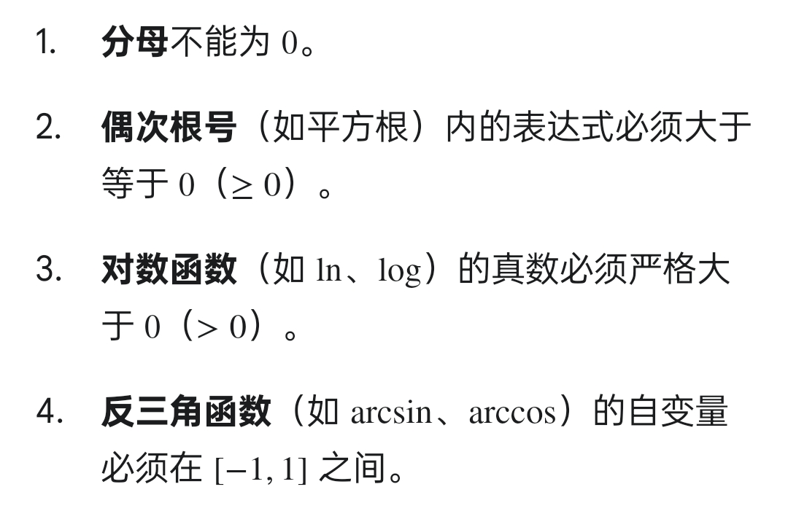

## 定义域题型求法


关联：初等函数间断处，则为定义域不存在的地方。


✅ 这个复习行为是对的。

你现在不是只背结论，而是问“为什么”。这对数学考试很有用，因为考试里条件一换，你不能只靠记忆，要能自己推出。

核心从这里开始：

平面一般式：

```text
Ax + By + Cz + D = 0
```

它的法向量是：

```text
n = (A, B, C)
```

法向量的意思是：**垂直于这个平面的方向**。

---

## 1. 为什么“通过某轴”会让前面系数为 0，同时 D 为 0？

先看最常用的：

平面通过 x 轴。

x 轴上的点长这样：

```text
(x, 0, 0)
```

因为平面通过整个 x 轴，所以 x 轴上任意点都要满足平面方程：

```text
A x + B·0 + C·0 + D = 0
```

也就是：

```text
Ax + D = 0
```

注意：这里的 x 是任意数。

如果要对任意 x 都成立，只能：

```text
A = 0, D = 0
```

所以：

```text
平面通过 x 轴  =>  A = 0, D = 0
```

同理：

```text
平面通过 y 轴  =>  B = 0, D = 0
```

因为 y 轴上的点是：

```text
(0, y, 0)
```

代进去：

```text
By + D = 0
```

对任意 y 成立，只能：

```text
B = 0, D = 0
```

同理：

```text
平面通过 z 轴  =>  C = 0, D = 0
```

因为 z 轴上的点是：

```text
(0, 0, z)
```

代进去：

```text
Cz + D = 0
```

对任意 z 成立，只能：

```text
C = 0, D = 0
```

---

## 2. 为什么“平行某轴”只让前面系数为 0？

还是看平面平行 x 轴。

x 轴的方向向量是：

```text
i = (1, 0, 0)
```

如果平面平行 x 轴，说明 x 轴这个方向在平面里。

而法向量 n 垂直于平面，所以法向量也必须垂直于 x 轴方向。

也就是：

```text
n · i = 0
```

其中：

```text
n = (A, B, C)
i = (1, 0, 0)
```

所以：

```text
(A, B, C) · (1, 0, 0) = A
```

因此：

```text
A = 0
```

所以：

```text
平面平行 x 轴  =>  A = 0
```

注意：这里只能推出 A = 0，不能推出 D = 0。

因为平行 x 轴，不一定经过原点，也不一定经过 x 轴。

例如：

```text
y = 1
```

它平行 x 轴，但不通过 x 轴。

写成一般式：

```text
y - 1 = 0
```

这里：

```text
A = 0, B = 1, C = 0, D = -1
```

D 不等于 0。

所以区别是：

```text
通过 x 轴：A = 0, D = 0
平行 x 轴：A = 0
```

---

## 3. 结论表

```text
通过 x 轴：A = 0，D = 0
通过 y 轴：B = 0，D = 0
通过 z 轴：C = 0，D = 0
```

```text
平行 x 轴：A = 0
平行 y 轴：B = 0
平行 z 轴：C = 0
```

记法：

```text
通过某轴：对应系数为 0，且 D = 0

平行某轴：只让对应系数为 0
```

---

## 4. 你图里的例题为什么这么做？

题目：

```text
求通过 x 轴和点 A(4, -3, -1) 的平面方程
```

设平面：

```text
Ax + By + Cz + D = 0
```

因为通过 x 轴：

```text
A = 0, D = 0
```

所以平面变成：

```text
By + Cz = 0
```

又因为点 A(4, -3, -1) 在平面上，代入：

```text
B(-3) + C(-1) = 0
```

即：

```text
-3B - C = 0
```

所以：

```text
C = -3B
```

取 B = 1，则：

```text
C = -3
```

所以平面方程：

```text
y - 3z = 0
```

---

## 5. 这个题不要误会成 XOY 面

```text
y - 3z = 0
```

不是 XOY 面。

XOY 面是：

```text
z = 0
```

这个平面只是**通过 x 轴**，并且还经过点：

```text
(4, -3, -1)
```

所以它是一个绕着 x 轴倾斜的平面。

你可以这样想：

```text
所有通过 x 轴的平面，都像一张纸绕着 x 轴旋转。
```

XOY 面只是其中一种情况：

```text
z = 0
```

但这道题额外要求经过点：

```text
(4, -3, -1)
```

所以角度被确定了，最后得到：

```text
y - 3z = 0
```

---

最短记忆法：

```text
通过 x 轴：把 (x,0,0) 代进去，得到 A=0,D=0

平行 x 轴：看方向向量 (1,0,0)，法向量点乘它为 0，得到 A=0
```

以后别死背“绝对重点结论”，你就用这两个来源推。
**通过轴：代点。平行轴：点乘方向向量。**
